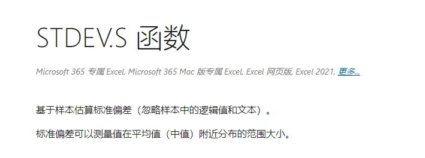
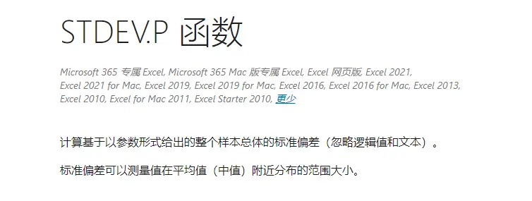

>

>作者：数据人阿多
>

# 背景
标准差这个指标在平时使用比较多，主要是用来计算数据的离散程度，在Excel中有相关的函数，可以直接来计算，其他的编程语言里面也有相关的函数。

Excel中提供了2个函数 stdev.S 和 stdev.P ，都可以用来计算标准差，但这两者应该如何合理使用呢？又有什么区别呢？本篇文章将对这两个函数进行详细的讲解

# stdev.S和stdev.P区别
**1、先看微软文档给出的解释**

**2、源自网络文章的理解**
当你只知道一小部分样本，想要通过其 **【估算】** 这部分 **【样本代表的总体】** 的 **【标准差】** ——选择stdev.S（2010版之后叫stdev.S，老版叫stdev。这个S就是sample，样本的意思）

当你拿到的数据已经是 **整体数据** 了，想要计算这部分数据精确的标准差——选择stdev.P(2010版之后叫stdev.P，老版叫stdevP。这个P我猜是population，在统计学上有“总体”之意）

**3、公式对比**
**stdev.S** 计算公式：
$$\sqrt{\frac{\sum(x-\overline{x})^2}{n-1}}$$

**stdev.P** 计算公式：
$$\sqrt{\frac{\sum(x-\overline{x})^2}{n}}$$

从计算公式可以看出，唯一的区别就是根号中的分母不一样，这个涉及到自由度的概念（理解起来比较复杂），我们可以直接硬记住这个公式即可

**4、总结**
- 数据是抽取的样本时用stdev.S 【其他编程语言中用的是这个】
- 数据是全量时用stdev.P

# 历史相关文章
- [Python用xlwings库处理Excel](../Python数据处理/Python用xlwings库处理Excel.md)
- [像excel透视表一样使用pandas透视函数](../Python数据处理/像excel透视表一样使用pandas透视函数.md)
- [Python通过修改系统注册表，强制设置Excel宏信任级别](../Python数据处理/Python通过修改系统注册表，强制设置Excel宏信任级别.md)
**************************************************************************
**以上是自己实践中遇到的一些问题，分享出来供大家参考学习，欢迎关注微信公众号：DataShare ，不定期分享干货**

