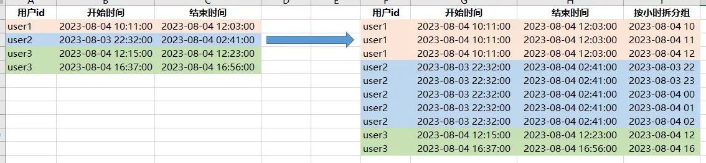
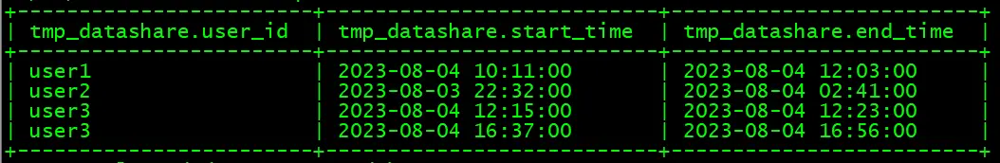
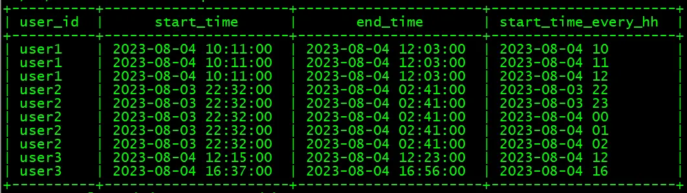

# 背景
业务场景：统计每个小时视频同时在线观看人数，因后台的业务数据是汇总之后的，只有开始时间、结束时间，没有每小时的详细日志数据，无法直接进行统计，所以需要对每条业务数据进行拆分，来统计每个小时的同时数

*当然，如果有详细的日志数据也是直接可以统计的，但是正常情况下，日志数据会非常大，如果每个用户每30秒会产生一条数据，那么每天会产生大量的数据，如此大量的数据，很难长期保存*

# 模拟数据与需求效果展示
对每行数据，按每小时进行拆分，结果如下所示：



# 创建测试数据
```sql
--创建临时表
create table test.tmp_datashare
(user_id string comment '用户id',
start_time string comment '开始时间',
end_time string comment '结束时间')
comment '业务数据'
row format delimited fields terminated by '\t' 
lines terminated by '\n';

--加载数据
load data local inpath '/tmp/datashare.txt' 
overwrite into table test.tmp_datashare;
```

**测试数据：**



# 数据处理过程
- **数据处理的要点：**

需要借助以下两个函数生成连续序列，然后用开始时间与该序列进行加和，生成相应的结果
`space`：空格字符串函数，语法: space(int n)，返回长度为n的空字符串
`posexplode`：炸裂函数，会同时返回两个值，数据的下标索引、数据的值

- **具体代码如下：**

*左右滑动查看代码*
```sql
set hive.cli.print.header=true;

with a as(select user_id,start_time,end_time
		from test.tmp_datashare
		),
	b as(select user_id,start_time,end_time,pos
		from a 
		lateral view posexplode(
			split(
				space(
					cast((unix_timestamp(substr(end_time,1,13),'yyyy-MM-dd HH')-
							unix_timestamp(substr(start_time,1,13),'yyyy-MM-dd HH'))/3600 as int)), 
				' ')
			) tmp as pos,val
		)
select user_id,start_time,end_time,
from_unixtime(unix_timestamp(start_time,'yyyy-MM-dd HH:mm:ss')+3600*pos,
	'yyyy-MM-dd HH') as start_time_every_hh
from b 
order by user_id,start_time_every_hh
```
- **结果数据：**


# 历史相关文章
- [Hive中对相邻访问时间进行归并分组](./Hive中对相邻访问时间进行归并分组.md)
- [Hive 数据聚合成键值对时，根据值大小进行排序](./Hive-数据聚合成键值对时，根据值大小进行排序.md)
- [Hive中的常用函数](./Hive中的常用函数.md)
- [Hive中各种日期格式转换方法总结](./Hive中各种日期格式转换方法总结.md)
- [Hive HQL支持的2种查询语句风格，你喜欢哪一种？](./Hive---HQL支持的2种查询语句风格，你喜欢哪一种？.md)

**************************************************************************
**以上是自己实践中遇到的一些问题，分享出来供大家参考学习，欢迎关注微信公众号：DataShare ，不定期分享干货**
