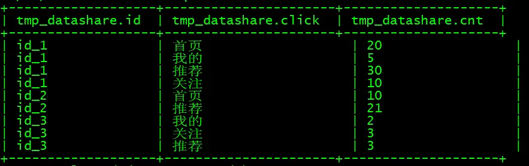
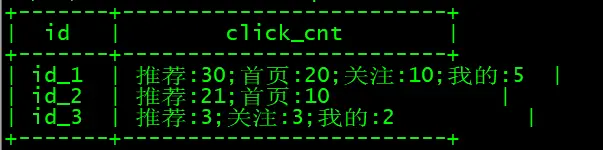

# 背景
最近对用户的行为数据进行统计分析时，需要列出不同用户的具体详情，方便进行观察，在hive中虽然有排序函数，但是处理键值对数据时，不能根据值进行排序，需要巧妙借助中间过程来处理，总结出来与大家进行分享，也方便后面自己查找使用

# 预想效果


# 创建测试数据
```sql
--创建临时表
use test;
create table tmp_datashare
(id string comment '用户id',
click string comment '点击位置',
cnt int comment '点击次数')
COMMENT '用户点击行为统计'
ROW FORMAT DELIMITED FIELDS TERMINATED BY '\t' LINES TERMINATED BY '\n';

--加载数据
load data local inpath '/tmp/datashare.txt' overwrite into table tmp_datashare;
```


**测试数据：** 



# 数据处理过程
>**数据处理具体步骤：**
>- 运用窗口函数进行降序排列增加一个添加辅助列
>- 对数据进行拼接并补全数字，比如：id_1中 `首页：20，降序序号：2`，需要转换为 `00002:首页:20`
>- 然后再进行分组聚合运用`sort_array`进行排序，并进行拼接
>- 最后再进行替换

**具体代码如下：**
```sql
with a as (select id,click,cnt,
			row_number() over(partition by id order by cnt desc) as rn
		from tmp_datashare
			),
	b as (select id,click,cnt,
			concat(lpad(rn, 5, '0'), '#', click, ':',cnt) as click_cnt_temp_1
		from a
		),
	c as (select id,
			concat_ws(';',
				sort_array(collect_list(click_cnt_temp_1))
				) as click_cnt_temp_2
		from b
		group by id
		)
select id,regexp_replace(click_cnt_temp_2,'\\d+#','') as click_cnt
from c
```

**结果数据：**



# 历史相关文章
- [Hive中的常用函数](./Hive中的常用函数.md)
- [Hive中各种日期格式转换方法总结](./Hive中各种日期格式转换方法总结.md)
- [Hive HQL支持的2种查询语句风格，你喜欢哪一种？](./Hive---HQL支持的2种查询语句风格，你喜欢哪一种？.md)

**************************************************************************
**以上是自己实践中遇到的一些问题，分享出来供大家参考学习，欢迎关注微信公众号：DataShare ，不定期分享干货**
