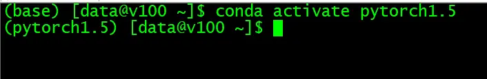

# 硬件信息及操作系统信息
服务器：戴尔R740

显卡：英伟达 Tesla V100

操作系统：CentOS Linux release 7.8.2003 (Core)

# Anaconda安装
从官网下载 `Anaconda3-2020.02-Linux-x86_64.sh`，运行后一步一步安装

参考： 
[https://blog.csdn.net/Gary1_Liu/article/details/81297927](https://blog.csdn.net/Gary1_Liu/article/details/81297927)

# Anaconda环境管理
- 克隆环境

`conda create --name newname --clone oldname`

例如：`conda create --name pytorch1.5 --clone base`

- 创建环境

`conda create -n 环境名 python=3.7`

例如：`conda create -n pytorch1.5 python=3.7`

- 激活环境

`conda activate 环境名`

例如：`conda activate pytorch1.5`

- 退出环境

`conda deactivate`

- 对虚拟环境中安装额外的包

`conda install -n your_env_name [package]`

例如：`conda install -n pytorch1.5 pytorch==1.5.0 torchvision==0.6.0 cudatoolkit=10.2 -c pytorch`

经测试后发现，只要激活了虚拟环境后，用`pip`直接安装也可以，安装的包是直接在虚拟环境里面

例如：`pip install torch==1.5.0 torchvision==0.6.0`

- 删除环境内某个包

`conda remove --name 环境名 包名`

例如：`conda remove --name pytorch1.5  pytorch`

- 查看当前存在哪些虚拟环境

`conda env list`
- 查看安装了哪些包

`conda list`
- 检查更新当前conda

`conda update conda`
- 删除虚拟环境

`conda remove --name oldname --all`

# 历史相关文章
- [Python内置的 os 模块常用函数、方法](../Python基础库/Python内置的-os-模块常用函数、方法.md)
- [Python常用语句汇总](../Python数据处理/Python常用语句汇总.md)

**************************************************************************
**以上是自己实践中遇到的一些问题，分享出来供大家参考学习，欢迎关注微信公众号，不定期分享干货**

