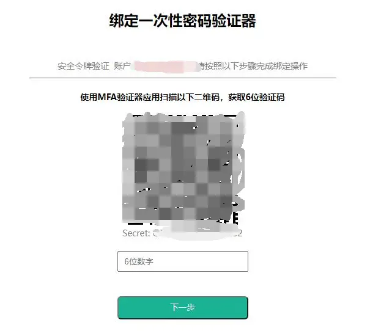
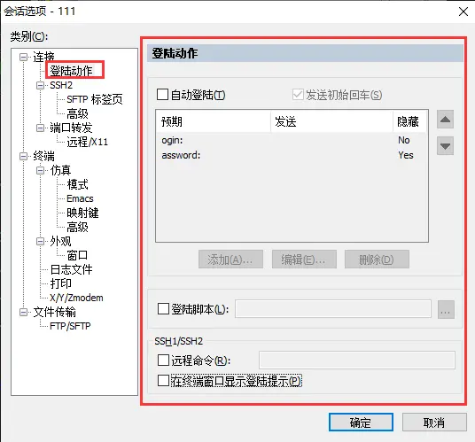
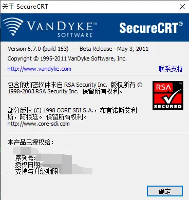
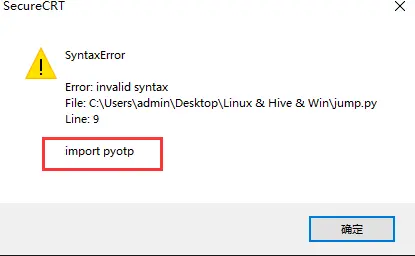
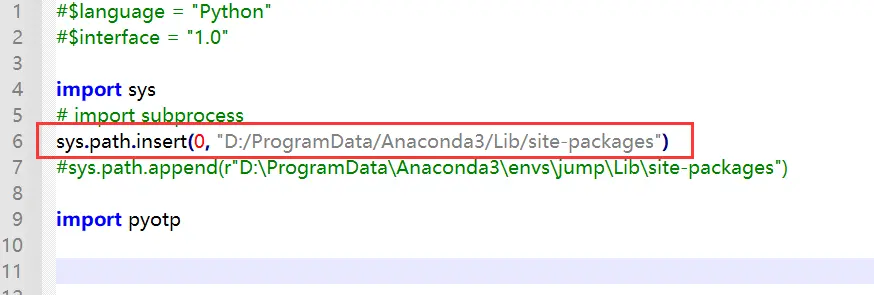

><p style="font-family: 'Microsoft YaHei', sans-serif; line-height: 1.5;">
>作者：数据人阿多
></p>

# 背景
本地连接远端的服务器，SecureCRT可以说是一大利器，可以保存密码、设置自动登陆等，每次都可以一键直连服务器

最近因公司加强了服务器登陆验证，增加了二次认证，必须用Google Authenticator输入6位动态验证码，才能成功登陆，这样的话每次都得打开手机，手动输入验证码比较麻烦

在 **Python** 中有这样的库 **`pyotp`** 可以直接生成Google Authenticator输入6位动态验证码，前提是你知道谷歌验证码对应的密钥，一般是在最开始让扫描二维的下方会提示出来



SecureCRT支持利用一些语言脚本来实现自动登陆，比如：python、vbs，本篇文章来介绍如何利用 **python** 脚本自动登陆


# SecureCRT版本
电脑为Win10操作系统

SecureCRT版本：Version 6.7.0 (build 153)  

SecureCRT中的python版本：python2.6   （可以在安装文件里面查看到）




**由于没有更新SecureCRT版本，一直用的老版本，支持的python也算是比较老了！！！**

最新的SecureCRT版本是支持python3，但是需要进行一些设置，相对比较麻烦，感兴趣的话可以看看这篇文章：

《How-To: Use Python 3.8 with SecureCRT v9.0 for Windows》

[https://forums.vandyke.com/showthread.php?t=14295](https://forums.vandyke.com/showthread.php?t=14295)

# 遇到问题
参考网上分享的一些例子，在 `import pyotp` 时总是会报错

《python 实现 jumpserver 自动登录》<br/>
[https://mp.weixin.qq.com/s/aLazW8WUVfvsICnHXes3CA](https://mp.weixin.qq.com/s/aLazW8WUVfvsICnHXes3CA)




即使添加了python包路径也不行，一直报错，`pyotp` 是兼容python2、python3所有版本



# 解决方法
通过提示可以看出，`import sys` 时并没有报错，说明python内置的包，是可以直接导入使用的，经过测试把 `pyotp` 源码中涉及到生成动态码的库import时，没有报错，说明已经走通了

这时就需要剖析 `pyotp` 源码，有哪些是生成生成动态码必须的，把冗余的代码全部剔除即可，经过分析也就是两个类有用，如下所示：

```python
class OTP(object):
    def __init__(self, s, digits=6, digest= hashlib.sha1, name= None,issuer= None):
        self.digits = digits
        self.digest = digest
        self.secret = s
        self.name = name or 'Secret'
        self.issuer = issuer
        
    def generate_otp(self, input):
        if input < 0:
            raise ValueError('input must be positive integer')
        hasher = hmac.new(self.byte_secret(), self.int_to_bytestring(input), self.digest)
        hmac_hash = bytearray(hasher.digest())
        offset = hmac_hash[-1] & 0xf
        code = ((hmac_hash[offset] & 0x7f) << 24 |
                (hmac_hash[offset + 1] & 0xff) << 16 |
                (hmac_hash[offset + 2] & 0xff) << 8 |
                (hmac_hash[offset + 3] & 0xff))
        str_code = str(code % 10 ** self.digits)
        while len(str_code) < self.digits:
            str_code = '0' + str_code

        return str_code

    def byte_secret(self):
        secret = self.secret
        missing_padding = len(secret) % 8
        if missing_padding != 0:
            secret += '=' * (8 - missing_padding)
        return base64.b32decode(secret, casefold=True)

    @staticmethod
    def int_to_bytestring(i, padding= 8):
        result = bytearray()
        while i != 0:
            result.append(i & 0xFF)
            i >>= 8
        # It's necessary to convert the final result from bytearray to bytes
        # because the hmac functions in python 2.6 and 3.3 don't work with
        # bytearray
        return bytes(bytearray(reversed(result)).rjust(padding, b'\0'))
        
        
class TOTP(OTP):
    def __init__(self, s, digits= 6, digest=hashlib.sha1, name=None,issuer=None, interval= 30):
        self.interval = interval
        super(TOTP,self).__init__(s=s, digits=digits, digest=digest, name=name, issuer=issuer)

    def now(self):
        return self.generate_otp(self.timecode(datetime.datetime.now()))

    def timecode(self, for_time):
        if for_time.tzinfo:
            return int(calendar.timegm(for_time.utctimetuple()) / self.interval)
        else:
            return int(time.mktime(for_time.timetuple()) / self.interval)
```

# 完整代码
以下为SecureCRT利用Python脚本自动登陆服务器的完整代码：
```python
# $language = "Python"
# $interface = "1.0"

import calendar
import datetime
import hashlib
import time
import base64
import hmac

class OTP(object):
    def __init__(self, s, digits=6, digest= hashlib.sha1, name= None,issuer= None):
        self.digits = digits
        self.digest = digest
        self.secret = s
        self.name = name or 'Secret'
        self.issuer = issuer
        
    def generate_otp(self, input):
        if input < 0:
            raise ValueError('input must be positive integer')
        hasher = hmac.new(self.byte_secret(), self.int_to_bytestring(input), self.digest)
        hmac_hash = bytearray(hasher.digest())
        offset = hmac_hash[-1] & 0xf
        code = ((hmac_hash[offset] & 0x7f) << 24 |
                (hmac_hash[offset + 1] & 0xff) << 16 |
                (hmac_hash[offset + 2] & 0xff) << 8 |
                (hmac_hash[offset + 3] & 0xff))
        str_code = str(code % 10 ** self.digits)
        while len(str_code) < self.digits:
            str_code = '0' + str_code

        return str_code

    def byte_secret(self):
        secret = self.secret
        missing_padding = len(secret) % 8
        if missing_padding != 0:
            secret += '=' * (8 - missing_padding)
        return base64.b32decode(secret, casefold=True)

    @staticmethod
    def int_to_bytestring(i, padding= 8):
        result = bytearray()
        while i != 0:
            result.append(i & 0xFF)
            i >>= 8
        # It's necessary to convert the final result from bytearray to bytes
        # because the hmac functions in python 2.6 and 3.3 don't work with
        # bytearray
        return bytes(bytearray(reversed(result)).rjust(padding, b'\0'))
        
        
class TOTP(OTP):
    def __init__(self, s, digits= 6, digest=hashlib.sha1, name=None,issuer=None, interval= 30):
        self.interval = interval
        super(TOTP,self).__init__(s=s, digits=digits, digest=digest, name=name, issuer=issuer)

    def now(self):
        return self.generate_otp(self.timecode(datetime.datetime.now()))

    def timecode(self, for_time):
        if for_time.tzinfo:
            return int(calendar.timegm(for_time.utctimetuple()) / self.interval)
        else:
            return int(time.mktime(for_time.timetuple()) / self.interval)

username='aaa'
password='aaa'
google_author_secret_key='自己的密钥'

def Main():
    tab = crt.GetScriptTab()
    if tab.Session.Connected != True:
        crt.Dialog.MessageBox("Session Not Connected")
        return
    tab.Screen.Synchronous = True
    
   
    tab.Screen.WaitForStrings(['Password: '])
    tab.Screen.Send(password+'\r\n')
    tab.Screen.WaitForStrings(['Please enter 6 digits.[MFA auth]: '])
    vc = TOTP(google_author_secret_key).now()
    tab.Screen.Send("{vc}\r\n".format(vc=vc))
    
    return


Main()

```

# 历史相关文章
- [数据分析师常用的 Linux 命令总结](./数据分析师常用的-Linux-命令总结.md)
- [Python 基于ssh连接远程Mysql数据库](../Python基础库/Python-基于ssh连接远程Mysql数据库.md)
- [Linux （Centos 7）中 Anaconda环境管理，安装不同的版本Python包](./Linux-（Centos-7）中-Anaconda环境管理，安装不同的版本Python包.md)

**************************************************************************
**以上是自己实践中遇到的一些问题，分享出来供大家参考学习，欢迎关注微信公众号：DataShare ，不定期分享干货**
