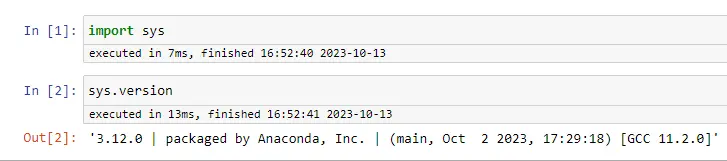

><p style="font-family: 'Microsoft YaHei', sans-serif; line-height: 1.5;">
>作者：数据人阿多
></p>

# 背景
小编在刚开始学习Python时，是在Python官网下载的原生版本，用的是自带的编码环境，后来了解到在数据分析、数据科学领域用Jupyter notebook比较好，于是直到现在也是一直在用Jupyter notebook，也偶尔用PyCharm做开发。在数据分析与处理中Jupyter notebook还是很方便，可以直接查看数据，可以写文档，可以画图 等很多优点，感觉Jupyter notebook 就是是为了数据分析、数据挖掘、机器学习而生的

如果用过Jupyter notebook，大家都知道，它是一个网页界面，服务端和客户端分离，每次启动都会在后台运行一个cmd/terminal窗口，可以理解为服务端，而使用的浏览器界面，可以理解为客户端。既然是服务端与客户端分开的，那么服务端就可以部署到服务器上，可以充分利用服务器的计算资源、存储资源，更甚者可以用GPU资源。其实在服务器部署Jupyter notebook，做机器学习的同学，应该对这个很熟悉，但是不一定亲手部署过


**浏览器-客户端**


**cmd-服务端**


# 必要前提！！！
**需要对Linux服务器要有所了解，如果在工作中压根就没使用过服务器，且不知道ssh，那小编劝你暂时先别看这篇文章，可以先去多学一些Python知识，后面随着知识的积累，慢慢的你就会接触到服务器**

# 小编服务器环境
硬件：谷歌云虚拟机实例，1G内存，100G硬盘

系统：64位 Debian，Debian GNU/Linux 11

# 服务器部署流程
在服务器上安装Jupyter notebook，一共分为4步，最终实现在本地电脑来访问

因为Anaconda自带Jupyter notebook，并且可以创建虚拟环境，使用起来非常方便，所以强烈推荐使用Anaconda，可以让你少采坑
## 第1步：下载Anaconda
Anaconda 下载地址：[https://www.anaconda.com/download#downloads](https://www.anaconda.com/download#downloads)


在服务器上直接下载（谷歌服务器下载很快）
```shell
wget https://repo.anaconda.com/archive/Anaconda3-2023.09-0-Linux-x86_64.sh
```

## 第2步：安装Anaconda
在服务器上直接安装Anaconda，在安装中一直点击回车或空格键，在许可条款、最后配置的地方输入 yes 即可

在安装时确保硬盘存储空间要足够，小编在安装是最开始只有10G硬盘资源，一直报错，后来扩大硬盘后解决了

安装完成后，命令行提示符前会有多了个 `(base)`，这个是Anaconda默认的基础虚假环境，小编下载的是截止发文章时最新版Anaconda，里面集成的是 **Python 3.11.5**
```shell
bash Anaconda3-2023.09-0-Linux-x86_64.sh
```


## 第3步：对Jupyter notebook进行配置
- 生成配置文件，运行后会显示配置文件的存放位置
```shell
jupyter notebook --generate-config
```


- 对配置文件进行修改
```txt
## The IP address the notebook server will listen on.
#  Default: 'localhost'
# 设置可以访问的ip, 默认是localhost, 将其改为 '*'
c.NotebookApp.ip = '*'


## The directory to use for notebooks and kernels.
#  Default: ''
# 默认打开目录
c.NotebookApp.notebook_dir = '/home/data123share66/python'


## Whether to open in a browser after starting.
#                          The specific browser used is platform dependent and
#                          determined by the python standard library `webbrowser`
#                          module, unless it is overridden using the --browser
#                          (NotebookApp.browser) configuration option.
#  Default: True
# Jupyter notebook启动后是否打开浏览器, 设为 False 即可
c.NotebookApp.open_browser = False


## Hashed password to use for web authentication.
#  
#                        To generate, type in a python/IPython shell:
#  
#                          from notebook.auth import passwd; passwd()
#  
#                        The string should be of the form type:salt:hashed-
#  password.
#  Default: ''
c.NotebookApp.password = 'argon2:$argon2id$v=19$m=10240,t=10,p=8$Ny6WDdoLBm88cUMyOqgNqg$s3WObP81eU51RT2j8D8DULPM1OAPOnzYfODW8olB0xw'
```

小编这里在生成密码是用的 `datashare` ，在输入时屏幕不会显示


## 第4步：启动Jupyter notebook，并在本地电脑远程访问
- 1、服务器启动Jupyter notebook
```shell
jupyter notebook --ip=0.0.0.0 --port=9999
```

- 2、在本地电脑浏览器远程访问
在浏览器输入服务器的IP地址:9999，小编这里是`34.81.173.39:9999`，访问后，会出现如下页面


然后输入密码 `datashare` 进行登录，成功登录后界面如下所示：


- 3、创建一个notebook，查看python版本


# Jupyter 好用的扩展插件
- **1、安装jupyter_contrib_nbextensions**
该插件会扩展jupyter的很多功能，如目录，自动补全等，在服务器终端依次运行如下命令
```shell
pip install jupyter_contrib_nbextensions

jupyter-contrib-nbextension install --user
```
打开jupyter会发现多了一个菜单栏 `Nbextension`

对Nbextension进行配置，勾选需要的功能


- **2、安装nb_conda**
```shell
conda install nb_conda
```
安装完成后，需要在服务器重新启动一下Jupyter notebook，会发现多了一个菜单栏 `Conda`

在服务器创建一个虚拟环境 python312，然后刷新一下页面，就可以看到虚拟环境 python312
```shell
conda create -n python312 python=3.12
```


# 多个Python版本kernel配置
虽然上面已经创建了虚拟环境，并显示出来了，但是在创建新的notebook时并显示python312，因为python312存在不同的虚拟环境里面，这个需要我们再进行配置


Jupyter Notebook允许用户在同一个notebook中使用多个不同的IPython内核

- **1、安装Jupyter Notebook和IPython内核**
```shell
conda create -n python312 python=3.12   #上面安装过的可以忽略
conda activate python312
pip install jupyter
pip install ipykernel
pip install ipywidgets
```
- **2、安装新的kernel内核**
```shell
conda activate python312   #切换虚拟环境
ipython kernel install --name "python312" --user
```

- **3、服务器端重新启动Jupyter notebook**
建一个python312内核的notebook，查看当前内核的python解释器版本


# 历史相关文章
- [Linux （Centos 7）中 Anaconda环境管理，安装不同的版本Python包](./Linux-（Centos-7）中-Anaconda环境管理，安装不同的版本Python包.md)
- [Python常用语句汇总](../Python数据处理/Python常用语句汇总.md)
- [数据分析师常用的 Linux 命令总结](./数据分析师常用的-Linux-命令总结.md)

**************************************************************************
**以上是自己实践中遇到的一些问题，分享出来供大家参考学习，欢迎关注微信公众号：DataShare ，不定期分享干货**
