# 背景
也许你有这样的疑问，数据分析师为什么要了解Linux？这不是开发人员应该了解的吗？把Windows+SQL+Excel+Python玩的精通，不香吗？

以上的疑问也许处有人会提出，但随着个人的职业成长，企业数字化的发展，终究会与Linux系统打交道，比如：在数据挖掘时，大量的数据需要做分析、特征提取，然后跑模型，这些任务在个人的Windows系统基本完全做不了，只能在Linux服务器上来完成

**备注**：在大厂就职的同学  and 公司基建做的非常好的，可以忽略本文，说明你们公司比本小编曾经就职的某手好点，当然多学习一些知识，对自己百利而无一害，活到老学到老

*以下介绍的命令是基于： **Centos系统**，Linux的一个发行版*

# 常用命令
- `pwd`   

当前所处的文件夹位置

- `ls`  

列出当前文件夹里面的文件及子文件夹

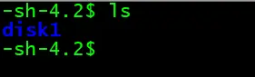

- `ll`
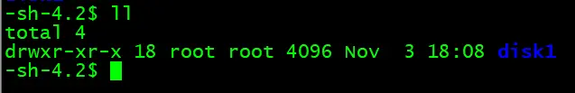

该命令相当于 `ls -l`

展示文件夹里面的文件及子文件夹详细信息，有点类似在Windows里面查看文件夹时以详细信息方式展示一样

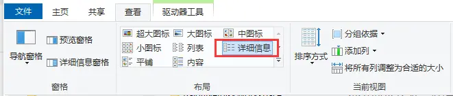

- `cd`

切换目录，换到别的文件夹

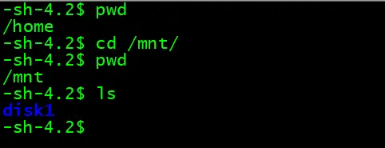

- `mkdir`

创建一个新建文件夹

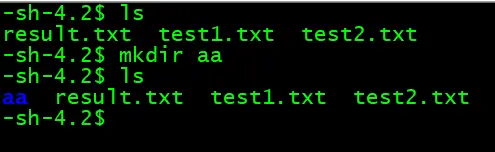

- `cp`

`cp 文件 新文件夹`

复制文件到新的文件夹里面，copy的简写

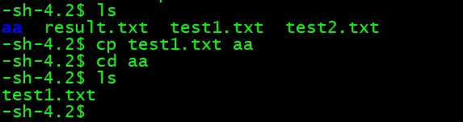

`cp -r 文件夹 新文件夹`

复制整个文件夹到新的文件夹里面，需要添加 `-r` 参数，进行递归式复制

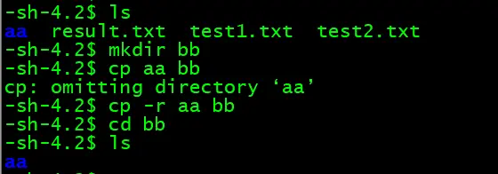
- `mv`

`mv 文件 新文件夹`

移动文件到新文件夹，move 的简写

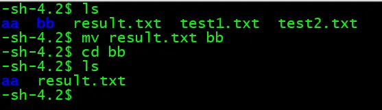

`mv 文件夹 新文件夹`

移动文件夹到新文件夹

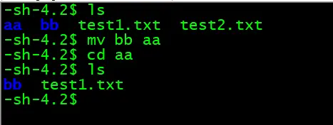

- `cat`

`cat 文件名`

展示文件里面的内容

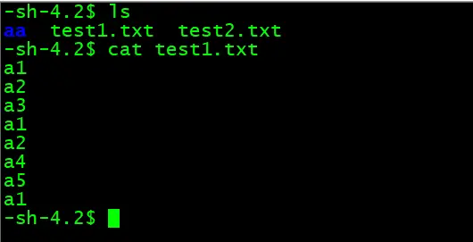

- `sort`

`sort 文件名`

对文件里面的行进行排序

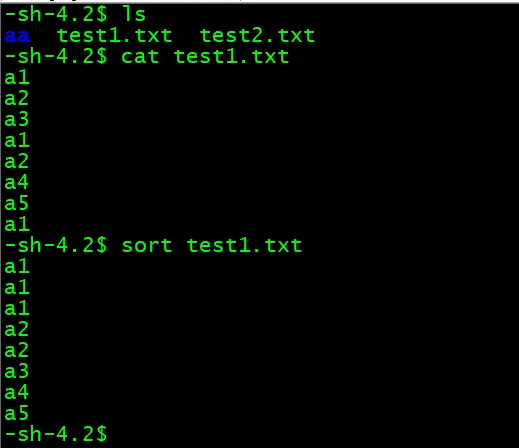

`sort -u 文件名`

对文件里面的行进行去重并且排序，`-u` 是 unique 的简写

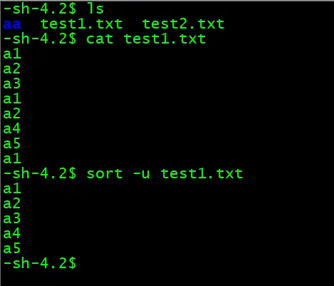

- `head`

显示文件的前几行内容，在默认情况下，head命令显示文件的头10行内容，`-n ` 参数可以指定要显示的行数

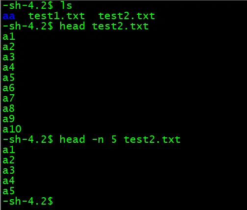

- `tail`

显示文件的后几行内容，在默认情况下，tail显示最后 10 行，`-n ` 参数可以指定要显示的行数

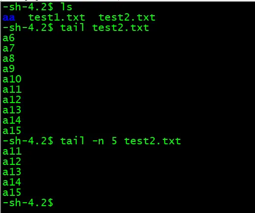

- `top`

实时动态显示各进程的情况，可以按 M与T 进行可视化变化，可以显示为进度条样式

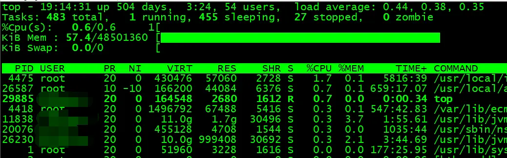

- `df -h`

显示目前在 Linux 系统上的文件系统使用情况统计磁盘，`-h` 参数代表使用人类可读的格式 human-readable，是human的简写

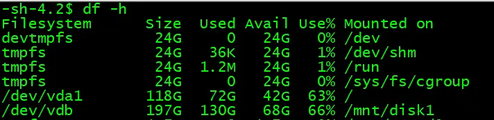

- `ps -ef`

查看服务器上所有运行的进程，类似Windows的查看任务管理器,PID 代表进程号

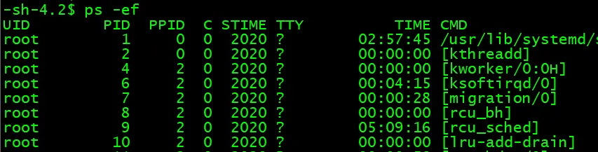

- `kill -9 进程号`

强制杀死进程，类似Windows的在任务管理器中结束某个进程任务，用上面的 ps 命令查出进程号后，可以直接强制退出该进程

- `rm`

删除文件或者文件夹，**谨慎使用**，删除掉就不容易恢复，不像Windows在回收站可以找回

`rm 文件名`

删除文件

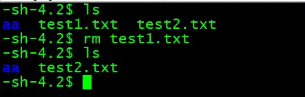

`rm -r 文件夹`
删除文夹，`-r` 参数为递归删除文件夹及子文件夹里面的文件

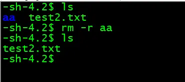

# 好用的学习网站
以上介绍的只是几个常用的命令，下面列出几个网站，个人感觉这几个比较好用，供大家可参考学习
- [https://man.linuxde.net/](https://man.linuxde.net/)        
- [http://c.biancheng.net/linux_tutorial/](http://c.biancheng.net/linux_tutorial/)
- [https://www.runoob.com/linux/linux-tutorial.html](https://www.runoob.com/linux/linux-tutorial.html)

# 历史相关文章
- [Linux之NTFS、FAT32、exFAT 各种格式硬盘挂载整理](./Linux之NTFS、FAT32、exFAT-各种格式硬盘挂载整理.md)
- [Linux （Centos 7）中 Anaconda环境管理，安装不同的版本Python包](./Linux-（Centos-7）中-Anaconda环境管理，安装不同的版本Python包.md)

**************************************************************************
**以上是自己实践中遇到的一些问题，分享出来供大家参考学习，欢迎关注微信公众号：DataShare ，不定期分享干货**
