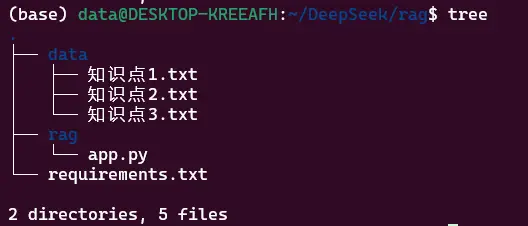

# 背景
经过一段使用DeepSeek后，感觉使用体验和ChatGPT基本差不多，问答问题的质量略有提升，因DeepSeek已开源，它的模型、模型权重参数从网上都可以下载到，所以可以基于开源的模型，在本地构建一个自己的知识库，小编这里使用的是蒸馏后的模型权重 `deepseek-r1:1.5b` 

>RAG （Retrieval-Augmented Generation）检索增强生成，是一种通过整合外部知识库来增强大模型（LLM）回答问题质量的模式。最简单的理解，可以认为是给大模型外挂了一个知识库。
>
>很多大模型的问题，多数是由于数据缺失造成的，企业中解决这类数据确实的问题，通常的方案是采取企业向量知识库的方式，在应用Prompt的时候，先从企业知识库中检索与Prompt关联的知识，然后把领域知识和原始Prompt整合在一起，最后作为大模型的输入。
>
>这样大模型就了解了领域专业知识，也能更好的回答问题。


# 小编环境
基于Win10中的Linux子系统进行部署安装
子系统：Ubuntu 22.04.5 LTS
```bash
python -V  
# Python 3.11.11

uname -a
# Linux DESKTOP-KREEAFH 5.15.167.4-microsoft-standard-WSL2 #1 
# SMP Tue Nov 5 00:21:55 UTC 2024 x86_64 x86_64 x86_64 GNU/Linux

lsb_release -a
# No LSB modules are available.
# Distributor ID: Ubuntu
# Description:    Ubuntu 22.04.5 LTS
# Release:        22.04
# Codename:       jammy
```


# 安装Ollama，并下载deepseek模型
官网地址：https://ollama.com/download
官网命令：`curl -fsSL https://ollama.com/install.sh | sh`

因该网站是国外服务器，所以都懂得，按官网命令进行安装，基本都不会成功，所有需要魔改安装脚本 `install.sh`
**1. 在Linux下载 `install.sh` 安装脚本文件到本地**
```bash
 curl -fsSL https://ollama.com/install.sh -o install.sh
```
**2. 修改安装脚本文件，需要开启魔法上网**
在83行增加curl命令的代理参数，前面ip地址为Win10的网络地址，端口需要查看自己本地魔法上网的软件端口，小编使用的是 v2rayN，因为是Linux子系统中使用，需要使用局域网的http端口
```bash
curl --fail --show-error --location --progress-bar \
    --proxy http://192.168.21.121:10811 \
    "https://ollama.com/download/ollama-linux-${ARCH}.tgz${VER_PARAM}" | \
    $SUDO tar -xzf - -C "$OLLAMA_INSTALL_DIR"
```


**3. 开启魔法上网，执行安装脚本文件**
```bash
bash install.sh
```
**4. 下载模型参数权重文件**
```bash
ollama pull deepseek-r1:1.5b
```

# 安装Python环境依赖包
新建`requirements.txt `文件，需要把以下内容放入该文件
```text
langchain
langchain-community
langchain_experimental
streamlit
pdfplumber
semantic-chunkers
open-text-embeddings
ollama
prompt-template
sentence-transformers
faiss-cpu
```
安装上面列出的所有三方库：
```bash
pip install -r requirements.txt
```

# Web完整代码
app.py文件
```python
import streamlit as st
from langchain_community.document_loaders import TextLoader
from langchain_community.embeddings import OllamaEmbeddings
from langchain_community.vectorstores import FAISS
from langchain.chains import RetrievalQA
from langchain_community.llms import Ollama
import os

def initialize_interface():
    # 定义 CSS 样式
    st.markdown(
        """
        <style>
        .text-color {
            color: grey; /* 设置字体颜色为灰色 */
            font-size: 25px; /* 设置字体大小为 20px */
        }
        </style>
        """, 
        unsafe_allow_html=True
    )

    st.markdown(
        """
        <h1 style="text-align:center;">
            个人本地知识库 <span class="text-color">@DeepSeek </span>
        </h1>
        """,
        unsafe_allow_html=True
    )

def load_documents(folder_path):
    documents = []
    for file_name in os.listdir(folder_path):
        file_path = os.path.join(folder_path, file_name)
        loader = TextLoader(file_path)
        documents.extend(loader.load())  # 读取本地文件的內容
    return documents

def create_vectorstore(documents, model_name="deepseek-r1:1.5b"):
    embeddings = OllamaEmbeddings(model=model_name)
    vectorstore = FAISS.from_documents(documents, embeddings)
    return vectorstore.as_retriever(search_type="similarity", search_kwargs={"k": 3})

def initialize_qa_chain(retriever, model_name="deepseek-r1:1.5b"):
    llm = Ollama(model=model_name)
    return RetrievalQA.from_chain_type(llm, retriever=retriever)

def main():
    initialize_interface()  # 初始化web
    documents = load_documents("data")  # 加载本地文件内容
    retriever = create_vectorstore(documents)  # 创建RAG
    qa_chain = initialize_qa_chain(retriever)  # 初始化问答
    
    query = st.text_area("请输入要搜索问题：",height=80)
    if query:
        response = qa_chain.run(query)
        st.write("💡 回答：", response)

if __name__ == "__main__":
    main()
```

# 项目文件结构
需要把个人的知识库内容放入data目录下面，目前支持text文件


# 启动Web程序
启动Web程序，按照提示打开浏览器，稍等几分钟后（根据个人的电脑配置），就可以提问
```bash
streamlit run ./rag/app.py
```


# 参考文章
1. https://sebastian-petrus.medium.com/developing-rag-systems-with-deepseek-r1-ollama-f2f561cfda97
2. https://zhuanlan.zhihu.com/p/17210266424
3. https://github.com/henry3556108/rag

# 历史相关文章
- [自然语言处理（NLP） Bert与Lstm结合](./自然语言处理（NLP）-Bert与Lstm结合.md)
- [Python 除了结巴分词，还有什么好用的中文分词工具？](./Python-除了结巴分词，还有什么好用的中文分词工具？.md)

**************************************************************************
**以上是自己实践中遇到的一些问题，分享出来供大家参考学习，欢迎关注微信公众号：DataShare ，不定期分享干货**
