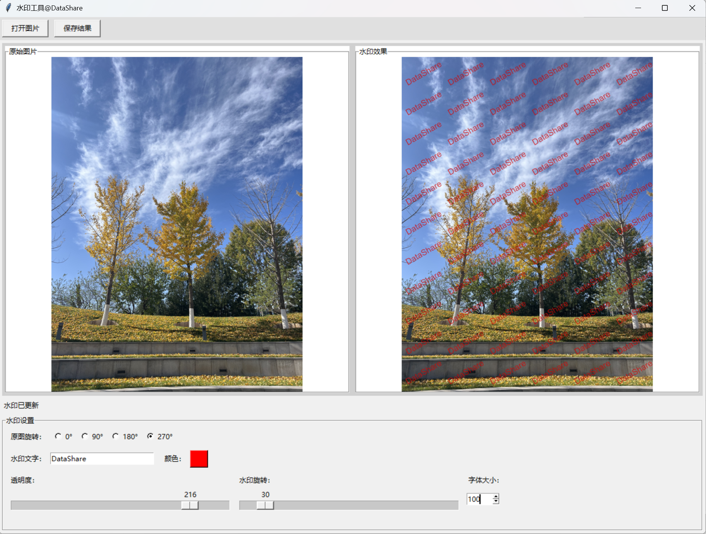
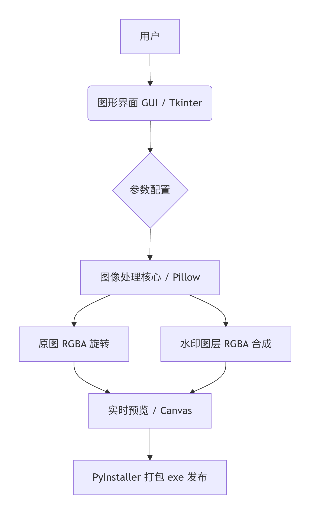

><p style="font-family: 'Microsoft YaHei', sans-serif; line-height: 1.5;">
>作者：数据人阿多&emsp;&emsp;&emsp;日期：2026年4月30日
></p>


# 背景
在现代数字内容创作与分发的流程中，为图片添加水印已成为保护版权、防止盗用的重要工序，然而，市面上许多水印工具依赖于在线服务，存在隐私泄露的风险；而专业图像处理软件则显得过于笨重，不够轻便

因此，开发一款**本地化、轻量级、零网络依赖**的图片水印工具，不仅能够满足日常使用需求，更是一次探索 Python 桌面应用开发实践的绝佳机会


# 效果


# 整体架构与技术选型

Photo Water Marker 的整体技术栈包含三大核心模块：
* **GUI 客户端**：采用 Python 标准库 `tkinter`，零依赖，高度可移植
* **图像处理内核**：采用 Python 生态中久经考验的 `Pillow`（PIL 的友好分支）库
* **分发与交付**：采用工业级打包工具 `PyInstaller`，将 Python 脚本与运行时环境一同打包为 Windows 下的独立 `.exe` 可执行文件


# 图像处理逻辑深度解析

本项目的图像处理代码完全基于 `Pillow` 库实现，历经多次迭代，最终形成了一个高效且灵活的处理管线。整个水印应用的核心处理逻辑位于 `apply_watermark` 方法中，可高度归纳为以下六个步骤：

1.  **载入 RGBA 原图**：直接调用 `self.original_image.copy()` 获取一份独立的 RGBA 图像副本，为后续的**非破坏性编辑**奠定基础
2.  **构建透明文字水印层**：利用 `Image.new` 创建一个与原图尺寸完全一致的 `RGBA` 透明图层，以避免直接修改原图
3.  **解析并应用水印样式**：根据从 GUI 获取的**颜色、透明度、字体大小与旋转角度**等参数，动态构建一个仅包含单个水印文字块的临时透明图层
4.  **执行几何旋转**：对该文字块临时图层执行 `rotate( )` 操作，并设置 `expand=True` 以保证旋转后文本块的完整可见
5.  **满屏平铺与合成**：使用双层循环将旋转后的文字块平铺到第 2 步创建的透明水印层上，最终通过 `Image.alpha_composite( )` 将其与原图无缝融合
6.  **输出最终结果**：将融合图像返回，供预览和最终保存

> 在工程实践中，将几何变换（旋转）置于水印块生成阶段，而非合成后的全图处理，是保证图像边缘无黑边、支持透明背景的关键技巧

# GUI 界面搭建与优化

Photo Water Marker 的 GUI 界面严格遵循简洁高效的开发标准，整体分为三大板块：**原图旋转、控制面板、实时预览**

*   **原图旋转功能**：采用清晰的 `Radiobutton` 组件，直接在界面中实现了 `0°、90°、180°、270°` 四个角度的硬件级旋转
*   **控制区**：使用 `grid` 网格布局管理器，确保透明度、水印旋转、字体大小等控件严格对齐
*   **原始预览区**：清晰呈现原图状态，便于与水印效果进行直观对比
*   **水印预览区**：实时展示水印添加后的成品效果

在开发过程中，我们解决了一个 **Tkinter 界面布局抖动** 的典型痛点：
通过将预览组件从 `Label` 替换为 **`Canvas` 画布**，并采用 `propagate(False)` 固定外框尺寸，结合 `<Configure>` 事件绑定实现图片的**等比缩放**，彻底杜绝了因内容更新导致的界面抖动现象

# PyInstaller 高兼容性打包

得益于 Python 脚本语言的特性，本项目开发完成后并未止步于源码形态。为了能让非 Python 用户也能享受到即刻使用的便利，我们通过 PyInstaller 将项目编译为了独立的 Windows 可执行文件 `.exe`

核心打包指令为：
```bash
pyinstaller -F -w photo_water_marker_gui.py
```
其中 `-F` 指定单文件模式，`-w` 指定 `Windows GUI` 模式（隐藏控制台窗口），确保最终交付的 exe 程序干净、整洁、无任何外部依赖。用户只需下载，双击即可运行

# 项目总结

Photo Water Marker 作为一个**致力于解决日常高频、小型、隐私敏感**需求的开源项目，完成了一次标准的 Python 桌面应用开发、优化与交付全流程实践

本项目不仅展示了 Python 作为“胶水语言”在桌面开发领域的深厚潜力，也再次证明了使用 Python 生态的核心组件足以快速搭建出可靠且优美的实用程序。从图像处理逻辑的精细打磨，到 GUI 交互体验的反复优化，整个开发过程充满了探索与创造的乐趣


*项目主页：*[https://github.com/DataShare-duo/photo_water_marker](https://github.com/DataShare-duo/photo_water_marker)

# 历史相关文章
- [利用Python生成手绘效果的图片](/Python图像处理/利用Python生成手绘效果的图片.md)
- [利用Python实现二维码自由](/Python图像处理/利用Python实现二维码自由.md)
- [Python-利用聚类算法对图片进行颜色压缩](/Python图像处理/Python-利用聚类算法对图片进行颜色压缩.md)


**************************************************************************
**以上是自己实践中遇到的一些问题，分享出来供大家参考学习，欢迎关注微信公众号：DataShare ，不定期分享干货**


