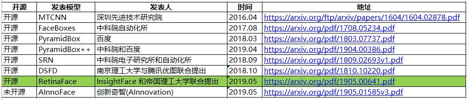

>

>作者：数据人阿多
>

# 背景
由于最近项目的要求，需要对视频里面出现的所有人脸进行打马赛克，调研了相关的方法，总结了一下，供大家参考。
大家都知道视频其实是有很多张图片（帧）组成的，那么只要把图片中的人脸检测出来，那么视频就迎刃而解了。
>帧数就是在1秒钟时间里传输的图片的量，也可以理解为图形处理器每秒钟能够刷新几次，通常用fps（Frames Per Second）表示。每一帧都是静止的图象，快速连续地显示帧便形成了运动的假象。高的帧率可以得到更流畅、更逼真的动画。帧数 (fps) 越高，所显示的动作就会越流畅。 但是文件大小会变大
# 人脸检测 vs 人脸识别
**人脸检测** 与 **人脸识别** 是两个不同的概念

**人脸检测**

检测图片里面有没有人脸

**人脸识别**

首先检测出图片中的人脸，再与已知的人脸做对比，看这个人脸是张三的，还是李四的，常见应用：人脸识别上班打卡

# 方法总结
- **opencv**

最简单、速度最快的方法，但效果一般
- **face_recongnition（基于dlib）**

可选参数 hog 、cnn

pip有发布的库，不用自己训练模型，可以直接拿来使用，比较方便，效果较好
[https://github.com/ageitgey/face_recognition](https://github.com/ageitgey/face_recognition)
[face_recognition模块方法集合](https://blog.csdn.net/u012819339/article/details/81671574)

- **mtcnn（基于tensorflow）**

需要训练自己的模型，github有开源的项目，效果较好
[https://github.com/ipazc/mtcnn](https://github.com/ipazc/mtcnn)

- **RetinaFace（基于pytorch）**-----------最终采用

需要训练自己的模型，github有开源的项目，效果最好
[https://github.com/supernotman/RetinaFace_Pytorch](https://github.com/supernotman/RetinaFace_Pytorch)

以上这些都是自己亲自试验过的人脸检测方法，**RetinaFace（基于pytorch）** 方法效果最好，最终采用这种方法，进行了一些优化

- **其他一些方法**

# RetinaFace效果

# 历史相关文章
- [利用Python生成手绘效果的图片](./利用Python生成手绘效果的图片.md)
- [Python基于opencv “三维”旋转图片，解决日常小问题](./Python基于opencv-“三维”旋转图片，解决日常小问题.md)

**************************************************************************
**以上是自己实践中遇到的一些问题，分享出来供大家参考学习，欢迎关注微信公众号，不定期分享干货**

