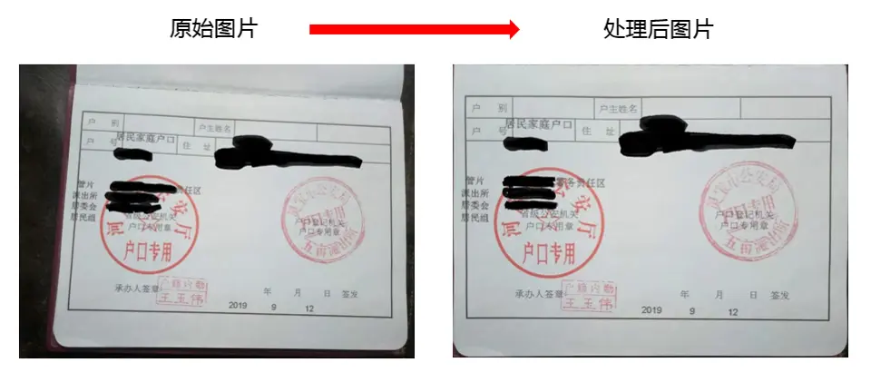
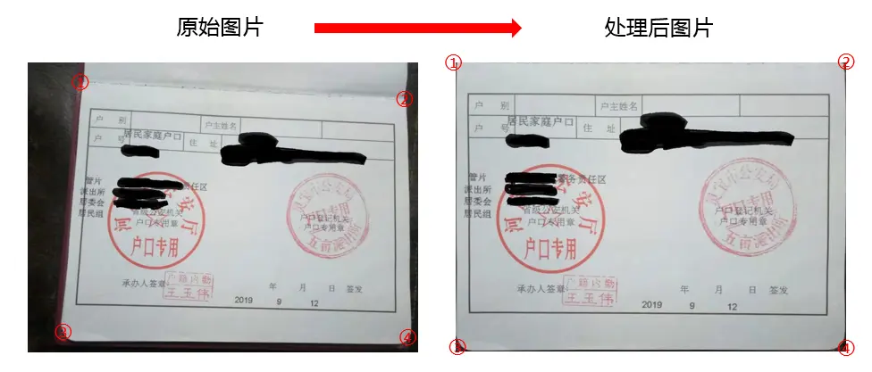
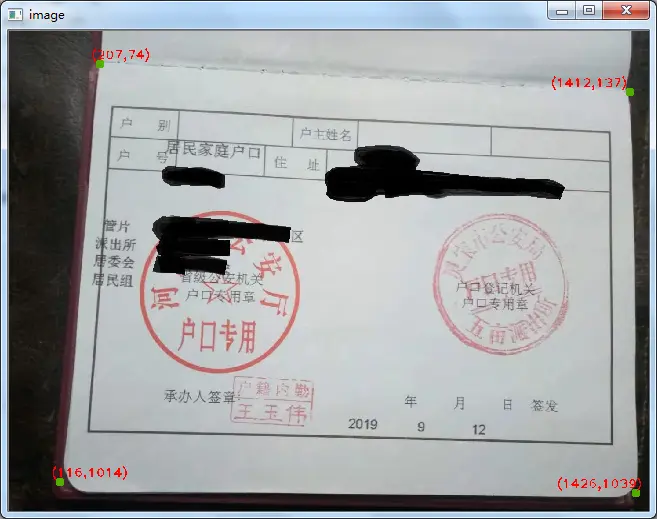
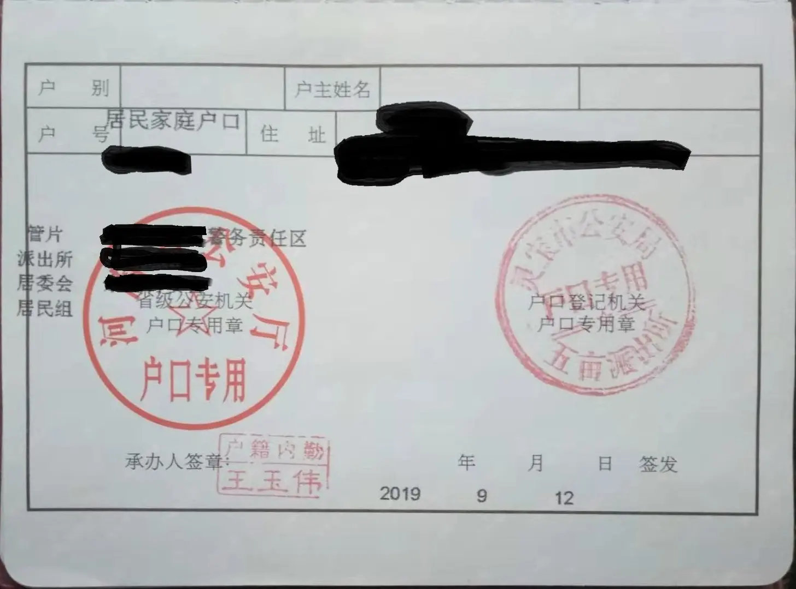

# 背景
前段时间因为要办理一些事情，需要家里人拍 **`户口本首页`** 和 **`个人所在页`** 的照片用来打印，家里父亲已经年过六旬，能学会玩微信已经实属不易，让父亲用手机拍出很正的图片有点太难，**`户口本首页`** 拍了有5张以上，里面有一张比较清晰，能凑合着用，但还是不正，于是想着能不能 **`旋转`** 一下，让照片变正。因之前对opencv有所了解，就查找相关文档，然后对图片进行处理，3步即可搞定，最后大功告成！！！


# 基于opencv图片处理过程
#### 1.安装opencv
由于opencv为第三方库，需要手动安装一下，安装成功后即可导入使用
```python
pip install opencv-python
```
#### 2.确定照片上4个点
可以想象一下，把照片看成一个空间，要想把照片旋转正，我们可以拽着户口本首页4个角，给拽到图片的4个角，有点立体的感觉，如下图所示：


确定照片上这4个点的方法比较多，比如：我们可以直接用尺子测量一下、根据截图大小计算一下等。

但是作为会编程的人员，**我们可以有更好的方法：点击图片上的4个点，可以直接出现相应的位置（x坐标，y坐标）**。

经过在网上查找了相关的帖子后，opencv就可以实现这个功能，结果如下：




代码如下：
```python
#加载库
import cv2
import numpy as np

img = cv2.imread('home-1.jpg')
img.shape    #图片尺寸大小
#(1080, 1456, 3)

#定义函数，实现在图片上显示坐标位置
def on_EVENT_LBUTTONDOWN(event, x, y, flags, param):
    if event == cv2.EVENT_LBUTTONDOWN:
        xy = "(%d,%d)" % (x, y)
        print(xy)
        cv2.circle(img, (x, y), 10, (0, 176, 80), thickness = -1)
        if (x+50)>img.shape[1] & x>(img.shape[1]/2):
            cv2.putText(img, xy, (x-180, y-10), cv2.FONT_HERSHEY_PLAIN,2.0, (0,0,255), thickness = 2)
        elif x<50:
            cv2.putText(img, xy, (x, y-10), cv2.FONT_HERSHEY_PLAIN,2.0, (0,0,255), thickness = 2)
        else:
            cv2.putText(img, xy, (x-20, y-10), cv2.FONT_HERSHEY_PLAIN,2.0, (0,0,255), thickness = 2)
        cv2.imshow("image", img)

cv2.namedWindow("image",0)
cv2.resizeWindow("image", 640, 480)
cv2.setMouseCallback("image", on_EVENT_LBUTTONDOWN)
cv2.imshow("image", img)
while(True):
    try:
        cv2.waitKey(10)
    except:
        cv2.destroyWindow("image")
        break
        
cv2.waitKey(10)
cv2.destroyAllWindow()
```
代码执行过程中，唯一不足一点为，最后需要手动强制退出程序，结束循环

#### 3.旋转图片

根据上面大概确定好4个点的位置后，下面调用opencv的透视变换函数`cv2.warpPerspective`，对进行图片旋转，**旋转时坐标位置可以根据实际结果进行调节，是否想多显示一点边界，可以调整x，y坐标大小**，旋转后效果如下，照片基本算是比较平整，没有出现明显的波纹，打印出来可以用



代码如下：
```python
import cv2
import numpy as np

img = cv2.imread('home-1.jpg')

#确定位置，旋转前后位置要相互对应，坐标位置可以根据实际来调节
pts1 = np.float32([[202,70],[120,1040],[1415,135],[1435,1055]])   #左上  左下   右上   右下
pts2 = np.float32([[0,0],[0,1080],[1456,0],[1456,1080]])

#进行旋转
M = cv2.getPerspectiveTransform(pts1,pts2)
home_P = cv2.warpPerspective(img,M,(cols,rows))

#保存旋转后的图片
cv2.imwrite("home_P.jpg", home_P, [int(cv2.IMWRITE_JPEG_QUALITY), 100])
```

- **参考文章**

1. [https://blog.csdn.net/huzhenwei/article/details/82900715](https://blog.csdn.net/huzhenwei/article/details/82900715)
2. [https://segmentfault.com/a/1190000015645951](https://segmentfault.com/a/1190000015645951)

**************************************************************************
**以上是自己实践中遇到的一些点，分享出来供大家参考学习，欢迎关注本简书号**

