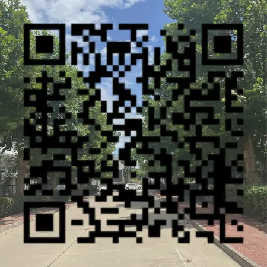

><p style="font-family: 'Microsoft YaHei', sans-serif; line-height: 1.5;">
>作者：数据人阿多
></p>

# 背景
二维码，早已融入我们的日常！扫一扫加好友、支付买单、参加活动……处处可见它的身影。

但你是否想过，自己也能轻松生成专属二维码？无论是分享链接、联系方式，还是传递一句悄悄话，一个专属二维码就能搞定！

想知道如何实现？本文为你准备了详细案例教程，手把手教你玩转二维码生成！👇

# 小编环境
```python
import sys

print('python 版本：',sys.version.split('|')[0])
#python 版本： 3.11.11
```
# 安装qrcode
```bash
pip install "qrcode[pil]"
```
# Demo1
生成普通的二维码图片
```python
"""
===========================
@Time : 2025/7/15 18:40
@File : generate_qr
@Software: PyCharm
@Platform: Win10
@Author : 数据人阿多
===========================
"""

import qrcode

data = input("请输入要生成二维码的内容：")

# 创建二维码配置对象
# version=3：二维码尺寸版本 (1-40)，版本3对应 29x29 模块（自动适配时可省略）
# box_size=8：每个二维码小方块占8像素
# border=4：二维码边缘留白宽度（4个小方块宽度的白色边框）
qr = qrcode.QRCode(version=3, box_size=8, border=4)

# 添加数据
qr.add_data(data)

# 生成数据矩阵
# fit=True：自动选择最小可用版本尺寸
# 若数据过长会自动升级 version 值（覆盖初始设置的version=3）
qr.make(fit=True)

# 渲染图像
# 支持颜色名称/十六进制值
image1 = qr.make_image(fill='Black', back_color='GreenYellow')
image2 = qr.make_image(fill='Black', back_color='#CE8540')

# 保存输出
# 支持其他格式（如 JPG/BMP 需指定后缀）
image1.save('qr_code1.png')
image2.save('qr_code2.jpg')
```


# Demo2
可以把喜欢的图片设置为二维码背景
```python
"""
===========================
@Time : 2025/7/15 18:40
@File : generate_qr_image
@Software: PyCharm
@Platform: Win10
@Author : 数据人阿多
===========================
"""
import qrcode
from PIL import Image, ImageFilter, ImageOps


def create_custom_bg_qrcode(data, bg_path, output_path="qr_code.png",
                            qr_color=(0, 0, 0), overlay_opacity=0.05):
    """
    创建带自定义背景的二维码

    参数:
        data: 二维码数据
        bg_path: 背景图片路径
        output_path: 输出文件路径
        qr_color: 二维码颜色 (R,G,B)
        overlay_opacity: 二维码层不透明度 (0-1)
    """
    # 生成基础二维码
    qr = qrcode.QRCode(version=5,
                       box_size=10,
                       border=4,
                       error_correction=qrcode.constants.ERROR_CORRECT_H)
    qr.add_data(data)
    qr.make(fit=True)
    qr_img = qr.make_image(fill_color="black", back_color="white").convert("RGB")

    # 创建二维码遮罩
    mask = qr_img.convert("L").point(lambda x: 255 if x < 128 else 0)
    mask = mask.filter(ImageFilter.GaussianBlur(1))

    # 处理背景图片
    bg = Image.open(bg_path)
    bg = ImageOps.fit(bg, qr_img.size,
                      method=Image.LANCZOS,
                      bleed=0.0,
                      centering=(0.5, 0.5)
                      )

    # 创建纯色层用于增强对比度
    overlay = Image.new("RGB", qr_img.size, (250, 250, 250))  # 浅灰色背景
    colored_qr = Image.new("RGB", qr_img.size, qr_color)

    # 合成图像
    bg = Image.blend(bg, overlay, 0.15)  # 降低背景复杂度
    composite = Image.composite(colored_qr, bg, mask)

    # 添加原始二维码层以增强识别点
    final = Image.blend(composite, colored_qr, overlay_opacity)

    # 保存结果
    final.save(output_path)
    return output_path


# 使用示例
data = input("请输入要编码的内容：")
bg_path = '背景.jpg'
output = create_custom_bg_qrcode(data, bg_path,output_path='qr_code3.png')
print(f"已生成带背景二维码: {output}")
```


# 历史相关文章
- [Python 一个在本地给图片添加水印的小工具](/Python图像处理/Python-一个在本地给图片添加水印的小工具.md)
- [利用Python对图片进行模糊化处理](/Python图像处理/利用Python对图片进行模糊化处理.md)
- [Python 利用4行代码实现图片灰度化](/Python图像处理/Python-利用4行代码实现图片灰度化.md)

**************************************************************************
**以上是自己实践中遇到的一些问题，分享出来供大家参考学习，欢迎关注微信公众号：DataShare ，不定期分享干货**
