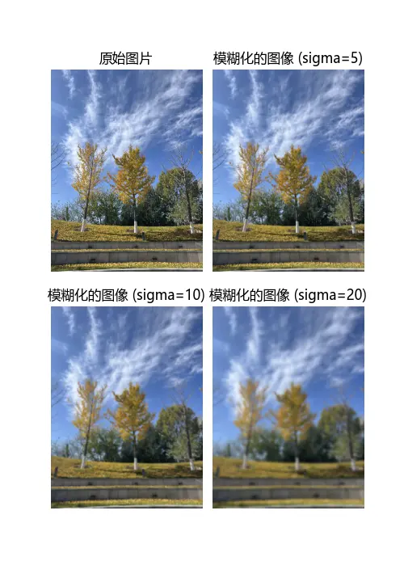

><p style="font-family: 'Microsoft YaHei', sans-serif; line-height: 1.5;">
>作者：数据人阿多
></p>

# 背景
大家在制作视频时，是不是见过一种特效：图片从清晰状态慢慢渐变为模糊状态，视频其实也就是每一帧图片拼接组成，今天就来介绍下怎么把图片模糊化，主要运用的原理就是多维高斯滤波器

# 效果展示


# 小编环境
```python
import sys

print('python 版本：',sys.version.split('|')[0])   
#python 版本： 3.11.4
```
# 完整代码
```python
%matplotlib qt
from scipy import ndimage
from PIL import Image
import matplotlib.pyplot as plt
import numpy as np

#中文乱码的处理
plt.rcParams['font.sans-serif']=['Microsoft YaHei']

def blur_image(image_path):    
    image=np.array(Image.open(image_path))
    image = np.rot90(image,-1)  #对图片顺时针旋转90度
    
    plt.figure(figsize=(5, 15),dpi=100)
    plt.subplot(221)
    plt.imshow(image)
    plt.title("原始图片")
    plt.axis( 'off')
    
    sigma = 5
    blurred_image = np.zeros(image.shape, dtype=np.uint8)
    for i in range(3):  #对图像的每一个通道都应用高斯滤波
        blurred_image[:,:,i] = ndimage.gaussian_filter(image[:,:,i], sigma)
    plt.subplot(222)
    plt.imshow(blurred_image)
    plt.title(f'模糊化的图像 (sigma={sigma})')
    plt.axis('off')
    
    sigma = 10
    blurred_image = np.zeros(image.shape, dtype=np.uint8)
    for i in range(3):  #对图像的每一个通道都应用高斯滤波
        blurred_image[:,:,i] = ndimage.gaussian_filter(image[:,:,i], sigma)
    plt.subplot(223)
    plt.imshow(blurred_image)
    plt.title(f'模糊化的图像 (sigma={sigma})')
    plt.axis('off')
    
    sigma = 20
    blurred_image = np.zeros(image.shape, dtype=np.uint8)
    for i in range(3):  #对图像的每一个通道都应用高斯滤波
        blurred_image[:,:,i] = ndimage.gaussian_filter(image[:,:,i], sigma)
    plt.subplot(224)
    plt.imshow(blurred_image)
    plt.title(f'模糊化的图像 (sigma={sigma})')
    plt.axis('off')
    
    plt.subplots_adjust(top=0.9,
                        bottom=0.1,
                        left=0.125,
                        right=0.9,
                        hspace=0.05,
                        wspace=0.07)
    plt.show()


image_path ='秋天的银杏树.jpg'
blur_image(image_path)
```
# 历史相关文章
- [Python 利用Matplotlib制作初中时圆规画的图](../数据可视化/Python-利用Matplotlib制作初中时圆规画的图.md)
- [Python 利用4行代码实现图片灰度化](./Python-利用4行代码实现图片灰度化.md)
- [Python 利用聚类算法对图片进行颜色压缩](./Python-利用聚类算法对图片进行颜色压缩.md)

**************************************************************************
**以上是自己实践中遇到的一些问题，分享出来供大家参考学习，欢迎关注微信公众号：DataShare ，不定期分享干货**
