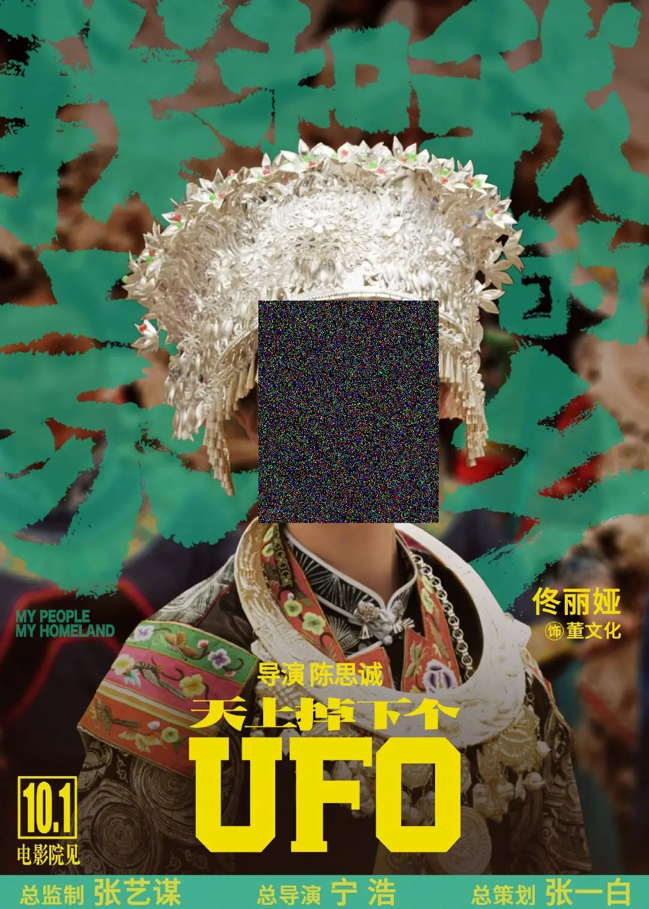

# 背景
最近项目需要用人脸检测技术把视频里面的人脸检测出来后，进行马赛克处理，人脸检测这一块就是大家熟知的利用深度学习技术来解决

之前有相关文章介绍，这篇文章主要介绍马赛克处理过程

[Python 人脸检测方法总结](./Python-人脸检测方法总结.md)

# 马赛克原理
图片是由一个三维数组，打马赛克就是把特定区域的值替换为其他值，项目在做的过程中经过一次升级，最开始用的是`高斯马赛克`，后来应客户的要求，升级为和其他软件手工打的马赛克一样的样式`正规马赛克`
- 高斯马赛克

特定区域值替换为高斯分布数值，可以利用`numpy`中的`np.random.normal(size=(h,w))`来生成一些随机的数值，然后进行替换即可
- 正规马赛克

马赛克的实现原理是把图像上某个像素点一定范围邻域内的所有点用邻域内左上像素点的颜色代替，这样可以模糊细节，但是可以保留大体的轮廓。就是用左上角的那个值，来替换右下方一个小方块的值，逐步进行替换即可。
# 代码
- 高斯马赛克
```python
import cv2
import numpy as np

face_location=[430,500,730,870]  #x1,y1,x2,y2  x1,y1为人脸左上角点；x2,y2为人脸右下角点
img=cv2.imread('./tongliya.jpg')  #opencv读取的是BGR数组

##高斯马赛克
def normal_mosaic(img, x1, y1, x2, y2):
    img[y1:y2, x1:x2, 0] = np.random.normal(size=(y2-y1, x2-x1))
    img[y1:y2, x1:x2, 1] = np.random.normal(size=(y2-y1, x2-x1))
    img[y1:y2, x1:x2, 2] = np.random.normal(size=(y2-y1, x2-x1))
    
    return img

x1=face_location[0]
y1=face_location[1]
x2=face_location[2]
y2=face_location[3]
img_mosaic=normal_mosaic(img, x1, y1, x2, y2)
cv2.imwrite('img_mosaic_normal.jpg',img_mosaic)
```
- 正规马赛克
```python
import cv2
import numpy as np

face_location=[430,500,730,870]  #x1,y1,x2,y2  x1,y1为人脸左上角点；x2,y2为人脸右下角点
img=cv2.imread('./tongliya.jpg')  #opencv读取的是BGR数组

#正规马赛克
def do_mosaic(img, x, y, w, h, neighbor=9):
    """
    :param rgb_img
    :param int x :  马赛克左顶点
    :param int y:  马赛克左顶点
    :param int w:  马赛克宽
    :param int h:  马赛克高
    :param int neighbor:  马赛克每一块的宽
    """
    for i in range(0, h , neighbor):  
        for j in range(0, w , neighbor):
            rect = [j + x, i + y]
            color = img[i + y][j + x].tolist()  # 关键点1 tolist
            left_up = (rect[0], rect[1])
            x2=rect[0] + neighbor - 1   # 关键点2 减去一个像素
            y2=rect[1] + neighbor - 1
            if x2>x+w:
                x2=x+w
            if y2>y+h:
                y2=y+h
            right_down = (x2,y2)  
            cv2.rectangle(img, left_up, right_down, color, -1)   #替换为为一个颜值值
    
    return img

x=face_location[0]
y=face_location[1]
w=face_location[2]-face_location[0]
h=face_location[3]-face_location[1]
img_mosaic=do_mosaic(img, x, y, w, h, neighbor=15)
cv2.imwrite('img_mosaic.jpg',img_mosaic)
```
# 效果

<br/>

<br/>

# 历史相关文章
- [Python 人脸检测方法总结](./Python-人脸检测方法总结.md)
- [利用Python生成手绘效果的图片](./利用Python生成手绘效果的图片.md)

**************************************************************************
**以上是自己实践中遇到的一些问题，分享出来供大家参考学习，欢迎关注微信公众号DataShare，不定期分享干货**
