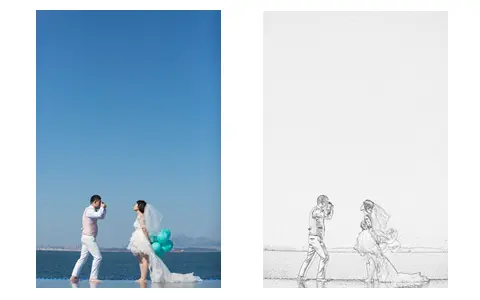
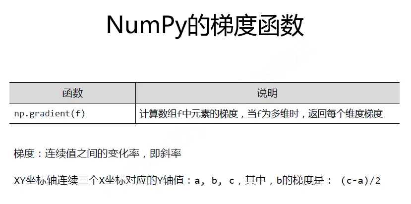
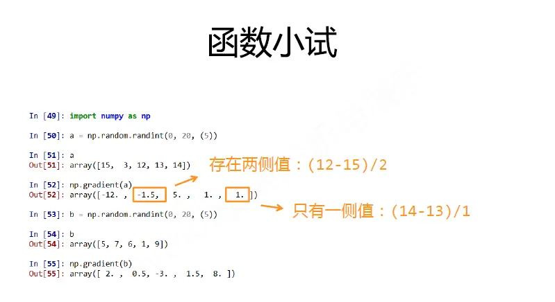
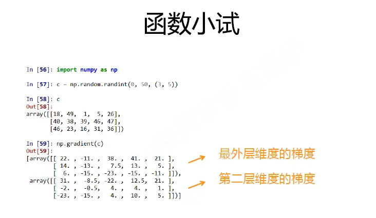
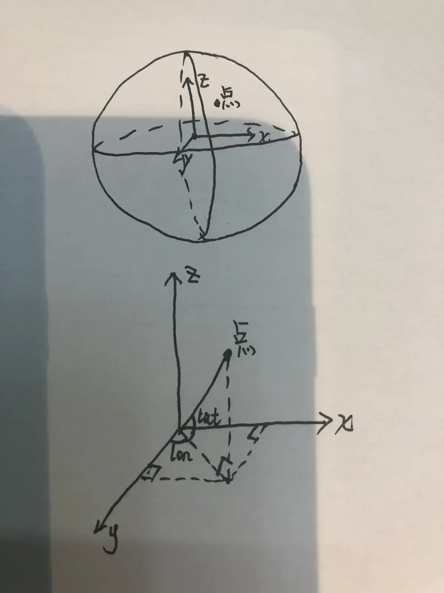
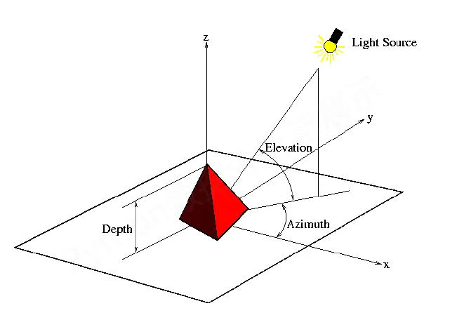
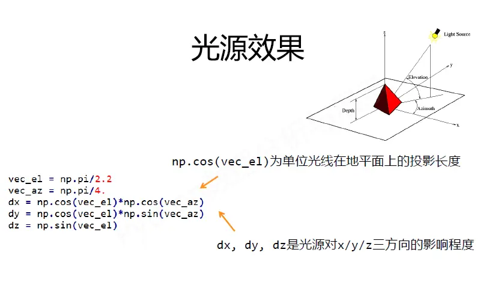
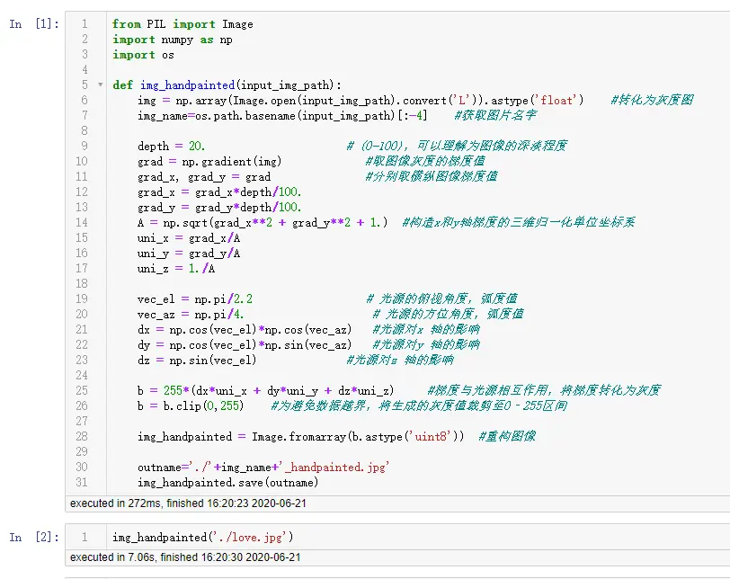

# 手绘效果



# 利用到的数学知识

手绘效果的几个特征：

- **黑白灰色-----------图像灰度转化**
- **边界线条较重-----------梯度**
- **相同或相近色彩趋于白色-----------梯度调整、梯度缩放**
- **略有光源效果-----------投影、三角函数**

---

1. 黑白灰色-----------图像灰度转化
   图像是由红（Red）、绿（Green）、蓝（Blue）三原色来表示真彩色，R分量，G分量，B分量的取值范围均为0~255，正常读取的图片构成的三维矩阵就是图像各像素点的RGB值。
   图像的灰度化，就是让像素点矩阵中的每一个像素点都满足这样的关系：R=G=B，此时的这个值叫做灰度值：
   
   **灰度化后的R =  处理前的R * 0.299+ 处理前的G * 0.587 +处理前的B * 0.114**
   
   **灰度化后的G =  处理前的R * 0.299+ 处理前的G * 0.587 +处理前的B * 0.114**
   
   **灰度化后的B =  处理前的R * 0.299+ 处理前的G * 0.587 +处理前的B * 0.114**

> PIL库里面在灰度转化时，利用的公式
>
> When translating a color image to greyscale (mode "L"),
> the library uses the ITU-R 601-2 luma transform:
>
> L = R * 299/1000 + G * 587/1000 + B * 114/1000

2. 边界线条较重-----------梯度

   **梯度、导数、偏导数、斜度、斜率、神经网络梯度，均为同一个概念**
   
   
   
   
   
3. 相同或相近色彩趋于白色-----------梯度调整、梯度缩放

   grad= grad*alpha 
   
   alpha取[0,1]之间的值，这样使相近颜色的值，梯度缩放到更小，即可认为颜色是差不多一样的，手绘时是白色

4. 略有光源效果-----------投影、三角函数

类似之前分享文章（[利用Python计算两个地理位置之间的中点](./Python数据处理/利用Python计算两个地理位置之间的中点.md)）介绍的经纬度投影





# 完整代码

*可左右滑动查看代码*

```python
from PIL import Image
import numpy as np
import os

def img_handpainted(input_img_path):
    img = np.array(Image.open(input_img_path).convert('L')).astype('float')    #转化为灰度图
    img_name=os.path.basename(input_img_path)[:-4]    #获取图片名字
  
    depth = 20.                      # (0-100)，可以理解为图像的深淡程度
    grad = np.gradient(img)             #取图像灰度的梯度值
    grad_x, grad_y = grad               #分别取横纵图像梯度值
    grad_x = grad_x*depth/100.
    grad_y = grad_y*depth/100.
    A = np.sqrt(grad_x**2 + grad_y**2 + 1.)  #构造x和y轴梯度的三维归一化单位坐标系
    uni_x = grad_x/A
    uni_y = grad_y/A
    uni_z = 1./A

    vec_el = np.pi/2.2                  # 光源的俯视角度，弧度值
    vec_az = np.pi/4.                    # 光源的方位角度，弧度值
    dx = np.cos(vec_el)*np.cos(vec_az)   #光源对x 轴的影响
    dy = np.cos(vec_el)*np.sin(vec_az)   #光源对y 轴的影响
    dz = np.sin(vec_el)              #光源对z 轴的影响

    b = 255*(dx*uni_x + dy*uni_y + dz*uni_z)     #梯度与光源相互作用，将梯度转化为灰度
    b = b.clip(0,255)    #为避免数据越界，将生成的灰度值裁剪至0‐255区间

    img_handpainted = Image.fromarray(b.astype('uint8'))  #重构图像
  
    outname='./'+img_name+'_handpainted.jpg'
    img_handpainted.save(outname)

img_handpainted('./love.jpg')
```



# 手绘效果


# 历史相关文章

- [利用Python计算两个地理位置之间的中点](./Python数据处理/利用Python计算两个地理位置之间的中点.md)
- [Python基于opencv “三维”旋转图片，解决日常小问题](./Python基于opencv-“三维”旋转图片，解决日常小问题.md)
