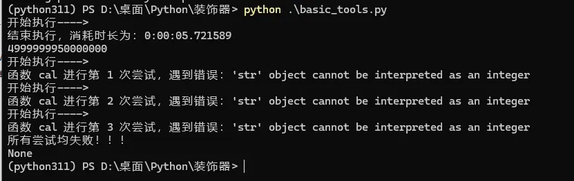

><p style="font-family: 'Microsoft YaHei', sans-serif; line-height: 1.5;">
>作者：数据人阿多
></p>

# 背景
装饰器：Python开发者的效率利器！ 🛠️

在Python的世界里，装饰器绝对是一把强大的“瑞士军刀”。它能帮我们优雅地封装通用逻辑，大幅减少重复代码，真正实现事半功倍的开发效率。

如果你是第一次接触装饰器这个概念，强烈建议先找些基础资料了解一下它的核心思想和工作原理（别担心，小编当初也是一头雾水，看别人的代码完全摸不着头脑）。打好基础再往下看，理解起来会顺畅得多，相信小编！

# 小编环境
```python
import sys

print('python 版本：',sys.version.split('|')[0])
#python 版本： 3.11.11
```
# 计算耗时
想知道函数执行耗时？一个装饰器轻松搞定！⏱️

还在手动写 `time.time()` 包裹你的函数来计算耗时吗？太麻烦啦！只需几行代码定义一个计时装饰器，轻轻松松给任何函数“戴上”，就能自动获取精准的执行时间

```python
def time_it(func):
    @wraps(func)  # 保留原始函数的元数据
    def wrapper(*args, **kwargs):
        print("开始执行---->")
        start_time=datetime.datetime.now()
        result = func(*args, **kwargs)
        end_time=datetime.datetime.now()
        print(f"结束执行，消耗时长为：{end_time - start_time}")
        return result
    return wrapper
```

# 重试机制
在程序中调用外部API、访问数据库或进行网络请求时，网络环境的不稳定性往往是导致程序“意外扑街”的头号元凶！面对这种不可控因素，与其祈祷网络永远畅通，不如主动出击——引入重试机制，来增加程序的健壮性

```python
def retry(func=None,*,times=3):
    if func is None:
        return partial(retry,times=times)
    
    @wraps(func)
    def wrapper(*args,**kwargs):
        for attempt in range(1,times+1):
            try:
                return func(*args,**kwargs)
            except Exception as exc:
                print(f"函数 {func.__name__} 进行第 {attempt} 次尝试，遇到错误：{exc}")
                sleep(SLEEP_TIME * attempt)
        print(f"所有尝试均失败！！！")
        return None
    
    return wrapper
```

# 完整代码
```python
from time import sleep
import datetime
from functools import wraps,partial  # 导入 wraps 装饰器

SLEEP_TIME=1

def time_it(func):
    @wraps(func)  # 保留原始函数的元数据
    def wrapper(*args, **kwargs):
        print("开始执行---->")
        start_time=datetime.datetime.now()
        result = func(*args, **kwargs)
        end_time=datetime.datetime.now()
        print(f"结束执行，消耗时长为：{end_time - start_time}")
        return result
    return wrapper


def retry(func=None,*,times=3):
    if func is None:
        return partial(retry,times=times)
    
    @wraps(func)
    def wrapper(*args,**kwargs):
        for attempt in range(1,times+1):
            try:
                return func(*args,**kwargs)
            except Exception as exc:
                print(f"函数 {func.__name__} 进行第 {attempt} 次尝试，遇到错误：{exc}")
                sleep(SLEEP_TIME * attempt)
        print(f"所有尝试均失败！！！")
        return None
    
    return wrapper
    

if __name__=='__main__':
    
    @retry
    @time_it
    def cal(x):
        total=0
        for i in range(x):
            total += i
            
        return total 
    
    print(cal(100000000))
    print(cal('100000'))
    
```

运行测试结果


# 历史相关文章
- [Python中的Lambda匿名函数](/Python数据处理/Python中的Lambda匿名函数.md)
- [Python利用partial偏函数，生成不同的聚合函数](/Python基础库/Python利用partial偏函数，生成不同的聚合函数.md)
- [Python-内建模块-bisect，数组二分查找算法](/Python基础库/Python-内建模块-bisect，数组二分查找算法.md)

**************************************************************************
**以上是自己实践中遇到的一些问题，分享出来供大家参考学习，欢迎关注微信公众号：DataShare ，不定期分享干货**
