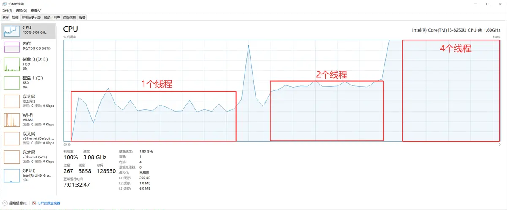
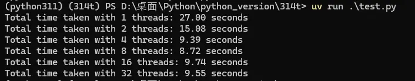

# 背景
Python 3.14 自2025年10月7日发布以来，已在技术社区中积累了丰富的实践与评测资料。目前国内的相关文章大多译自国外大神的博客文章，内容都很“高大上”，但在普遍适用性方面尚缺乏贴近实际的基础案例。为此，本文旨在提供一个通用的实践示例，作为后续深入研究和学习的baseline

# 名词解释
**自由线程**、**无GIL**与英文术语 **Free-threaded** 同义，均指代同一项核心语言特性，即代码在执行时不再受全局解释器锁（GIL）的约束

# 小编环境
```bash
#Win10 系统  安装uv 
pip install uv 

uv -V  
#uv 0.9.0 (39b688653 2025-10-07)

python -VV
#Python 3.14.0 free-threading build (main, Oct  7 2025, 15:34:02) [MSC v.1944 64 bit (AMD64)]
```
# 测试结果图




# 安装python3.14无GIL解释器
目前，Python官方的标准构建版本仍默认包含全局解释器锁（GIL）。若需使用无GIL的解释器，开发者需从源代码自行构建，或选用由社区提供的预编译版本。值得注意的是，工具 `uv` 现已提供预编译的无GIL解释器，支持用户直接安装使用。

```bash
mkdir 314t && cd 314t  #创建目录

uv init  #初始化项目
uv python list #查看所有可用的python版本
uv python install cpython-3.14.0+freethreaded-windows-x86_64-none  #安装无GIL版本
uv python pin 3.14t #切换项目解释器
```
# 测试代码
```python
#test.py
import time
import threading
import queue

N = 3_0000_0000  #模拟任务量


def cpu_bound_task(n, thread_id, q):
   count = 0
   for i in range(n):
       count += i * i
   q.put(count)


def run_with_threads(num_threads):
   threads = []
   start = time.time()
   q = queue.Queue()
   for i in range(num_threads):
       t = threading.Thread(
           target=cpu_bound_task,
           args=(N // num_threads, i, q)  #每个线程计算 1/n
       )

       threads.append(t)
       t.start()
       
   for t in threads:
       t.join()
   end = time.time()
   print(f"Total time taken with {num_threads} threads: {end - start:.2f} seconds")
   
   
if __name__ == "__main__":
   for num in [1, 2, 4, 8, 16, 32]:
       run_with_threads(num)
```

**运行测试代码：**
小编电脑是物理4核，启动4个线程时，CPU利用率达到100%
```bash
uv run test.py
#Total time taken with 1 threads: 27.00 seconds
#Total time taken with 2 threads: 15.08 seconds
#Total time taken with 4 threads: 9.39 seconds
#Total time taken with 8 threads: 8.72 seconds
#Total time taken with 16 threads: 9.74 seconds
#Total time taken with 32 threads: 9.55 seconds
```
# 历史相关文章
- [Python 标准库之pathlib（二），路径操作](https://www.jianshu.com/p/b72b946a5c82)
- [Python 项目管理新思路：用 uv Workspace 共享虚拟环境，省时省空间！](https://www.jianshu.com/p/c68ffea87816)
- [Python 新晋包项目工具uv的简单尝试](https://www.jianshu.com/p/b6b8f810bf4f)

**************************************************************************
**以上是自己实践中遇到的一些问题，分享出来供大家参考学习，欢迎关注微信公众号：DataShare ，不定期分享干货**
