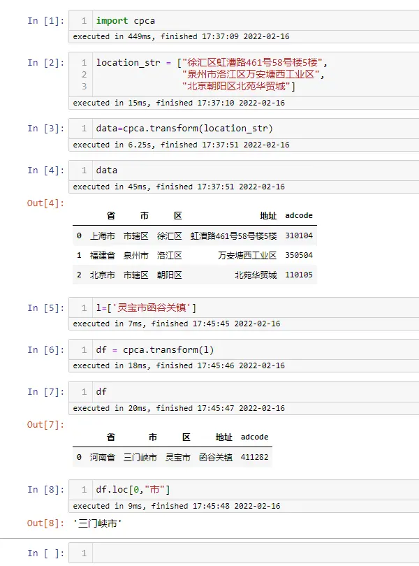
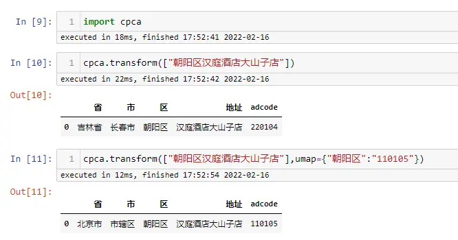

# 简介
gihub地址：
[https://github.com/DQinYuan/chinese_province_city_area_mapper](https://github.com/DQinYuan/chinese_province_city_area_mapper)

`cpca`---chinese province city area，**一个用于提取简体中文字符串中省，市和区并能够进行映射，检验和简单绘图的python模块**

>["徐汇区虹漕路461号58号楼5楼", "泉州市洛江区万安塘西工业区"] <br/>
↓ <br/> 
>
>|省    |市   |区    |地址                 | 
>|:--:|:--:|:--:|:--:|
>|上海市|上海市|徐汇区|虹漕路461号58号楼5楼  |  
>|福建省|泉州市|洛江区|万安塘西工业区        |  
>  
>“地址”列：代表去除了省市区之后的具体地址

# 安装介绍
该库目前仅支持Python3，在命令行直接进行安装即可：
`pip install cpca`

**windows 中需要C/C++编译环境的支持**，需要下载另外的软件，然后再进行安装
http://go.microsoft.com/fwlink/?LinkId=691126

编译环境的安装教程：
https://o7planning.org/11467/install-microsoft-visual-cpp-build-tools

# 基本使用方法
#### 常规用法
会自动补全相应的省、市、区



```python
import cpca

location_str = ["徐汇区虹漕路461号58号楼5楼", 
                "泉州市洛江区万安塘西工业区", 
                "北京朝阳区北苑华贸城"]

data=cpca.transform(location_str)

data

l=['灵宝市函谷关镇']

df = cpca.transform(l)
df

df.loc[0,"市"]
```

<br/>

#### 重名情况
中国的区级行政单位非常的多，经常有重名的情况，比如“北京市朝阳区”和“吉林省长春市朝阳区”，当有上级地址信息的时候，cpca 能够根据上级地址 推断出这是哪个区，但是如果没有上级地址信息，单纯只有一个区名的时候， cpca 就没法推断了，只能随便选一个了， 通过 umap 参数你可以指定这种情况下该选择哪一个



从例子可以看出，umap 字典的 key 是区名，value 是区的 adcode，这里 `110105` 就是北京市朝阳区的 adcode，具体的 adcode 可以去全国行政区划查询平台上查询

**全国行政区划查询平台：** http://xzqh.mca.gov.cn/map

# 历史相关文章
- [Python 基于pyecharts自定义经纬度热力图可视化](../数据可视化/Python-基于pyecharts自定义经纬度热力图可视化.md)
- [利用Python计算两个地理位置之间的中点](../Python数据处理/利用Python计算两个地理位置之间的中点.md)

**************************************************************************
**以上是自己实践中遇到的一些问题，分享出来供大家参考学习，欢迎关注微信公众号：DataShare ，不定期分享干货**
