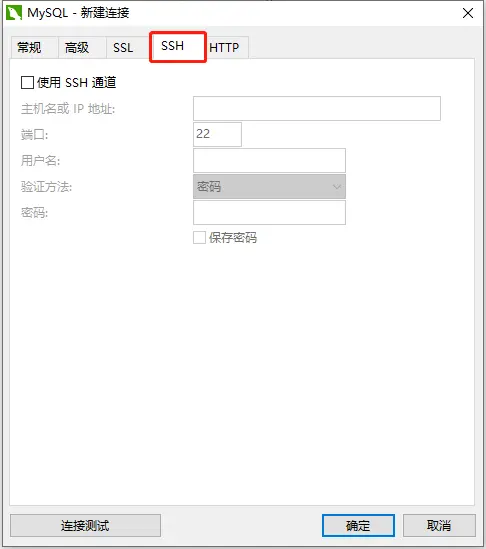

# 背景
如果需要访问远程服务器的Mysql数据库，但是该Mysql数据库为了安全期间，安全措施设置为只允许本地连接（也就是你需要登录到该台服务器才能使用），其他远程连接是不可以直接访问，并且相应的端口也做了修改，那么就需要基于ssh来连接该数据库。这种方式连接数据库与Navicat里面界面化基于ssh连接一样。




# 安装支持库
- 如果要连接Mysql，首先需要安装pymysql
```python
pip install pymysql
```
- 安装基于ssh的库sshtunnel
```python
pip install sshtunnel    #当前最新 0.3.1版
```
*建议安装最新的sshtunnel库，旧版本库有一些bug*
# 连接Mysql
基于ssh连接Mysql可以查看sshtunnel的文档，里面有一些案例
```python
with SSHTunnelForwarder(
        ('192.168.1.1', 2222),
        ssh_password='123456',
        ssh_username='root',
        remote_bind_address=('127.0.0.1', 3306)) as server:
    print('SSH连接成功')
    conn = pymysql.connect(host='127.0.0.1',
                           port=server.local_bind_port,
                           user='root',
                           database='data',
                           charset='utf8')
    print('mysql数据库连接成功')
    cursor = conn.cursor()
    ...  #获取数据操作，此处省略
    cursor.close()
    conn.close()
```
# 自定义查询函数
可以对上面的连接进行封装为一个函数，方便其他地方使用
```python
def mysql_ssh(sql,args=None):
    with SSHTunnelForwarder(
            ('192.168.1.1', 2222),
            ssh_password='123456',
            ssh_username='root',
            remote_bind_address=('127.0.0.1', 3306)) as server:
        print('SSH连接成功')
        conn = pymysql.connect(host='127.0.0.1',
                               port=server.local_bind_port,
                               user='root',
                               database='data',
                               charset='utf8')
        print('mysql数据库连接成功')
        cursor = conn.cursor()
        print('游标获取成功')
        try:
            print(f'执行查询语句：{sql}  参数：{args}')
            cursor.execute(sql,args)
            print('数据查询成功')
            conn.commit()
            print('事务提交成功')
            datas = cursor.fetchall()
            success = True
        except:
            print('数据查询失败')
            datas = None
            success = False

        print('正在关闭数据库连接')
        cursor.close()
        conn.close()

    return datas, success
```
**注意点：**
- 在使用数据库时，`conn.commit()`、`cursor.close()`、`conn.close()`
这些一定要规范使用，防止不必要的bug
- 传入参数时建议用这种方式`cursor.execute(sql,args)`，防止sql注入的风险

# 历史相关文章
- [Python加载txt数据乱码问题升级版解决方法](../Python数据处理/Python加载txt数据乱码问题升级版解决方法.md)
- [Python文件打包成exe可执行程序](./Python文件打包成exe可执行程序.md)
**************************************************************************
**以上是自己实践中遇到的一些问题，分享出来供大家参考学习，欢迎关注 DataShare （同微），不定期分享干货**
