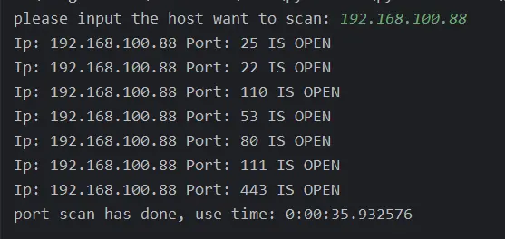
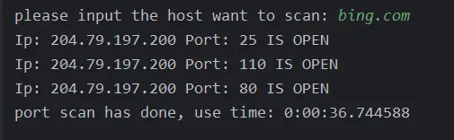

# 背景
端口扫描技术广泛应用于网络运维、网络安全测试、以及黑客攻击服务器等领域。在网络运维中，管理员通过端口扫描来检查服务器或设备的开放端口，确保网络安全并及时发现潜在的漏洞。在网络安全测试中，端口扫描帮助识别网络中的弱点，进而制定防护措施，提升整体安全性。而在黑客攻击的情境下，攻击者通过端口扫描发现目标设备开放的服务，从而寻找攻击入口点，实施非法入侵。因此，端口扫描不仅是安全防护的一个重要工具，也常被黑客用作攻击手段。

本篇文章的目的是通过构建一个端口扫描工具，深入探讨如何在Python中利用协程进行高效的网络端口扫描。传统的端口扫描通常是串行的，效率较低，尤其在扫描大量IP时，耗时非常长。借助Python的协程特性，我们可以实现高并发的网络扫描，显著提高扫描速度，并且在处理多个任务时能够有效地节省系统资源。通过实践这一过程，读者不仅可以掌握端口扫描的基本原理，还能进一步理解如何在Python中高效地使用协程来解决实际问题。

# 小编环境
```python
import sys

print('python 版本：',sys.version)
#python 版本： 3.11.11 | packaged by Anaconda, Inc. | 
#(main, Dec 11 2024, 16:34:19) [MSC v.1929 64 bit (AMD64)]
```
# 效果
**直接扫描IP地址：**


**扫描域名：**



# 完整代码
```python
import asyncio
import socket
from datetime import datetime


class ScanPort:
    def __init__(self, concurrency_limit=100):
        self.ip = None
        self.concurrency_limit = concurrency_limit  # 并发限制，默认是 100

    async def scan_port(self, port, semaphore):
        try:
            # 获取信号量
            async with semaphore:
                # 创建异步 TCP 连接
                conn = asyncio.open_connection(self.ip, port)
                reader, writer = await asyncio.wait_for(conn, timeout=1)
                writer.close()
                await writer.wait_closed()
                print(f'Ip: {self.ip} Port: {port} IS OPEN')
        except (asyncio.TimeoutError, ConnectionRefusedError, OSError):
            pass  # 忽略连接超时或端口未开启的错误

    async def scan_ports(self):
        semaphore = asyncio.Semaphore(self.concurrency_limit)  # 限制最大并发数
        tasks = []

        for port in range(1, 65536):  # 要扫描的端口范围
            tasks.append(self.scan_port(port, semaphore))  # 为每个端口创建一个异步任务

        await asyncio.gather(*tasks)  # 并发执行所有任务

    def start(self):
        host = input("please input the host want to scan: ")
        self.ip = socket.gethostbyname(host)  # 获取主机的 IP 地址
        start_time = datetime.now()

        # 执行异步扫描
        asyncio.run(self.scan_ports())

        print("port scan has done, use time:", datetime.now() - start_time)

if __name__ == "__main__":
    # 运行扫描程序
    ScanPort(concurrency_limit=2000).start()  # 设置并发量限制为2000
```
# 历史相关文章
- [Python-利用aiohttp异步流式下载文件](/Python数据处理/Python-利用aiohttp异步流式下载文件.md)
- [Python-利用协程采集想看的《人世间》下载地址](/数据采集/Python-利用协程采集想看的《人世间》下载地址.md)

**************************************************************************
**以上是自己实践中遇到的一些问题，分享出来供大家参考学习，欢迎关注微信公众号：DataShare ，不定期分享干货**
