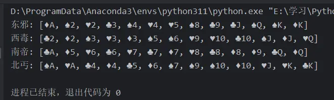

# 背景
最近在看《Python - 100天从新手到大师》时，运行了一下代码，感觉挺有意思。一个简单的小游戏，包含了pyhon的很多知识，分享出来，供大家参考学习

小编对扑克牌的排序进行了简单修改，使相同大小的牌放在一起

>《Python - 100天从新手到大师》，感兴趣的同学可以去学习该教程 <br/>
地址：https://github.com/jackfrued/Python-100-Days

# 发牌结果




# 小编环境
```python
import sys

print('python 版本：',sys.version.split('|')[0])   
#python 版本： 3.11.4
```

# 完整代码
```python
"""
===========================
@Software: PyCharm
@Platform: Win10
@Author : DataShare
===========================
"""

from enum import Enum, unique
import random


@unique
class Suite(Enum):
    """花色"""

    SPADE, HEART, CLUB, DIAMOND = range(4)

    def __lt__(self, other):
        return self.value < other.value


class Card:
    """牌"""

    def __init__(self, suite, face):
        """初始化方法"""
        self.suite = suite
        self.face = face

    def show(self):
        """显示牌面"""
        suites = ['♠︎', '♥︎', '♣︎', '♦︎']
        faces = ['', 'A', '2', '3', '4', '5', '6',
                 '7', '8', '9', '10', 'J', 'Q', 'K']
        return f'{suites[self.suite.value]}{faces[self.face]}'

    def __repr__(self):
        return self.show()


class Poker:
    """扑克"""

    def __init__(self):
        self.index = 0
        self.cards = [Card(suite, face)
                      for suite in Suite
                      for face in range(1, 14)]

    def shuffle(self):
        """洗牌（随机乱序）"""
        random.shuffle(self.cards)
        self.index = 0

    def deal(self):
        """发牌"""
        card = self.cards[self.index]
        self.index += 1
        return card

    @property
    def has_more(self):
        return self.index < len(self.cards)


class Player:
    """玩家"""

    def __init__(self, name):
        self.name = name
        self.cards = []

    def get_one(self, card):
        """摸一张牌"""
        self.cards.append(card)

    def sort(self, comp=lambda card: (card.face, card.suite)):
        """整理手上的牌"""
        self.cards.sort(key=comp)


def main():
    """主函数"""
    poker = Poker()
    poker.shuffle()
    players = [Player('东邪'), Player('西毒'), 
               Player('南帝'), Player('北丐')]
    while poker.has_more:
        for player in players:
                player.get_one(poker.deal())
    for player in players:
        player.sort()
        print(player.name, end=': ')
        print(player.cards)

if __name__ == '__main__':
    main()

```

# 历史相关文章
- [Python 标准库之pathlib，路径操作](./Python-标准库之pathlib，路径操作.md)
- [Python 记录re正则模块，方便后期查找使用](./Python-记录re正则模块，方便后期查找使用.md)
- [Python 内建模块 bisect，数组二分查找算法](./Python-内建模块-bisect，数组二分查找算法.md)

**************************************************************************
**以上是自己实践中遇到的一些问题，分享出来供大家参考学习，欢迎关注微信公众号：DataShare ，不定期分享干货**
