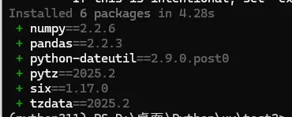
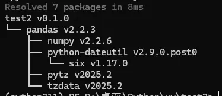

><p style="font-family: 'Microsoft YaHei', sans-serif; line-height: 1.5;">
>作者：数据人阿多
></p>

# 背景
小编最近看公众号里面 `uv` 文章比较多，于是也尝试着用了一下，整体感觉对于开发项目人员来说很好，方便自动管理项目依赖，后期在部署时，可以根据 `uv` 自动构建的项目依赖来进行配置，省去各种包冲突麻烦

# 小编环境
```python
import sys

print('python 版本：',sys.version.split('|')[0])
#python 版本： 3.11.11
```
# 安装uv
自己本地已经安装了python，可以直接使用 pip 进行安装
```bash
pip install uv -i https://pypi.tuna.tsinghua.edu.cn/simple

uv --version
#uv 0.7.3 (3c413f74b 2025-05-07)
```
# uv各命令
- **初始化项目**

初始化项目时，可以指定python版本
```
uv init test1 
uv init test2 -p 3.11
uv init test3 --python 3.11
```

- **添加依赖**

用于安装包并自动更新项目配置文件（pyproject.toml）和锁定文件（uv.lock）

uv add 可以理解为 uv pip install的增强版，底层同样是利用了pip进行安装，但是uv add额外增加了更新项目配置文件的功能
```
uv add pandas -i https://pypi.tuna.tsinghua.edu.cn/simple
```


- **删除依赖**
也会自动删除pandas依赖的其他包
```
uv remove pandas
```
- **显示完整依赖树**
```
uv tree
```


- **uv python 命令**
```
list	列出可用的Python安装版本
install	下载并安装Python版本
find	显示当前Python安装位置
pin	固定使用特定Python版本
dir	显示uv Python安装目录
uninstall	卸载Python版本
```

- **uv 升级，自己升级**
```
uv self update
```

- **设置全局默认python版本**
```
uv python pin --global 3.11
```

- **安装python版本**
```
uv python install 3.13
```
- **显示已安装的 Python 版本路径**
```
uv python dir
```

# 历史相关文章
- [Python中一个构建-web-页面的神奇库-streamlit](/Web/Python中一个构建-web-页面的神奇库-streamlit.md)
- [Python-基于pyhive库操作hive](/Python数据处理/Python-基于pyhive库操作hive.md)
- [Python-基于plotly库快速画旭日图](/数据可视化/Python-基于plotly库快速画旭日图.md)

**************************************************************************
**以上是自己实践中遇到的一些问题，分享出来供大家参考学习，欢迎关注微信公众号：DataShare ，不定期分享干货**
