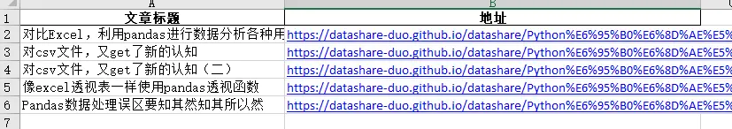
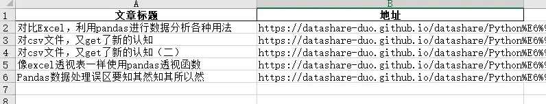

# 背景
在日常数据处理中，你是否遇到过这样的困扰？😫

当你使用 **pandas 的 `to_excel` 方法导出包含网址的数据时，pandas会“自作主张”地将这些URL转换为Excel可点击的超链接**。这个看似贴心的功能，实际上却暗藏两个让人头疼的问题：

🚨 **数量超标危机**

- Excel单个工作表最多只能容纳65,530个超链接

- 一旦超过这个限制，程序就会报错，或者更糟糕——静默丢弃超出的部分，导致数据丢失！

🚨 **长度截断陷阱**

- 自动转换为超链接时，Excel对URL长度有严格限制（通常为255个字符）

- 超过这个长度的链接会被无情截断，生成无效的超链接

**那么，有没有办法让pandas“安分守己”，老老实实地将URL保存为普通文本呢？**

答案是肯定的！本文将为你揭秘如何通过简单的设置，彻底告别这些烦恼，确保你的URL数据完整无缺地导出到Excel中。

无论你是数据分析师、爬虫工程师，还是日常需要处理大量URL的办公人员，这个技巧都将为你的工作带来极大的便利！✨

*接下来，让我们一起来看看具体的实现方法……*

# 小编环境
```python
import sys

print('python 版本：',sys.version.split('|')[0])
#python 版本： 3.11.11

import pandas as pd
print("pandas 版本：", pd.__version__)
#pandas 版本： 2.2.2
```
# 默认带url导出
默认导出Excel文件时，带URL的单元格，自动会变为超链接的形式，显示为蓝色的样式
```
import pandas as pd

data=pd.read_excel("url测试数据.xlsx", dtype='str', engine='openpyxl')
data.to_excel('url测试数据-默认带url导出.xlsx',index=False)
```


# 禁止URL转换
禁止URL转换后，输出的单元格是不带超链接
```
import pandas as pd

data=pd.read_excel("url测试数据.xlsx", dtype='str', engine='openpyxl')
with pd.ExcelWriter('url测试数据-禁止URL转换.xlsx', 
                    engine='xlsxwriter', 
                    engine_kwargs={'options': {'strings_to_urls': False}}
                   ) as xlsx:
    data.to_excel(xlsx,index=False)
```



# 历史相关文章
- [Python-pandas中重排列与列重名](/Python数据处理/Python-pandas中重排列与列重名.md)
- [Python-pandas-2-0-初探](/Python数据处理/Python-pandas-2-0-初探.md)
- [对比Excel，利用pandas进行数据分析各种用法](/Python数据处理/对比Excel，利用pandas进行数据分析各种用法.md)

**************************************************************************
**以上是自己实践中遇到的一些问题，分享出来供大家参考学习，欢迎关注微信公众号：DataShare ，不定期分享干货**
