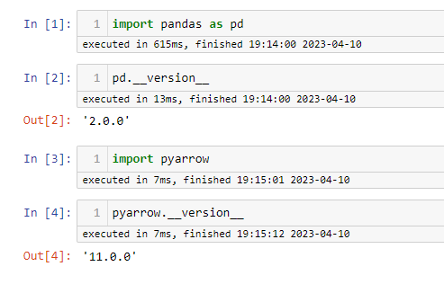
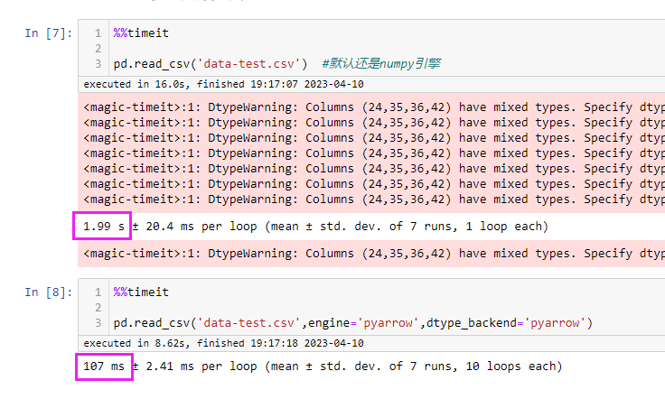
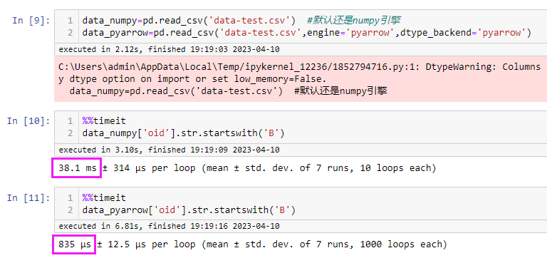
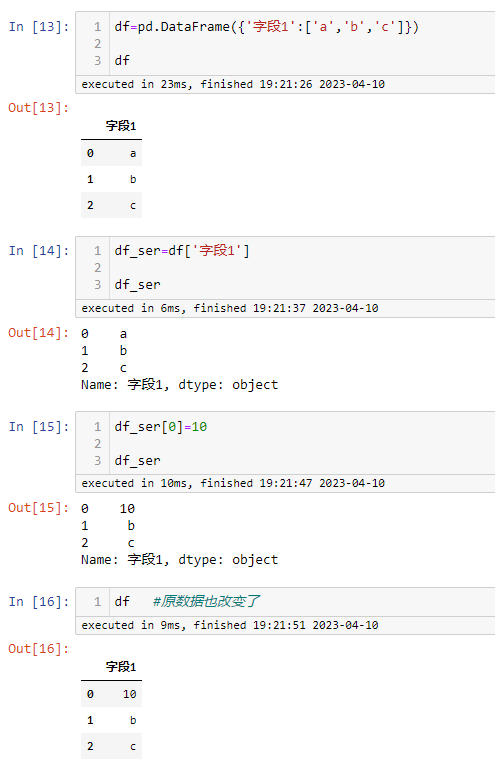
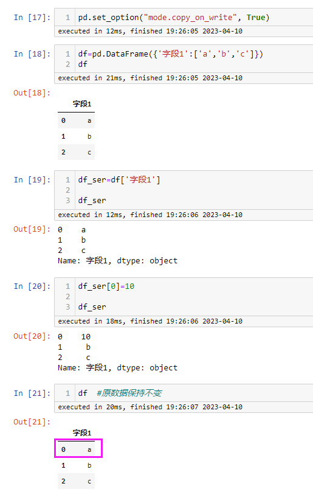

# 背景
每门编程语言都有其独特的用途，目前python在数据科学方面发展的相对比较全面，大家目前也都喜欢使用python来处理数据、做模型开发等。python在数据处理方面离不开 `pandas` 库，该库在今年的4月3日发布了 2.0版更新，对底层进行了大量的重构以优化性能和稳定性

# 主要新增功能及优化
**1、引擎增加pyarrow**

最主要是底层的数据引擎增加了对pyarrow支持（Apache Arrow 内存数据交换格式），`pandas`之前的底层引擎是`numpy`，`numpy`在处理数值型数据时效率很高，但是在处理字符串型的数据时效率比较慢，`pyarrow`的引入，使字符串的处理效率得到明显提升

**2、写入时复制（Copy-on-Write）的优化**

当你复制一个`pandas`对象，如`DataFrame`或`Series`，而不是立即创建一个新的数据副本，`pandas`将创建一个对原始数据的引用（视图），推迟创建一个新的副本，直到你以某种方式修改数据时才创建一个副本，而原数据保持不变，

这可以大大减少内存的使用，提高性能，因为你不需要对数据进行不必要的复制。总的来说，写时拷贝是一种强大的优化技术，可以帮助你更有效地处理大型数据集，并减少内存占用


# 安装
必须要安装`pyarrow`库，否则运行时会报错
```cmd
pip install --upgrade pandas    #更新pandas库
pip install pyarrow             #安装pyarrow库
```



# 测试
测试数据是有12W+行数据

**1、加载数据测试**

从加载csv数据可以看出，速度有明显的提升，差不多有10倍



**2、字符串处理测试**

从字符串处理方面看，速度大约是原来的40倍


**3、修改时复制机制**

- 默认该机制是关闭的，修改视图数据时，原始数据也会被修改



- 打开修改时复制机制，修改视图数据时，原始数据保持不变



# 历史相关文章
- [Python pandas 数据筛选与赋值升级版详解](./Python-pandas-数据筛选与赋值升级版详解.md)
- [Python pandas 里面的数据类型坑，astype要慎用](./Python-pandas-里面的数据类型坑，astype要慎用.md)
- [Python pandas.str.replace 不起作用](./Python-pandas-str-replace-不起作用.md)

**************************************************************************
**以上是自己实践中遇到的一些问题，分享出来供大家参考学习，欢迎关注微信公众号：DataShare ，不定期分享干货**
