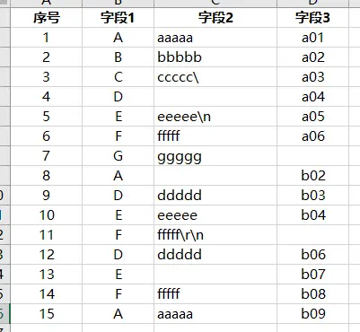
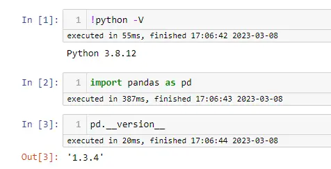
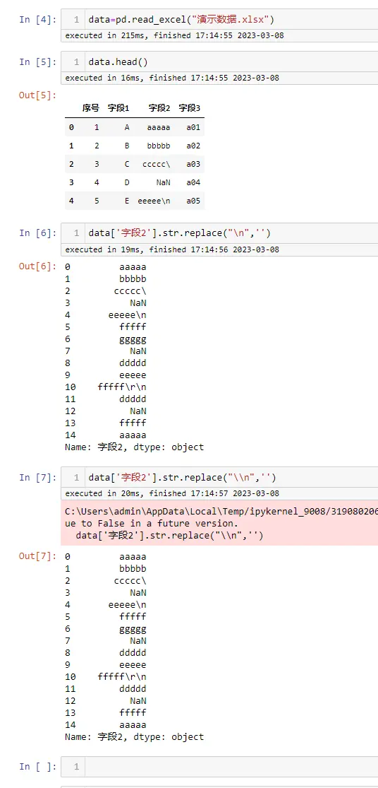
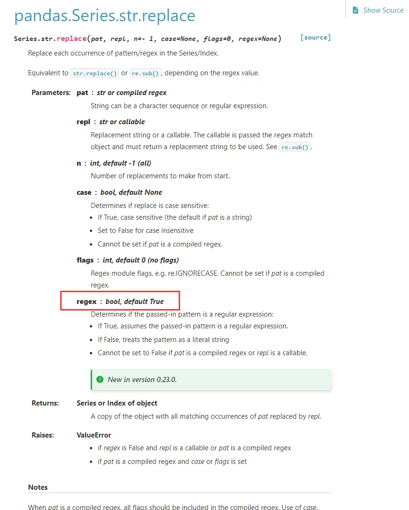
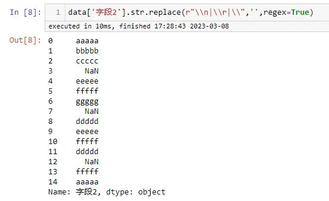
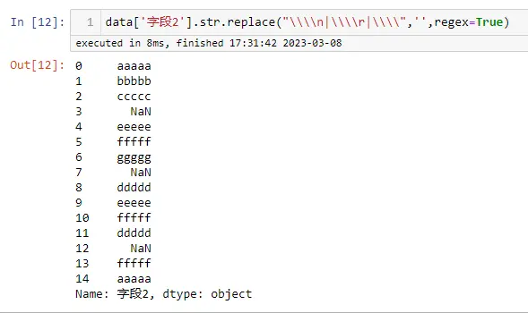
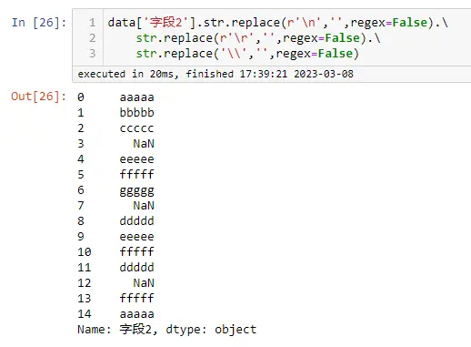

# 背景
最近在处理别人给的数据时，大概 700w+ 行数据，发现有的字段里面存在换行符、斜杠等一些特殊字符，于是想着就用Python来处理下，因为Pandas处理数据还是很方便，结果发现这些转义字符： `\n`、`\r`、`\` 一直替换不掉，后来经过研究成功替换，分享出来供大家参考

# 演示数据

# python 与 pandas版本
*特意说一下版本，现在不同的版本功能可能不一样*

# 问题复现
因为涉及到字符串替换，所以直接想到的方法是用 `pandas.Series.str.replace` 来进行替换，但是一直不能成功，即使双斜杠也不行

# 问题解决
在上面第7个单元格运行时，报了一个错误，`FutureWarning: The default value of regex will change from True to False in a future version.`

于是就翻看了 `pandas.Series.str.replace` 的官方文档：

http://pandas.pydata.org/pandas-docs/stable/reference/api/pandas.Series.str.replace.html

文档中写了 `regex：bool, default True`，正则默认是开启的

**个人经验：正则表达式来处理转义字符是比较麻烦的事，因为里面的斜杠不知道要写几个，总是记不住**

 

**经过测试如下几种方法，可行：**

***方法1：***

明确使用正则来处理，并且使用原字符 `r`

***方法2：***

明确使用正则来处理，正常的写法，经测试需要4个斜杠 

***方法3：***

不使用正则来处理，但是在处理单个斜杠时，必须用2个

# 历史相关文章
- [Python pandas在读取csv文件时（linux与windows之间传输），数据行数不一致的问题](./Python-pandas在读取csv文件时（linux与windows之间传输），数据行数不一致的问题.md)
- [Python pandas 里面的数据类型坑，astype要慎用](./Python-pandas-里面的数据类型坑，astype要慎用.md)
- [Python pandas 数据筛选与赋值升级版详解](./Python-pandas-数据筛选与赋值升级版详解.md)

**************************************************************************
**以上是自己实践中遇到的一些问题，分享出来供大家参考学习，欢迎关注微信公众号：DataShare ，不定期分享干货**

