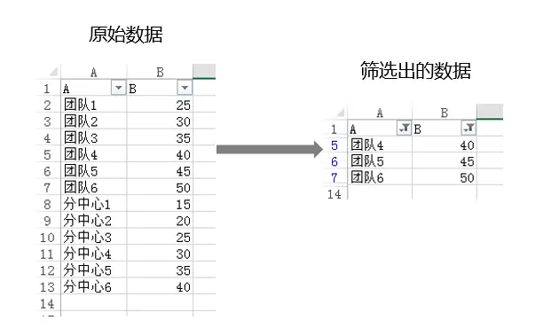
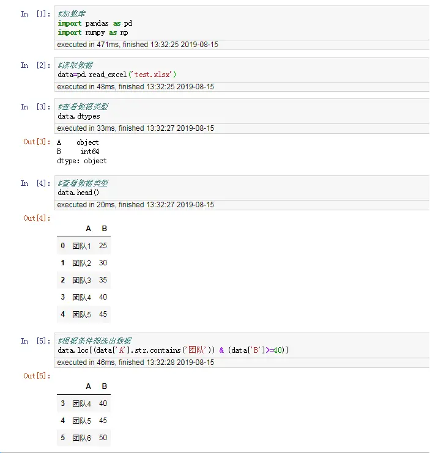
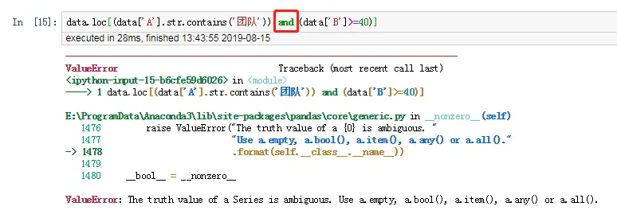
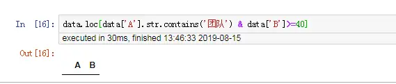
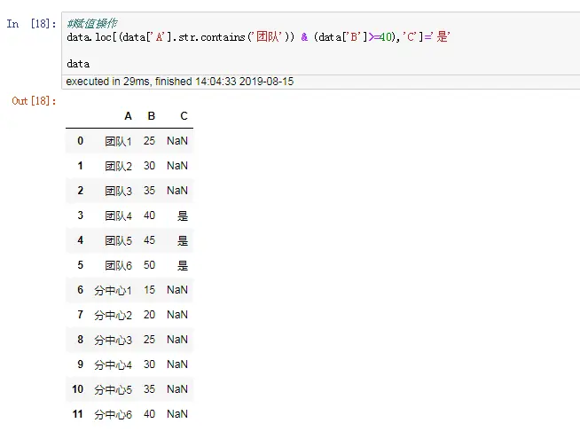
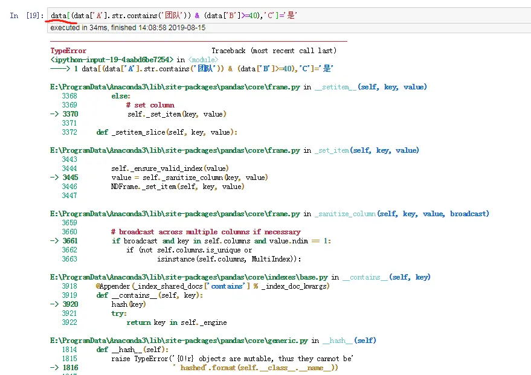
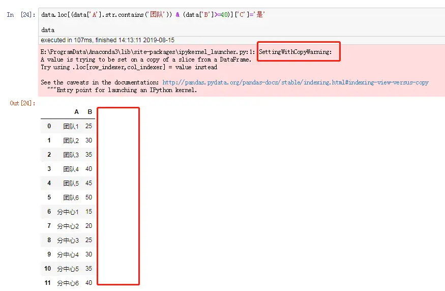

><p style="font-family: 'Microsoft YaHei', sans-serif; line-height: 1.5;">
>作者：数据人阿多
></p>

# 数据筛选背景
在处理数据时，我们可能希望从数据库里面筛选出符合特定条件的记录（个案或样本，不同的行业叫法不一样），平常大家对Excel筛选很熟悉，比如从A字段（变量或特征）包含“团队”，B字段大于等于40，筛选出符合这两个条件的记录，如下图所示：


*******
# pandas处理
* **正确代码**
```python
#加载库
import pandas as pd
import numpy as np

#读取数据
data=pd.read_excel('test.xlsx')

#查看数据类型
data.dtypes

#查看数据前5行
data.head()

#根据条件筛选出数据
data.loc[(data['A'].str.contains('团队')) & (data['B']>=40)]
#data[(data['A'].str.contains('团队')) & (data['B']>=40)]    #这两行都可以
```


* **错误代码**

1. 位运算符`&`与`|`，而不是逻辑运算符 `and` 与`or`，两者是有区别的

```
data.loc[(data['A'].str.contains('团队')) and (data['B']>=40)]
```


2. 缺少括号`()`，**导致筛选不出数据，但是不报错**
```python
data.loc[data['A'].str.contains('团队') & data['B']>=40]
```


**经过多方查找原因，动手实践，这个问题貌似没有帖子仔细进行解释，那这是为什么筛选不出来数据呢，加了括号就可以，可能有同学一下子就明白了，`运算符的顺序`，对，位运算符`&`的优先级      高于    比较运算符`>=`，其实也就是只对后面的条件加上括号即可，但是考虑到逻辑严谨性，`最好把所有条件都括起来`，详情参考这篇文章[Python 3 的运算符及优先级](https://www.jianshu.com/p/ff60791b5398)**

*******************************
# pandas赋值操作
* **正确代码**

注意避免**链式操作**导致`SettingwithCopyWarning `，最详细的解释，请参考这篇文章[Pandas 中 SettingwithCopyWarning 的原理和解决方案](https://www.jianshu.com/p/72274ccb647a)

```python
#赋值操作
data.loc[(data['A'].str.contains('团队')) & (data['B']>=40),'C']='是'

data
```


**及时原来的数据框里面没有C列变量，但是在赋值时可以直接指定，数据框会自动生成这一列变量**

* **错误代码** 

1. 缺少`.loc`导致报错提示不可哈希，对这个不是很懂
```python
data[(data['A'].str.contains('团队')) & (data['B']>=40),'C']='是'
```

**建议为了使代码规范，在根据条件筛选时就把`.loc`带上，防止后期出错**

2. 链式操作，提示`SettingwithCopyWarning`
```python
data.loc[(data['A'].str.contains('团队')) & (data['B']>=40)]['C']='是'

data
```


**为什么会出现这种情况，请详细阅读这篇文章[Pandas 中 SettingwithCopyWarning 的原理和解决方案](https://www.jianshu.com/p/72274ccb647a)**


**************************************************************************
**以上是自己实践中遇到的一些问题，分享出来供大家参考学习，欢迎关注微信公众号：DataShare ，不定期分享干货**