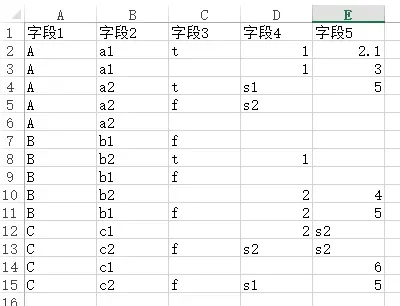
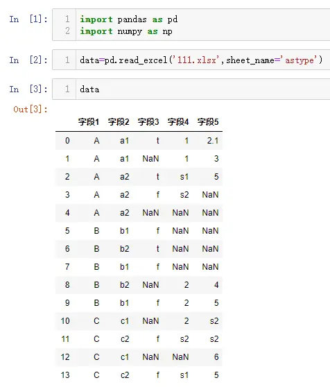
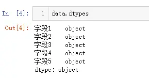
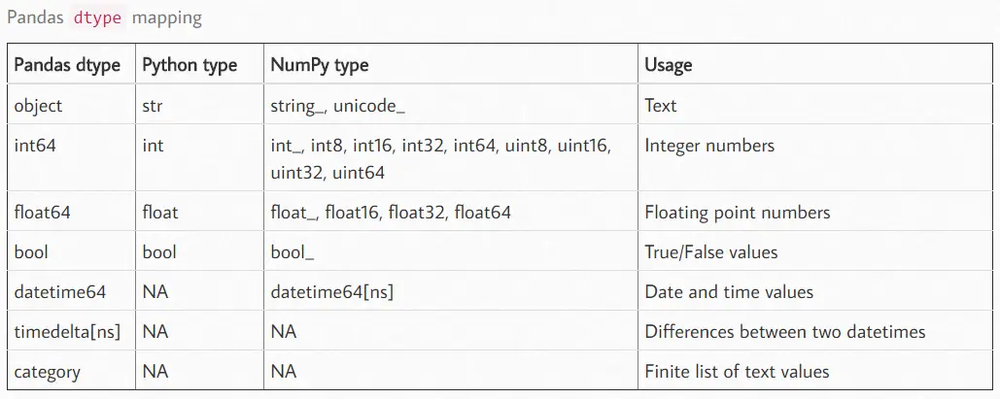
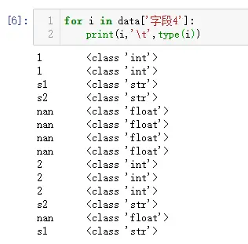
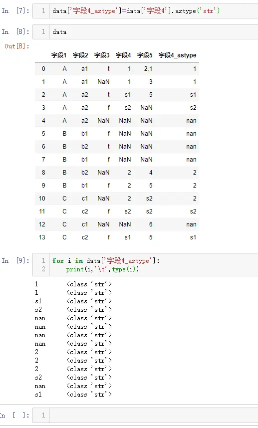
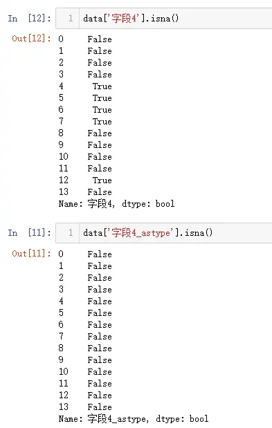
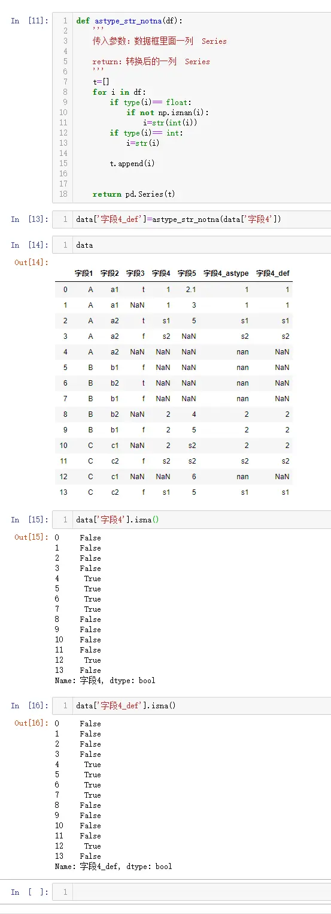
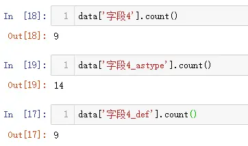

# 背景
最近在项目处理数据时，对pandas里面的数据类型进行转换时（astype），产生了一些意外的情况，经过研究，对数据框里面的数据类型，又有了新的认识，分享出来供大家参考学习。

# 创建模拟数据


- 假如模拟的数据如上图所示，里面有一些空单元格，下面读取模拟数据
```python
import pandas as pd
import numpy as np

data=pd.read_excel('111.xlsx',sheet_name='astype')

data
```


- 查看整体数据类型，可以看出所有的数据类型均为`object`，这里的`object`对应的是python里面的`str`字符类型

```
data.dtypes
```




- 查看`字段4`每一个数据是什么类型
```
for i in data['字段4']:
    print(i,'\t',type(i))
```


可以看出`字段4`这一列里面，有`str`、`float`、`int`三种数据类型，**这里就可以看出一列里面数据类型可以不同，类似Excel一列，每个单元格可以存放不同类型的数据，和数据库里面一列完全不一样，数据库里面一列数据类型在建表时，已声明类型，只存放一种类型。但是上面在获取整列数据类型时返回的是`object`，用的是最大的数据类型，能囊括整列的数据类型**

# 如果astype类型强制转换
```
data['字段4_astype']=data['字段4'].astype('str')

data

for i in data['字段4_astype']:
    print(i,'\t',type(i))
```


可以看出这里全部转换为`str`，`NaN`也会强制转换为字符型`nan`，不再是`np.nan`


**这样的话就出现一个问题，astype是强制把所有的类型都转换为`str`，而不忽略`NaN`，要对非NAN进行转换，就需要自定义函数来实现**
# 自定义函数实现非NAN转换类型
```
def astype_str_notna(df):
    '''
    传入参数：数据框里面一列  Series
    
    return：转换后的一列  Series
    '''
    t=[]
    for i in df:
        if type(i)== float:
            if not np.isnan(i):
                i=str(int(i))
        if type(i)== int:
            i=str(i)
            
        t.append(i)
     
    
    return pd.Series(t)

data['字段4_def']=astype_str_notna(data['字段4'])

data

data['字段4'].isna()
```


**通过自定义函数，可以实现数据类型转换，而忽略NAN，从而达到在数据统计时，不会计算NAN**




**************************************************************************
**以上是自己实践中遇到的一些问题，分享出来供大家参考学习，欢迎关注微信公众号：DataShare ，不定期分享干货**

