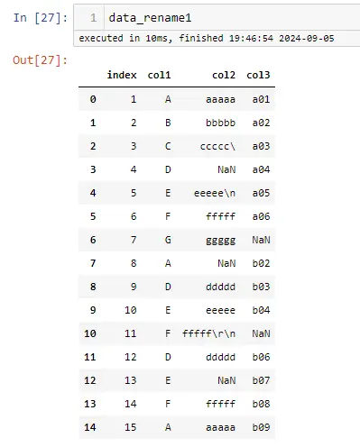

# 背景
把数据导出到Excel中时，有时需要对列的顺序进行调整，按业务需求进行排列，并且字段名字不能是英文，这样方便业务人员查看与理解数据，在 `pandas` 中有相应的函数可以满足以上2个要求，让我们来学习一下吧

重排列：`pandas.DataFrame.reindex`

列重名：`pandas.DataFrame.rename`


# 小编运行环境
```python
import sys

print('python 版本：',sys.version.split('|')[0])
#python 版本： 3.11.9

import pandas as pd

print("pandas 版本：",pd.__version__)
#pandas 版本： 2.2.2
```

# 模拟数据 
```python
data = pd.read_excel('演示数据.xlsx')
```


# 用 reindex 对字段顺序，重新排序
```python
new_columns=['序号','字段3','字段1','字段2']

data_reindex=data.reindex(columns=new_columns)
```


# 用 rename 对字段重新命名
## 方法1
```python
columns_mapper ={
    '序号':'index',
    '字段1':'col1',
    '字段2':'col2',
    '字段3':'col3'
}

data_rename1 = data.rename(columns=columns_mapper)
```


## 方法2
```python
def fn_columns_mapper(col):
    if '字段' in col:
        new_col = col.replace('字段','col')
    else:
        new_col = 'col0'
        
    return new_col

data_rename2 = data.rename(columns=fn_columns_mapper)
```


# 历史相关文章
- [Python-pandas遍历行数据的2种方法](/Python数据处理/Python-pandas遍历行数据的2种方法.md)
- [Python-利用pandas对数据进行特定排序](/Python数据处理/Python-利用pandas对数据进行特定排序.md)
- [Python-pandas-2-0-初探](/Python数据处理/Python-pandas-2-0-初探.md)
- [Python-pandas-str-replace-不起作用](/Python数据处理/Python-pandas-str-replace-不起作用.md)
- [Python数据处理中-pd-concat-与-pd-merge-区别](/Python数据处理/Python数据处理中-pd-concat-与-pd-merge-区别.md)

**************************************************************************
**以上是自己实践中遇到的一些问题，分享出来供大家参考学习，欢迎关注微信公众号：DataShare ，不定期分享干货**
