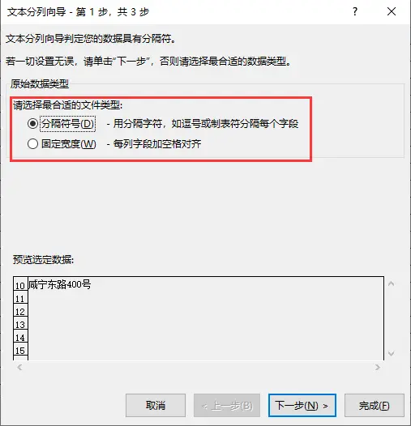

# 背景
数据分列在数据处理中很常见，数据分列一般指的都是字符串分割，这个功能在Excel里面很实用，处理数据非常方便，那么在pandas数据框中怎么使用呢，今天这篇文章就来详细介绍下


# 模拟数据
以下面这9行数据作为案例来进行处理


# 读取数据
```python
#加载库
import pandas as pd

#读取数据
data=pd.read_excel('data.xlsx')
```

# 分割符号分列
主要运用了pandas里面列的`str`属性，`str `有很多的方法，感性的同学可以自动查找，这里不做过多介绍。分割字符用到的就是`split`方法

**重点：在分割前一定要把该列强制转换为字符型**

```python
#对指定列进行分割
split_data_1=data['分割字符'].astype('str').str.split('&',expand=True)

#修改分割后的字段名称
split_data_1.columns=['D_'+str(i) for i in split_data_1.columns]

#与原始数据进行合并
data_result=data.join(split_data_1)
```


# 固定宽度分列
pandas里面没有固定分割的相应函数，这里巧妙的运用了辅助函数来进行处理，这里的固定宽度为1

```python
#定义个辅助函数
def concat_split(x,width=1):
    result=''
    start=0
    while True:
        s=str(x)[start:start+width]
        
        if s:
            result =result + s + '&'
        else:
            break
        start=start+width
        
    return result[:-1]

#先利用辅助函数，再进行分割
split_data_2=data['固定宽度'].map(concat_split).str.split('&',expand=True)

#修改分割后的字段名称
split_data_2.columns=['W_'+str(i) for i in split_data_2.columns]

#与原始数据进行合并
data_result=data.join(split_data_2)
```


# 历史相关文章
- [Python pandas 里面的数据类型坑，astype要慎用](./Python-pandas-里面的数据类型坑，astype要慎用.md)
- [Python pandas 数据无法正常分列](./Python-pandas-数据无法正常分列.md)

**************************************************************************
**以上是自己实践中遇到的一些问题，分享出来供大家参考学习，欢迎关注微信公众号：DataShare ，不定期分享干货**
