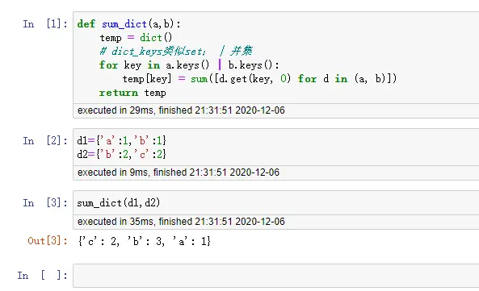
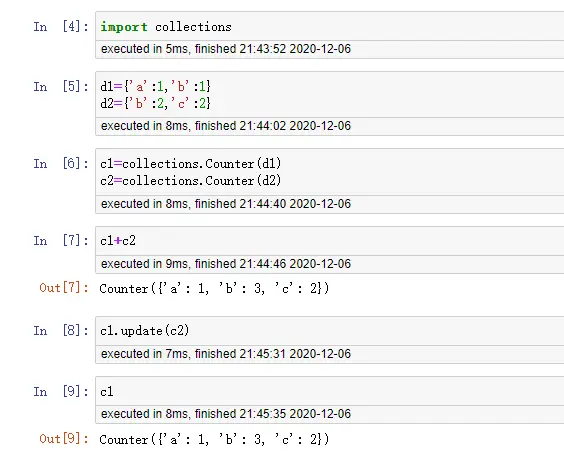

><p style="font-family: 'Microsoft YaHei', sans-serif; line-height: 1.5;">
>作者：数据人阿多
></p>

# 背景
在数据处理过程中经常遇到求两个字典相加（并集），要求相同的键，值相加，不同的键，进行汇集，最后得出一个总的字典，自己可以先进行思考，利用已有的知识，是否马上在心里有解决方法

例如：<br/>
d1={'a':1,'b':1}  <br/>
d2={'b':2,'c':2}  <br/>
要求的结果：d1+d2={'a':1,'b':3,'c':2}


下面介绍两种方法：
- **自定义函数法**
- **利用collections库**


# 方法一
```python
def sum_dict(a,b):
    temp = dict()
    # dict_keys类似set； | 并集
    for key in a.keys() | b.keys():
        temp[key] = sum([d.get(key, 0) for d in (a, b)])
    return temp
```
**案例：**


# 方法二
利用`collections`库里面的`Counter`函数进行计数，collections模块是一个很强大的模块，里面有各种扩展的变量容器<br/>
如果感兴趣的话可以参考这篇文章 [Python-collections模块](https://blog.csdn.net/mall_lucy/article/details/108822795)，里面有详细的使用方法


# 历史相关文章
- [Python math模块详解](./Python基础库/Python-math模块详解.md)
- [Python pandas数据计数函数value_counts](./Python-pandas数据计数函数value_counts.md)

**************************************************************************
**以上是自己实践中遇到的一些问题，分享出来供大家参考学习，欢迎关注 DataShare （同微），不定期分享干货**
