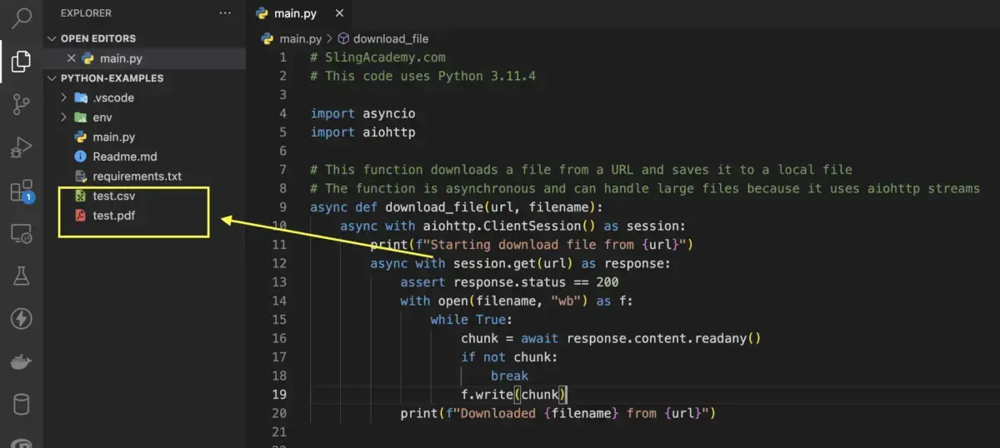

# 背景
本篇文章为小编翻译文章，小编在查找资料时看到的一篇文章，看了后感觉不错，就翻译过来，供大家参考学习

文章原文地址：<br/>
[https://www.slingacademy.com/article/python-aiohttp-how-to-download-files-using-streams/](https://www.slingacademy.com/article/python-aiohttp-how-to-download-files-using-streams/)

# Overview 概述
**`aiohttp`** 是一个现代库，为Python提供异步（协程）HTTP客户端和服务器功能。流是一种分块处理数据的方式，无需一次将整个文件加载到内存中，这对于下载大文件或同时处理多个请求非常有用。

可以通过以下步骤下载带有aiohttp流的文件（尤其是几百MB或更多的大文件）：
1. 创建一个 `aiohttp.ClientSession` 对象，它表示用于发出HTTP请求的连接池（客户端会话，用于发送不同的HTTP请求）

2. 使用 `session.get` 方法向文件URL发送get请求，并获得`aiohttp.ClientResponse` 对象，表示来自服务器的响应

3. 使用 `response.content` 属性访问 `aiohttp.StreamReader` 对象，它是用于读取响应主体的流

4. 使用 `stream.read` 或 `stream.readany` 方法从流中读取数据块，并将其写入本地的文件中

5. 完成后关闭响应和会话对象（这可以通过使用 `async with` 语句自动完成）

上面说的这么多，可能让你困惑且难以理解，让我们来看看下面的例子以获得更清晰的理解
# Complete Example 完整示例
假如我们要同时下载两个文件，一个文件是CSV，另一个是PDF <br/>
CSV文件的URL：https://api.slingacademy.com/v1/sample-data/files/student-scores.csv  <br/>
PDF文件的URL：https://api.slingacademy.com/v1/sample-data/files/text-and-table.pdf  <br/>

**完整的代码（带说明）**
在运行以下代码时，`aiohttp` 建议更新为最新的版本，否则可能报错
```python
# SlingAcademy.com
# This code uses Python 3.11.4

import asyncio
import aiohttp

# This function downloads a file from a URL and saves it to a local file
# The function is asynchronous and can handle large files because it uses aiohttp streams
async def download_file(url, filename):
    async with aiohttp.ClientSession() as session:
        print(f"Starting download file from {url}")
        async with session.get(url) as response:
            assert response.status == 200
            with open(filename, "wb") as f:
                while True:
                    chunk = await response.content.readany()
                    if not chunk:
                        break
                    f.write(chunk)
            print(f"Downloaded {filename} from {url}")


# This function downloads two files at the same time
# 同时下载两个文件
async def main():
    await asyncio.gather(
        # download a CSV file
        download_file(
            "https://api.slingacademy.com/v1/sample-data/files/student-scores.csv",
            "test.csv",
        ),

        # download a PDF file
        download_file(
            "https://api.slingacademy.com/v1/sample-data/files/text-and-table.pdf",
            "test.pdf",
        ),
    )

# Run the main function
asyncio.run(main())
```

运行的输出：
```text
Starting download file from https://api.slingacademy.com/v1/sample-data/files/student-scores.csv
Starting download file from https://api.slingacademy.com/v1/sample-data/files/text-and-table.pdf
Downloaded test.pdf from https://api.slingacademy.com/v1/sample-data/files/text-and-table.pdf
Downloaded test.csv from https://api.slingacademy.com/v1/sample-data/files/student-scores.csv
```
下载的文件将保存在当前的脚本目录中，`test.csv`、`test.pdf`，如下面的屏幕截图所示：

# 历史相关文章
- [Python 利用协程采集想看的《人世间》下载地址](../数据采集/Python-利用协程采集想看的《人世间》下载地址.md)

**************************************************************************
**以上是自己实践中遇到的一些问题，分享出来供大家参考学习，欢迎关注微信公众号：DataShare ，不定期分享干货**
