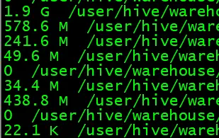
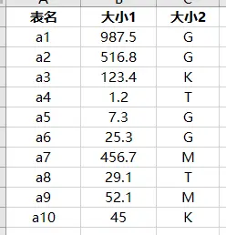
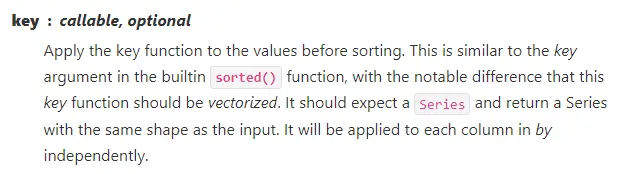
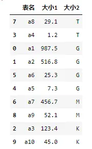

# 背景
小编最近在处理hive表存储大小时，需要对每个表的大小进行排序，因通过 `hadoop fs -du -s -h /path/table` 命令获取的数据表大小，其结果是展示为人能直观理解的大小，例如 1.1T、1.9G、49.6M 等，如果想对这些表根据存储大小进行降序排列，利用pandas应该如何做呢？



# 小编环境
```python
import sys

print('python 版本：',sys.version.split('|')[0])   
#python 版本： 3.11.5

import pandas as pd

print(pd.__version__)
#2.1.0
```
# 测试数据
这里仅列举10行数据，进行演示，小编真实的hive表有几万个


# 函数概述
在pandas对数据进行排序主要使用 `pandas.DataFrame.sort_values` 方法
```python
DataFrame.sort_values(by, *, 
                axis=0,   
                ascending=True, 
                inplace=False, 
                kind='quicksort', 
                na_position='last', 
                ignore_index=False, 
                key=None)
```

**参数解释：**
- **by ：str or list of str**  <br/>
用于排序的单个字段 或 多个字段组成的列表

- **axis：“{0 or ‘index’, 1 or ‘columns’}”, default 0**  <br/>
排序时的轴向，0 表示行向排序（一行一行排序），1表示列向排序（一列一列排序），默认是 0，也就是Excel中经常使用的排序

- **ascending：bool or list of bool, default True**  <br/>
升序、降序，默认是升序，也就是True，如果是False，则是降序  <br/>
注意：该参数需要和 上面的`by`参数要相对应 

- **inplace：bool, default False** <br/>
是否原地更新排序的数据，默认是False，表示调用该方法后，会返回一个新的数据框

- **kind：{‘quicksort’, ‘mergesort’, ‘heapsort’, ‘stable’}, default ‘quicksort’**  <br/>
进行排序时，指定的排序算法，默认是 `quicksort`，快速排序算法

- **na_position：{‘first’, ‘last’}, default ‘last’**  <br/>
在排序的数据中，指定 `NaN` 的排序位置，默认是排在最后

- **ignore_index：bool, default False**   <br/>
是否要忽略数据的索引，默认是 Fasle，不忽略，使用数据原本的索引

- **key：callable, optional** <br/>
排序之前使用的函数，该函数需要是矢量化的，也就是传入参数是 `Series` ，返回的结果也需要为 `Series` ，该函数会逐个用在被排序的字段上


***官方文档***：
[https://pandas.pydata.org/docs/reference/api/pandas.DataFrame.sort_values.html](https://pandas.pydata.org/docs/reference/api/pandas.DataFrame.sort_values.html)

# 完整案例
```python
import pandas as pd

data=pd.read_excel('排序数据.xlsx',sheet_name='排序')

key_type={'T':1,'G':2,'M':3,'K':4}

data.sort_values(by=['大小2','大小1'],
                 ascending=[True,False],
                 key=lambda col: col.map(key_type) if col.name=='大小2' else col
                )
```



# 历史相关文章
- [Python pandas 2.0 初探](./Python-pandas-2-0-初探.md)
- [Python pandas.str.replace 不起作用](./Python-pandas-str-replace-不起作用.md)
- [Python数据处理中 pd.concat 与 pd.merge 区别](./Python数据处理中-pd-concat-与-pd-merge-区别.md)
- [对比Excel，利用pandas进行数据分析各种用法](./对比Excel，利用pandas进行数据分析各种用法.md)

**************************************************************************
**以上是自己实践中遇到的一些问题，分享出来供大家参考学习，欢迎关注微信公众号：DataShare ，不定期分享干货**
