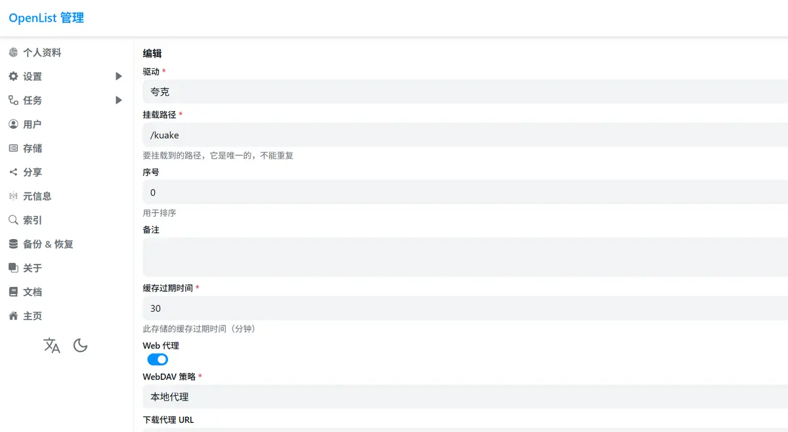

><p style="font-family: 'Microsoft YaHei', sans-serif; line-height: 1.5;">
>作者：数据人阿多
></p>

# 背景
**OpenList**  ------ **“网盘聚合器”**
近日，一个名为OpenList的开源网盘聚合神器，正成为越来越多网盘管理爱好者的新选择。它源于曾经广受欢迎的Alist项目，却在该项目走向商业化后，OpenList项目应运更生，由社区自发“接棒”继续前行

本篇文章介绍小编搜集来的一些夸克网盘资源，基于OpenList 批量下载到本地

资源小编也在这里分享一下：
- 凯叔讲故事大全（50G）：https://pan.quark.cn/s/8841430d1ef6
- python电子书：https://pan.quark.cn/s/f8653098c1d4

# 小编环境
```python
import sys

print('python 版本：',sys.version.split('|')[0])
#python 版本： 3.11.11
```
# 搭建OpenList
小编这里是在一台空闲的linux服务器安装
1. 安装  OpenList 文档：https://doc.oplist.org/guide/installation/script
```bash
curl -fsSL https://res.oplist.org/script/v4.sh > install-openlist-v4.sh && sudo bash install-openlist-v4.sh
```

2. 添加夸克存储文档：https://doc.oplist.org/guide/drivers/quark，需要通过浏览器获取 **Cookie**，小编这里的挂载路径为 `/kuake`，后续在下载网盘中的文件时，需要提供该路径，配置时开启Web代理，WebDAV策略：本地代理




# 下载夸克资源完整代码
```python
"""
===========================
@Time : 2026/1/3 19:41
@File : openlist
@Software: PyCharm
@Platform: Win10
@Author : 数据人阿多
===========================
"""

import time
import requests
import json
import pandas as pd
from pathlib import Path

class OpenList:
    def __init__(self,username,password,ip,port):
        self.username = username
        self.password = password
        self.ip = ip
        self.port = port
        self._login()

    def _login(self):
        url = f'http://{self.ip}:{self.port}/api/auth/login'
        payload = json.dumps({
            "username": self.username,
            "password": self.password,
            # "otp_code": otp_code
        })
        headers = {
            'Content-Type': 'application/json'
        }

        response = requests.request("POST", url, headers=headers, data=payload)

        self.token=response.json()['data']['token']

    def path_files(self,path,pages):
        api_url = f'http://{self.ip}:{self.port}/api/fs/list'

        pages_content_files = []
        pages_content_dirs = []
        for page in range(1,pages+1):
            page_content=self.path_every_page(page, api_url, path)

            if page_content:
                for page_detail in page_content:
                    if page_detail['is_dir']:
                        pages_content_dirs.append(page_detail)
                    else:
                        pages_content_files.append(page_detail)

            else:
                print(f"获取路径 {path} 数据完成！")
                break

        return pd.DataFrame(pages_content_files),pd.DataFrame(pages_content_dirs)

    def path_every_page(self, page, api_url, path, per_page=100):
        payload = json.dumps({
            "path": path,
            "password": "",
            "refresh": False,
            "page": page,
            "per_page": per_page
        })
        headers = {
            'Authorization': self.token,
            'Content-Type': 'application/json'
        }
        print(f"开始获取 {path} ，第{page:02}页数据")
        response = requests.request("POST", api_url, headers=headers, data=payload)

        return response.json()['data']['content']

    def download_file(self, url, filename, local_path, retry=3):
        for attempt in range(retry + 1):  # 尝试次数 = 重试次数 + 1
            try:
                response = requests.get(url, stream=True, timeout=30)
                # 检查请求是否成功
                if response.status_code == 200:
                    total_size = int(response.headers.get('content-length', 0))
                    downloaded = 0

                    with open(local_path / filename, 'wb') as f:
                        for chunk in response.iter_content(chunk_size=8192):
                            if chunk:
                                f.write(chunk)
                                downloaded += len(chunk)
                                # 可选：显示下载进度
                                if total_size > 0:
                                    percent = (downloaded / total_size) * 100
                                    print(f"\r下载进度: {percent:.1f}%", end='')

                    print(f"\n下载成功: {filename}")
                    return True

                elif response.status_code == 404:
                    print(f"文件不存在: {url}")
                    return False  # 404错误不需要重试

                else:
                    print(f"下载失败，状态码: {response.status_code}")

            except requests.exceptions.RequestException as e:
                print(f"请求异常: {e}")

            # 如果不是最后一次尝试，等待后重试
            if attempt < retry:
                wait_time = 2 ** attempt  # 指数退避：1, 2, 4秒...
                print(f"等待 {wait_time} 秒后重试... (剩余尝试: {retry - attempt})")
                time.sleep(wait_time)

        print(f"达到最大重试次数，下载失败: {filename}")
        return False

    def download_path_files(self, path, local_path, pages=10):

        path_files, path_dirs = self.path_files(path,pages)
        total_path_files=len(path_files)
        total_path_dirs=len(path_dirs)
        print(f"目录 {path} 下共有{total_path_files}个文件, 有{total_path_dirs}个目录")

        if total_path_files:
            print(f"开始下载目录 {path} 下的文件")
            for row in path_files.iterrows():
                # print(row)
                filename = row[1]['name']
                sign = row[1]['sign']
                url = f'http://{self.ip}:{self.port}/p{path}/{filename}?sign={sign}'

                print(f"开始下载[{row[0]+1}/{total_path_files}]：{filename}")
                self.download_file(url, filename, local_path)

        if total_path_dirs:
            for row_dir in path_dirs.iterrows():
                path_dir = path + '/' + row_dir[1]['name']


                local_path_subdir = local_path / row_dir[1]['name']
                if not local_path_subdir.exists():
                    local_path_subdir.mkdir()

                print(f"\n开始获取目录内容：{path_dir} ")
                self.download_path_files(path_dir, local_path_subdir)


if __name__ == '__main__':
    openlist = OpenList('admin','1234566','1.1.1.1','1024')
    # 获取当前路径
    current_path = Path.cwd()
    cloud_path = '/kuake/来自：分享/凯叔讲故事-历史集'
    path = current_path / 'ks'

    if not path.exists():
        path.mkdir()

    openlist.download_path_files(cloud_path, path)
```
提供linux服务器的ip、端口、用户名、密码，以及想下载的文件夹，运行后就可以下载到本地

API文档：https://fox.oplist.org/

# 工具与内容
**在数字化生活中，我们常常面对两类选择：一个是“用什么工具”，另一个是“如何对待内容”**

今天向大家介绍的 **OpenList**，正是众多网盘管理工具中的一个。市面上同类工具不少，你可以根据偏好自由选用，但 OpenList 背后那份 **坚持开源、保持透明** 的精神，尤其值得欣赏——这不仅关乎技术，更关乎一种共享、共建的社区态度。

工具本质是桥梁，最终的价值仍沉淀于**内容**。小编始终鼓励，在条件允许的情况下，**通过付费订阅等方式支持原创作者**。正是这些支持，才能让创作得以延续，让高质量的内容不断涌现。

当然，小编也观察到，有些本应开放的资源，在流转中被人为加上了不必要的门槛；看一部剧、听一首歌，往往需要跨过层层会员壁垒。当资源被过度封装，能够帮助我们**更便捷、更自由地管理个人数字资产**的工具，便显出了它的意义。

**好的工具，应当让人更靠近内容本身，而不是更远**
选择什么样的工具，其实也在表达我们如何看待内容、尊重创作以及守护自己本就应有的数字便利。

如果你也认同这样的理念，不妨尝试一下 OpenList，或者只是单纯思考一下：我们手中的工具，是否真的让我们离想看的世界更近了一点？

# 历史相关文章
- [《Python-编程从新手到高手》知识点](/Python基础库/《Python-编程从新手到高手》知识点.md)
- [Python-利用aiohttp异步流式下载文件](/Python数据处理/Python-利用aiohttp异步流式下载文件.md)
- [Python-利用协程整合IPTV直播源](/数据采集/Python-利用协程整合IPTV直播源.md)

**************************************************************************
**以上是自己实践中遇到的一些问题，分享出来供大家参考学习，欢迎关注微信公众号：DataShare ，不定期分享干货**
