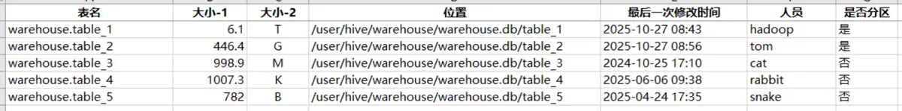

><p style="font-family: 'Microsoft YaHei', sans-serif; line-height: 1.5;">
>作者：数据人阿多
></p>

# 背景
你的Hive数据库是不是也悄悄“膨胀”了？

开发过程中产生的各种中间表，日积月累，占用了大量存储空间，手动清理时却犯了难：

- **哪些表最占空间？**

- **哪些表早已过时？**

- **谁创建的？能不能删？**

为解决这个问题，我写了一个Python脚本，能一键生成统计报表，清晰列出：

📊 **表存储大小**

📅 **最后修改时间**

👨💻 **表使用人**

让你对库表情况了如指掌，精准清理，彻底告别存储焦虑！

# 小编环境
```python
import sys

print('python 版本：',sys.version.split('|')[0])
#python 版本： 3.11.11
```
# 统计结果示例

# 完整代码
```
"""
Hive表存储信息统计脚本 - 基于HDFS路径检查
"""

import subprocess
import re
import datetime
import logging
import sys
import os
from typing import Dict, List, Tuple, Optional

# 配置日志
logging.basicConfig(
    level=logging.INFO,
    format='%(asctime)s - %(levelname)s - %(message)s',
    handlers=[
        logging.FileHandler("hive_table_stats_hdfs.log", encoding='utf-8'),
        logging.StreamHandler(sys.stdout)
    ]
)
logger = logging.getLogger(__name__)

class HiveTableStatsHDFS:
    def __init__(self, hdfs_cmd: str = "hadoop fs"):
        self.hdfs_cmd = hdfs_cmd
        # self.warehouse_base = "/user/hive/warehouse"
        
    def execute_hdfs_command(self, command: str) -> Tuple[bool, str]:
        """执行HDFS命令"""
        try:
            cmd = f"{self.hdfs_cmd} {command}"
            result = subprocess.run(
                cmd, 
                shell=True, 
                stdout=subprocess.PIPE, 
                stderr=subprocess.PIPE, 
                universal_newlines=True,
                timeout=60
            )
            
            if result.returncode == 0:
                return True, result.stdout.strip()
            else:
                logger.error(f"HDFS命令失败: {result.stderr}")
                return False, result.stderr
                
        except subprocess.TimeoutExpired:
            logger.error(f"HDFS命令超时: {command}")
            return False, "Command timeout"
        except Exception as e:
            logger.error(f"执行HDFS命令时发生异常: {e}")
            return False, str(e)
    
    def get_tables_from_database(self, db_path: str) -> List[str]:
        """获取指定数据库中的所有表"""
        logger.info(f"获取数据库 {db_path} 中的表列表...")
        success, output = self.execute_hdfs_command(f"-ls {db_path}")
        
        if not success:
            logger.warning(f"无法访问数据库路径: {db_path}")
            return []
        
        tables = []
        for line in output.split('\n'):
            if line.startswith('d'):
                parts = line.split()
                if len(parts) >= 8:
                    table_path = parts[-1]
                    table_name = table_path.split('/')[-1]
                    tables.append((table_name, table_path))
        
        logger.info(f"在 {db_path} 中找到 {len(tables)} 张表")
        return tables
    
    def get_table_size(self, table_path: str) -> Optional[str]:
        """获取表的存储大小"""
        success, output = self.execute_hdfs_command(f"-du -s -h {table_path}")
        
        if not success:
            return None
        
        # 解析输出，获取总大小
        if output:
            parts = output.split()
            if len(parts) == 5:
                return parts[0], parts[1]  # 返回人类可读的大小、字节类型
            
            if len(parts) == 3:
                return parts[0], 'B'  # 返回人类可读的大小、字节类型
        
        return None
    
    def get_table_details(self, table_path: str) -> Tuple[Optional[str], Optional[str], bool]:
        """获取表的详细信息：最后修改时间、修改人员、是否分区表"""
        success, output = self.execute_hdfs_command(f"-ls -t {table_path} | head -n 5")
        
        if not success:
            return None, None, False
        
        lines = output.strip().split('\n')
        if not lines:
            return None, None, False
        
        # 获取第一条记录（最新的）
        if 'Found' in lines[0]:
            first_line = lines[1]
        else:
            first_line = lines[0]
        
        parts = first_line.split()
        
        if len(parts) < 8:
            return None, None, False
        
        # 解析修改时间和修改人员
        mod_time = f"{parts[5]} {parts[6]}"
        modifier = parts[2]  # 文件所有者
        
        # 检查是否为分区表：查看表目录下是否有子目录
        is_partitioned = False
        if parts[0].startswith('d'):
            # 如果有子目录，则认为是分区表
            is_partitioned = True
        
        return modifier, mod_time, is_partitioned
    
    def get_all_table_stats(self, specific_database: str = None) -> List[Dict]:
        """获取所有表的统计信息"""
        results = []
        
        # 数据库名字
        db_name = specific_database.split('/')[-1].replace('.db','')
        
        # 获取数据库路径
        tables = self.get_tables_from_database(specific_database)
        total_tables = len(tables)
        
        logger.info(f"开始处理数据库 {db_name} 中的 {len(tables)} 张表...")
            
        for i, (table_name, table_path) in enumerate(tables, 1):
            logger.info(f"处理表 [{i}/{len(tables)}]: {db_name}.{table_name}")
            
            try:
                # 获取表大小
                size_1, size_2 = self.get_table_size(table_path)
                
                # 获取表详细信息
                modifier, mod_time, is_partitioned = self.get_table_details(table_path)
                
                table_info = {
                    'table_name': f'{db_name}.{table_name}',
                    'storage_size_1': float(size_1),
                    'storage_size_2': size_2,
                    'storage_location': table_path,
                    'last_modification_date': mod_time or "未知",
                    'last_modifier': modifier or "未知",
                    'is_partitioned': '是' if is_partitioned else '否'
                }
                
                results.append(table_info)
                
            except Exception as e:
                logger.error(f"处理表 {db_name}.{table_name} 时发生错误: {e}")
                error_info = {
                    'database': db_name,
                    'table_name': table_name,
                    'storage_size': '错误',
                    'storage_location': table_path,
                    'last_modification_date': '错误',
                    'last_modifier': '错误',
                    'is_partitioned': '错误'
                }
                results.append(error_info)
        
        logger.info(f"总共处理了 {len(results)} 张表")
        return results
    
    def export_to_excel(self, data: List[Dict], filename: str = None):
        """导出结果到Excel文件"""        
        try:
            import pandas as pd
            
            pd_data = pd.DataFrame(data)
            
            # 按大小进行排序
            key_type={'T':1,'G':2,'M':3,'K':4}
            # 创建临时列用于排序
            pd_data['temp_storage_size_2'] = pd_data['storage_size_2'].map(key_type)
            pd_data_sorted = pd_data.sort_values(
                by=['temp_storage_size_2','storage_size_1'],
                ascending=[True,False]
            )
            # 删除临时列
            pd_data_sorted = pd_data_sorted.drop('temp_storage_size_2', axis=1)
            
            # 重命名字段
            dic_columns={
                "table_name":"表名",
                "storage_size_1":"大小-1",
                "storage_size_2":"大小-2",
                "storage_location":"存储位置",
                "last_modification_date":"最后一次修改时间",
                "last_modifier":"人员",
                "is_partitioned":"是否分区"
            }
            pd_data_sorted_rename = pd_data_sorted.rename(columns=dic_columns)
            pd_data_sorted_rename.to_excel(filename, index=False, )
            
            logger.info(f"结果已导出到: {filename}")
            return True
        except ModuleNotFoundError as e:
            logger.error(f"没有安装 pandas : {e}")
            return False
        except Exception as e:
            logger.error(f"导出失败: {e}")
            return False

def main():
    """主函数"""  
    # 手动指定数据库目录
    specific_db = '/user/hive/warehouse/warehouse.db'
    
    # 创建统计对象
    stats = HiveTableStatsHDFS()
    
    try:
        # 获取表统计信息
        print(f"\n开始统计表信息...")
        results = stats.get_all_table_stats(specific_db)        
        
        # 导出到Excel
        stats.export_to_excel(results, 'hdfs_hive_table_statistics.xlsx')
        
        print("\n统计完成! 请查看日志文件 'hive_table_stats_hdfs.log' 获取详细信息")
        
    except KeyboardInterrupt:
        print("\n用户中断操作")
    except Exception as e:
        print(f"\n执行过程中发生错误: {e}")
        logger.exception("主程序异常")


if __name__ == "__main__":
    main()
```
# 历史相关文章
- [Python-基于pyhive库操作hive](/Python数据处理/Python-基于pyhive库操作hive.md)
- [Python-利用pandas对数据进行特定排序](/Python数据处理/Python-利用pandas对数据进行特定排序.md)
- [hadoop-常用命令总结](/Hive/hadoop-常用命令总结.md)

**************************************************************************
**以上是自己实践中遇到的一些问题，分享出来供大家参考学习，欢迎关注微信公众号：DataShare ，不定期分享干货**
