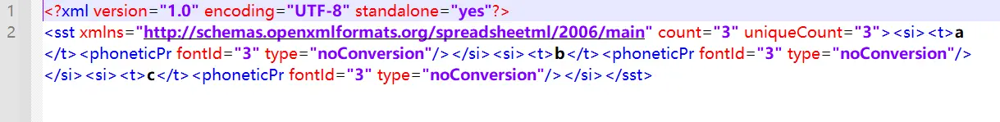

# 背景
在给业务生成自动化Excel报表时，需要把数据库里面的数据进行处理，然后放到Excel里面并进行美化，用邮件进行发送，满足业务的需求。但是这些自动化程序一般都是部署在Linux服务器上定期进行发送邮件，这样就需要在Linux环境下生成Excel文件，之前有文章介绍过 **xlwings库**，但是该库不支持Linux，经过查找相关的资料后，**openpyxl库** 可以满足要求。

**xlwings只支持Windows 和 Mac系统**


**openpyxl 三个系统都支持，该库是基于操作XML文件而支持操作Excel文件，支持Excel2010版之后的所有Excel文件**


*额外话题：
虽然现在一些公司都用BI工具，但是这些BI报表建立后，后期进行维护时需要很大的成本，比如：BI系统有升级、数据库字段有变化、更有甚者创建BI报表的员工离职等等，有的公司可能用的还是Tableau、帆软BI等第三方的工具，更新不及时，无法使用到最新的功能。
个人感觉从数据库里面查询数据，并实现可视化放到Excel文件里面是一个不错的选择。当然一些大厂有充足的人力除外，一些中小型公司用这种方法是最经济、最实用且高效的*
# 深度剖析Excel文件的构成
上面说到openpyxl库是基于操作XML文件而支持操作Excel文件，那么XML文件和Excel有什么关系呢？下面进行介绍：
现阶段公司里面基本用的都是office2013版之后的，文件后缀是 **.xlsx** ，可以把后缀修改为 **.zip** ，然后进行解压后，可以发现文件夹里面有一些XML文件，其实Excel就是由XML文件与其他一些文件联合组成的一个文件包，然后经过Excel解析后，呈现在用户面前的是一个可编辑的界面，如果理解了这些，就可以发现微软确实比较牛，他们的产品经理是多么厉害。


/demo/xl/worksheets/sheet1.xml 文件内容，B1到B3单元格存放的是1-3


而A1到A3单元格放的是0-2值来代替，真实的值可以在/demo/xl/sharedStrings.xml文件里面查到，这里微软用了映射的方法，放入的是数值，类似pandas里面的category类型一样，可以减少内存占用

# openpyxl介绍
该库是基于PHPExcel，也就是PHP操作Excel文件的库，PHP是后端的开发语言，一般大都是部署在Linux服务器
文档：[官方文档 https://openpyxl.readthedocs.io/en/stable/index.html](https://openpyxl.readthedocs.io/en/stable/index.html)，里面有很详细的介绍，目前只有英文版文档，可以配合百度翻译进行查阅

该库也一直有更新，最近的一次更新时间为：2021年3月9日，python里面建议用一直有更新的库


用 **openpyxl** 可以直接生产包含XML文件的文件包，也就是Excel文件，该库也就是按照微软的规则把数据写入XML文件，进而可以生产Excel，达到了操作Excel的目的


# 使用案例
[官方文档：https://openpyxl.readthedocs.io/en/stable/index.html](https://openpyxl.readthedocs.io/en/stable/index.html)里面有很详细的使用介绍，这里只展示一些自己用过的功能，一下只是部分代码：
```python
from openpyxl import load_workbook
from openpyxl.styles import Font,Border,Side,Alignment,PatternFill

#加载excel文件
workbook = load_workbook(filename = path_excel)

#字体、边框、加粗、居中对齐、格式化设置
bd=Side(border_style='thin', color="A6A6A6") 
for row_num,key in enumerate(result_index):
	worksheet.cell(row_num+2, 1, key).font = Font(name='微软雅黑',bold=False, size=10,color='000000')
	worksheet.cell(row_num+2, 1, key).border = Border(left=bd, top=bd, right=bd, bottom=bd)
	worksheet.cell(row_num+2, 1, key).alignment = Alignment(horizontal='center', vertical='center')

	if '率' in key:
		worksheet.cell(row_num+2, 2).number_format='0.0%'

	if key=='对话轮次':
		worksheet.cell(row_num+2, 2).number_format='0.0'

#单元格填充颜色
worksheet.cell(1, 1, value).fill = PatternFill(fill_type='solid',fgColor="538DD5")

#设置行高、列宽
worksheet.row_dimensions[1].height=29
worksheet.column_dimensions['A'].width=18
```
# 历史相关文章
- [Python用xlwings库处理Excel](./Python用xlwings库处理Excel.md)
- [对比Excel，利用pandas进行数据分析各种用法](./对比Excel，利用pandas进行数据分析各种用法.md)
**************************************************************************
**以上是自己实践中遇到的一些问题，分享出来供大家参考学习，欢迎关注微信公众号：DataShare ，不定期分享干货**
