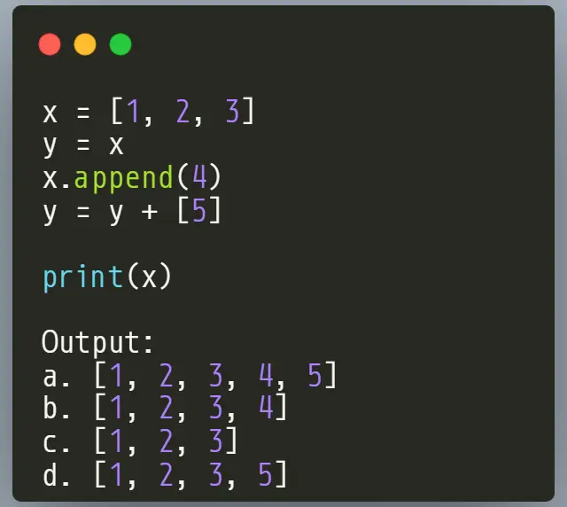
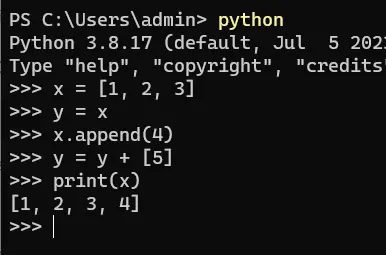
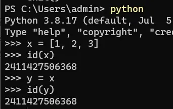
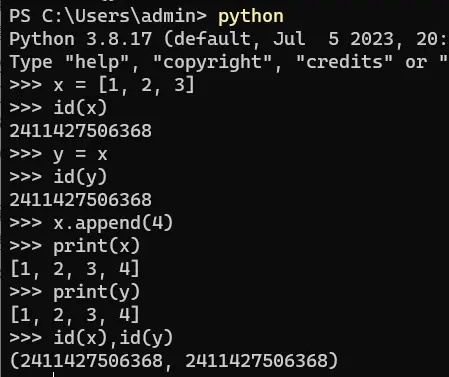
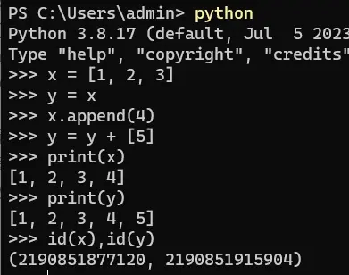

# 问题
请认真思考下这个问题，应该会输出什么呢？

# 答案
**`b. [1, 2, 3, 4]`**

# 解释
第1行：创建一个列表，变量 `x` 指向这个列表

`x = [1, 2, 3]`

第2行：把变量 `x` 赋值给一个新变量 `y`，这两个变量同时指向了第1行创建的列表

`y = x`

第3行：在列表后面追加一个新元素 `4`，这时 `x` 和 `y` 同时也更改为新列表的值

`x.append(4)`

第4行：变量 `y` 与 新列表 `[5]` 进行相加运算，会生成一个新列表，这个新列表与原来的列表不一样，变量 `y` 指向这个新生成的列表

`y = y + [5]`

**知识点：**  
列表的 `apend` 方法是在原有的内存地址后面继续添加新元素，而加号运算符则会产生新的列表，存放在新的内存地址里面

# 历史相关文章
- [Python pandas.str.replace 不起作用](./Python-pandas-str-replace-不起作用.md)
- [Python pandas 里面的数据类型坑，astype要慎用](./Python-pandas-里面的数据类型坑，astype要慎用.md)
- [Python数据处理中 pd.concat 与 pd.merge 区别](./Python数据处理中-pd-concat-与-pd-merge-区别.md)

**************************************************************************
**以上是自己实践中遇到的一些问题，分享出来供大家参考学习，欢迎关注微信公众号：DataShare ，不定期分享干货**
