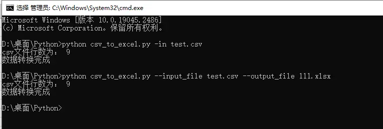

# 背景
由于研发部门给的数据是 csv 文件，业务人员一般都是熟悉 excel 文件，为了方便查看数据，因此需要写个程序，把 csv 文件转换为 excel 文件，由于是经常使用，小编的脚本程序，写成了在命令行中使用的方式

*业务人员直接打开 csv 文件会乱码，因excel 默认的编码是 GB2312，所以会乱码*

# 完整脚本
为了方便在命令行中使用，该脚本使用了 `argparse` 库，如果对该库不是很懂，可以查看相关资料，进行学习

```python
"""
===========================
@Time : 2023/2/1 11:19
@File : csv_to_excel.py
@Software: PyCharm
@Platform: Win10
@Author : DataShare
===========================
"""
import pandas as pd
import argparse

if __name__ == '__main__':
    parser = argparse.ArgumentParser(description='csv_to_excel')
    parser.add_argument('--input_file', '-in', type=str, required=True, help='csv文件')
    parser.add_argument('--output_file', '-out', type=str, required=False, default=None, help='excel文件')
    args = parser.parse_args()

    data = pd.read_csv(args.input_file, sep=',', dtype='str', quotechar='"', header=0)

    print('csv文件行数为：', len(data))  # 判断数据行数是否一致，防止不可见字符，例如：回车 等

    if args.output_file is not None:
        if args.output_file.endswith('.xlsx'):
            output_file_converted = args.output_file
        else:
            output_file_converted = args.output_file + '.xlsx'
    else:
        output_file_converted = args.input_file.split('.csv')[0] + '.xlsx'

    # 这是由于Excel单个工作表限制URL类型数据量为65530,超出的部分会被舍弃
    # 只要将strings_to_urls自动转换功能关闭就好了
    writer = pd.ExcelWriter(output_file_converted, engine='xlsxwriter',
                            engine_kwargs={'options': {'strings_to_urls': False}})
    data.to_excel(writer, index=False)
    writer.close()

    print('数据转换完成')

```
# 使用教程
***前提条件：***
- 需要把以上的完整脚本，复制下来保存为 `csv_to_excel.py` 文件
- 本机安装了python，并且在命令行中可以直接使用

**使用教程**
最好把 `csv_to_excel.py` 文件与将要转换的 csv 文件放到一个文件夹中

用法1：
只指定需要转换的 csv 文件，转换后的结果 excel 文件，默认与 csv 文件同名，且保存在同一个文件夹里面
```shell
python csv_to_excel.py -in test.csv
#python csv_to_excel.py --input_file test.csv
```

用法2：
指定需要转换的 csv 文件，同时指定输出的 excel 结果文件名
```shell
python csv_to_excel.py -in test.csv -out test_convert.xlsx
#python csv_to_excel.py --input_file test.csv --output_file test_convert.xlsx
```



# 历史相关文章
- [对csv文件，又get了新的认知](./对csv文件，又get了新的认知.md)
- [Python 处理Excel文件为了通用原则，建议用openpyxl库](./Python-处理Excel文件为了通用原则，建议用openpyxl库.md)
- [Python pandas在读取csv文件时（linux与windows之间传输），数据行数不一致的问题](./Python-pandas在读取csv文件时（linux与windows之间传输），数据行数不一致的问题.md)

**************************************************************************
**以上是自己实践中遇到的一些问题，分享出来供大家参考学习，欢迎关注微信公众号：DataShare ，不定期分享干货**
