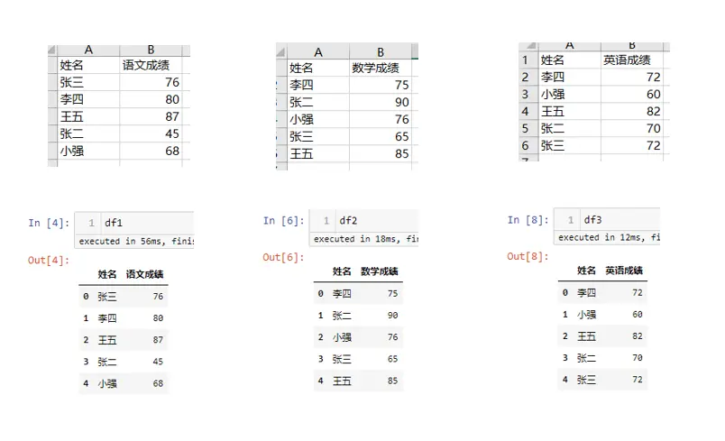
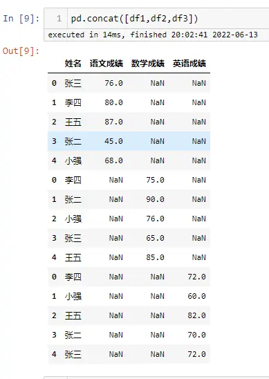
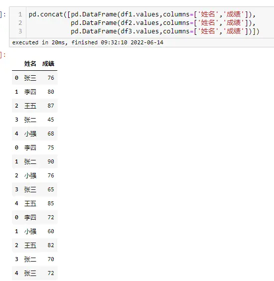
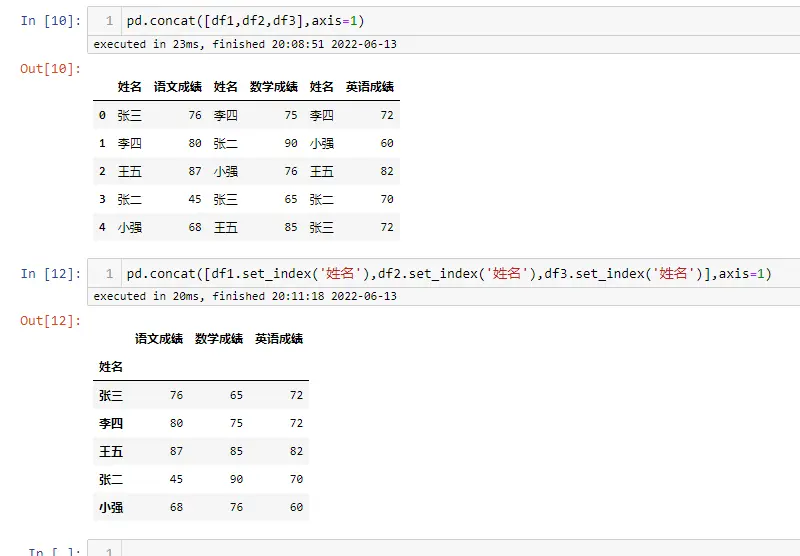
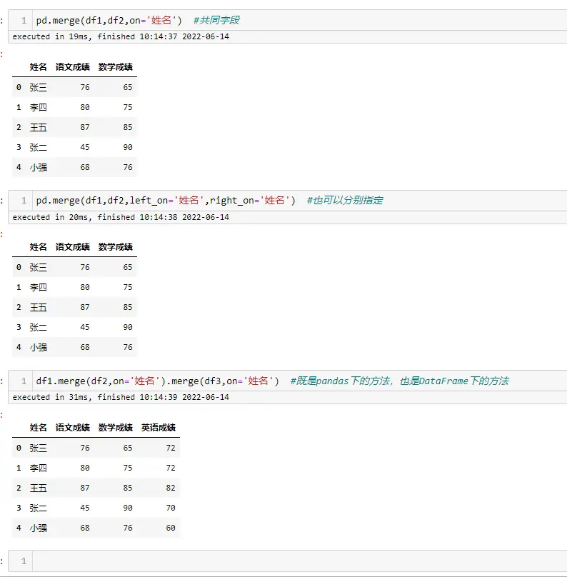

# 背景
数据的合并与关联是数据处理过程中经常遇到的问题，在SQL、HQL中大家可能都有用到 join、uion all 等 ，在 Pandas 中也有同样的功能，来满足数据处理需求，个人感觉Pandas 处理数据还是非常方便，数据处理效率比较高，能满足不同的业务需求

本篇文章主要介绍 Pandas 中的数据拼接与关联

# 数据拼接---pd.concat
concat 是pandas级的函数，用来拼接或合并数据，其根据不同的轴既可以横向拼接，又可以纵向拼接

**函数参数**
```python
pd.concat(
    objs: 'Iterable[NDFrame] | Mapping[Hashable, NDFrame]',
    axis=0,
    join='outer',
    ignore_index: 'bool' = False,
    keys=None,
    levels=None,
    names=None,
    verify_integrity: 'bool' = False,
    sort: 'bool' = False,
    copy: 'bool' = True,
) -> 'FrameOrSeriesUnion'
```
- `objs`：合并的数据集，一般用列表传入，例如：[df1,df2,df3] 
- `axis`：指定数据拼接时的轴，0是行，在行方向上拼接；1是列，在列方向上拼接 
- `join`：拼接的方式有 inner，或者outer，与sql中的意思一样

以上三个参数在实际工作中经常使用，其他参数不再做介绍

**案例：**


- **横向拼接**

字段相同的列进行堆叠，字段不同的列分列存放，缺失值用`NAN`来填充，下面对模拟数据进行变换用相同的字段，进行演示



- **纵向拼接**


可以看出在纵向拼接的时候，会按索引进行关联，使相同名字的成绩放在一起，而不是简单的堆叠

# 数据关联---pd.merge
数据联接，与SQL中的join基本一样，用来关联不同的数据表，有左表、右表的区分，可以指定关联的字段

**函数参数**
```python
pd.merge(
    left: 'DataFrame | Series',
    right: 'DataFrame | Series',
    how: 'str' = 'inner',
    on: 'IndexLabel | None' = None,
    left_on: 'IndexLabel | None' = None,
    right_on: 'IndexLabel | None' = None,
    left_index: 'bool' = False,
    right_index: 'bool' = False,
    sort: 'bool' = False,
    suffixes: 'Suffixes' = ('_x', '_y'),
    copy: 'bool' = True,
    indicator: 'bool' = False,
    validate: 'str | None' = None,
) -> 'DataFrame'
```
- `left`：左表
- `right`：右表
- `how`：关联的方式，{'left', 'right', 'outer', 'inner', 'cross'}, 默认关联方式为 'inner'
- `on`：关联时指定的字段，两个表共有的
- `left_on`：关联时用到左表中的字段，在两个表不共有关联字段时使用
- `right_on`：关联时用到右表中的字段，在两个表不共有关联字段时使用

以上参数在实际工作中经常使用，其他参数不再做介绍

**案例：**



merge 的使用与SQL中的 join 很像，使用方式基本一致，既有内连接，也有外连接，用起来基本没有什么难度

# 两者区别
- concat 只是 pandas 下的方法，而 merge 即是 pandas 下的方法，又是DataFrame 下的方法
- concat 可以横向、纵向拼接，又起到关联的作用
- merge 只能进行关联，也就是纵向拼接
- concat 可以同时处理多个数据框DataFrame，而 merge 只能同时处理 2 个数据框


# 历史相关文章
- [像excel透视表一样使用pandas透视函数](./像excel透视表一样使用pandas透视函数.md)
- [Python pandas 数据筛选与赋值升级版详解](./Python-pandas-数据筛选与赋值升级版详解.md)
- [Python pandas数据分列，分割符号&固定宽度](./Python-pandas数据分列，分割符号&固定宽度.md)

**************************************************************************
**以上是自己实践中遇到的一些问题，分享出来供大家参考学习，欢迎关注微信公众号：DataShare ，不定期分享干货**
