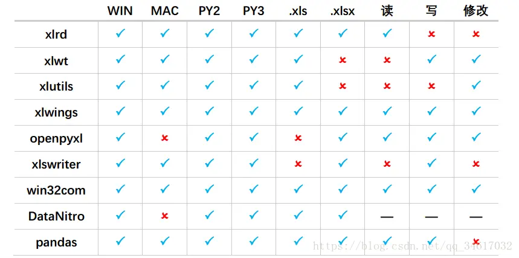

><p style="font-family: 'Microsoft YaHei', sans-serif; line-height: 1.5;">
>作者：数据人阿多
></p>

在网上查看了一些python处理excel库资料，参考相关内容
[Python读写Excel文件第三方库汇总，你想要的都在这儿！](https://blog.csdn.net/qq_34617032/article/details/80433939)
经过对比后，最后选择xlwings库，来处理excel文件

由于自己会VBA，所以xlwings里面的一些函数用起来还是比较方便的，能够看懂大概用法，如果你不会VBA的话也没关系

xlwings英文版文档：[http://docs.xlwings.org/en/stable/api.html](http://docs.xlwings.org/en/stable/api.html)

也很简单、简洁，英语很low的我也能看懂，不行就百度翻译一下，基本都可以理解怎么使用，而且这个库也一直在更新，长期来看还是比较靠谱的

```python
#以下代码在jupyter notebook 里面运行，打印时不用print

import xlwings as xw   #引入xlwings模块


#创建excel程序对象，这里有点类似VBA，不过这里也使很多人感到困惑
#如果你理解了在excel文件里可以直接打开其他excel文件过程，你基本上就可以理解这个（菜单文件---打开）
app = xw.App(visible=True,add_book=False) 
wb = app.books.open('01.xlsx')   #指定要打开的文件

wb.sheets     #查看里面的sheet
sht1=wb.sheets['grv']    #可以直接把一个sheet赋值给一个对象，相当于引用
sht2=wb.sheets.add('python',after='grv')   #添加一个新的sheet，在sheet(grv)后面，并命名为python

sht1[0,0].value    #打印出sheet(grv)里面 A1单元格的值，这里一定要用 .value ,与vba里面的cells（1,1）有所区别，但这里相对VBA引用相对更方便，模块里面对应excel的行、列均从0开始，这与python里面其他序列下标保持一致
sht2[0,0].value=sht1[0,0].value     #可以直接引用并赋值
i=1
j=1
sht1[i,j].value         #这里也可以直接用变量，在程序里面都是用变量来引用单元格

import pandas as pd   #加载pandas模块
import numpy as np    #加载numpy模块，这里加载两个模块目的用来生成一些数据，后面数据可以直接写入excel，不用pd.to_excel

data=np.arange(0,100).reshape(20,5)
data=pd.DataFrame(data,columns=list('ABCDE'))    #创建一个数据框
sht2[1,0].value=data       #可以直接把数据框写入excel，这里的.value不能省略

wb.save()   #保存工作簿
wb.close()   #关闭工作簿
app.quit()   #退出excel程序，经测试excel程序确实退出，但任务管理器里面的进程还在运行，并没有完全退出，此处建议用下面的kill
app.kill()    #完全退出excel程序，后台没有进程在运行
```

**注意的点：**
- 引用单元格数据时要加.value，这里和VBA的cell用法有所区别，cell默认就是.value，而这里不是
- 退出excel时，建议用app.kill()来终止进程

**************************************************************************
**以上是自己实践中遇到的一些点，分享出来供大家参考学习，欢迎关注微信公众号DataShare，不定期分享干货**


