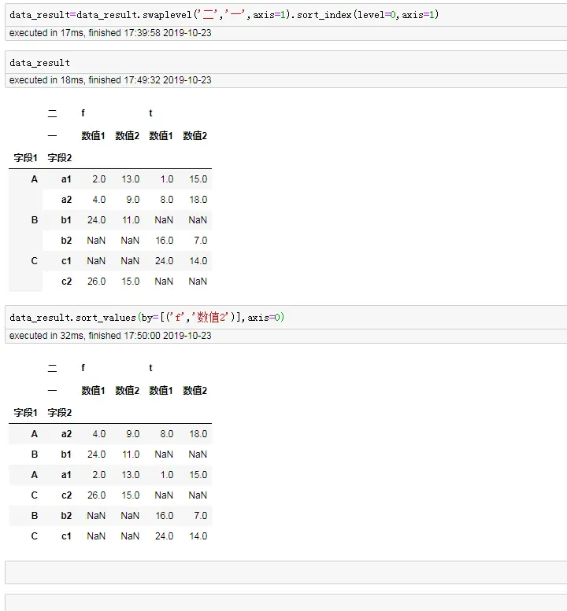

><p style="font-family: 'Microsoft YaHei', sans-serif; line-height: 1.5;">
>作者：数据人阿多
></p>

习惯了Excel里面的透视表拖拽方式，在Python中的pandas怎么能方便使用透视函数呢，有时可能会感到困惑，但是Excel中的透视表功能，pandas基本都能实现，下面进行详细介绍：
# 生成透视表函数
**pd.pivot_table(data,values=None,index=None,columns=None,aggfunc='mean',fill_value=None,margins=False,dropna=True,margins_name='All')** <br/>
详细介绍每个参数：<br/>
`data`：为了生成透视表需要用到的数据框，对应Excel里面的需要用到的区域 <br/>
`values`：对那个字段进行值计算，对应Excel里面需要把字段拖拽到值的地方 <br/>
`index`：根据字段进行汇总，生成每行一个分类，对应Excel里面需要把字段拖拽到行的地方 <br/>
`columns`：根据字段进行汇总，生成每列一个分类，对应Excel里面需要把字段拖拽到列的地方 <br/>
`aggfunc`：对值字段进行那种计算，计数、求和、平均，对应Excel里面对值字段设置里面的值汇总方式选择 <br/>
`fill_value`：行分类与列分类交叉值为空的地方用什么值填充 <br/>
`margins`：是否对行列显示汇总，对应Excel里面透视表下面设计选型卡，总计是否对行和列启用 <br/>
`dropna`：是否包括原始引用数据里面都为NAN的列 <br/>
`margins_name`：可以给总计的列起别名 <br/>


# 示例
- **导入数据**
```python
import pandas as pd
data=pd.read_excel('111.xlsx',sheet_name='python')
data
```

- **创建数据透视表**
```python
pd.pivot_table(data,values =['数值1','数值2'],index=['字段1','字段2','字段3'],aggfunc='sum')
```

- **查看生成的数据透视表是什么** <br/>
可以看到生成的数据透视表还是dataframe数据框，那么数据框能用的一切方法同样适用于生成的这个透视表
```python
data_result=pd.pivot_table(data,values =['数值1','数值2'],
                           index=['字段1','字段2','字段3'],
                           aggfunc='sum')
type(data_result)
```

- **添加行列总计**
```python
#添加margins参数
pd.pivot_table(data,values =['数值1','数值2'],
                    index=['字段1','字段2'],
                    columns=['字段3'],
                    aggfunc='sum',
                    margins=True)
```


- **转换成正常的数据框** <br/>
重置索引转换成正常的数据框样式
```python
data_result=pd.pivot_table(data,values =['数值1','数值2'],
                           index=['字段1','字段2','字段3'],
                           aggfunc='sum').reset_index()
```

- **生成带列分类的透视表**
```python
pd.pivot_table(data,values =['数值1','数值2'],
                    index=['字段1','字段2'],
                    columns=['字段3'],
                    aggfunc='sum')
```

- **不同层级之间的调换** <br/>
比如上面生成带列字段分类的透视表，需要把字段3（f、t）的一行和上面数值1、数值2的一行进行调换
```python
#先进行一下赋值
data_result=pd.pivot_table(data,values =['数值1','数值2'],
                    index=['字段1','字段2'],
                    columns=['字段3'],
                    aggfunc='sum')
#修改列的名称
data_result.columns.names=['一','二']

#进行调换
data_result.swaplevel('二','一',axis=1)

#为了对相同内容放到一块，进行排序
data_result.swaplevel('二','一',axis=1).sort_index(level=0,axis=1)
```

- **根据一列进行排序**
```python
#赋值操作
data_result=data_result.swaplevel('二','一',axis=1).sort_index(level=0,axis=1)

#进行排序
data_result.sort_values(by=[('f','数值2')],axis=0)
```


**************************************************************************
**以上是自己实践中遇到的一些问题，分享出来供大家参考学习，欢迎关注微信公众号：DataShare ，不定期分享干货**


