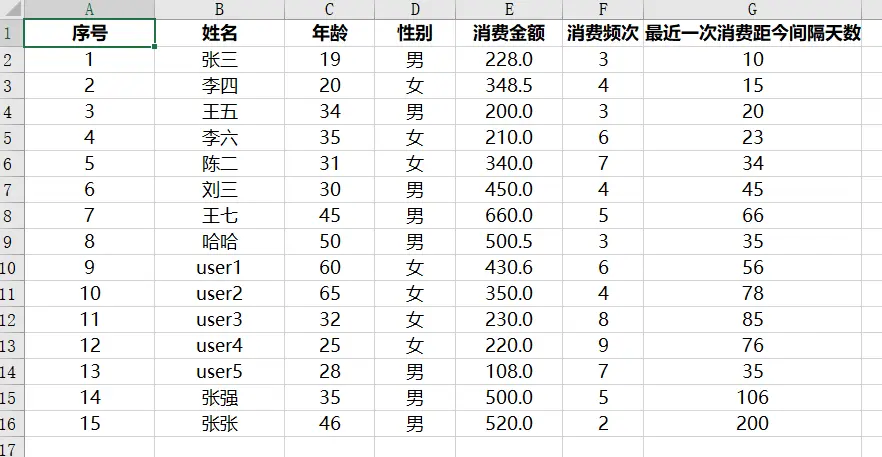
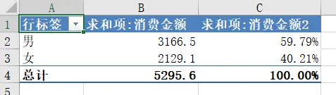
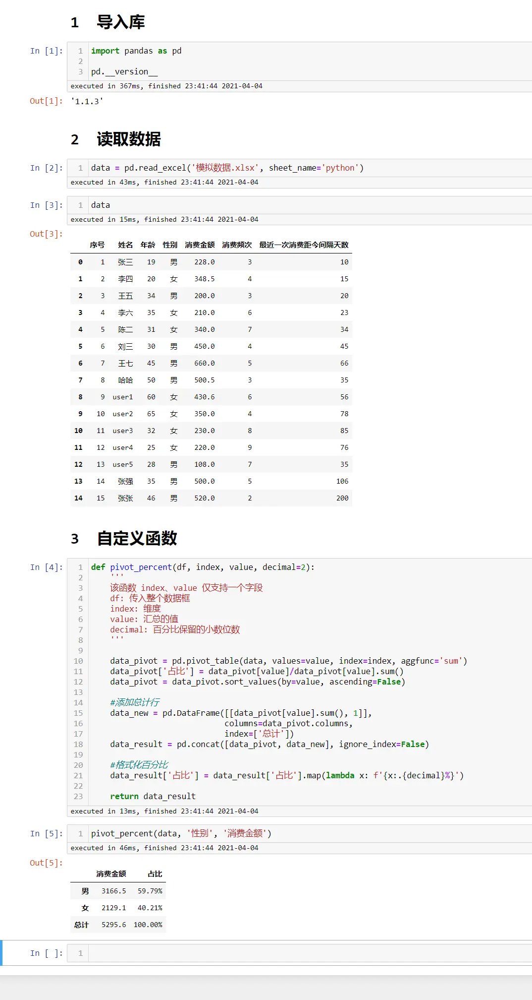

><p style="font-family: 'Microsoft YaHei', sans-serif; line-height: 1.5;">
>作者：数据人阿多
></p>

# 背景
Excel里面数据透视表可谓是功能强大，可以对数据进行去重，可以方便的对数据进行汇总，可以对数据从不同维度进行交叉分析等，而且速度还非常快，即使有几万行数据。

当然在Python里面也有数据透视函数，但是没有Excel这么灵活，比如今天要介绍的这种情况，在值里面要一列放聚合的求和，一列放聚合后的占比，这在Excel里面可以非常方便的利用数据透视表的功能 **值显示方式** 来解决，今天这篇文章利用 **自定义函数** 来实现这个功能。
# 模拟数据

# 需要类似Excel数据透视表的结果

# 自定义函数
利用pandas的 **pivot_table** 函数可以实现求和功能，然后再让该列值除以总和来实现占比的功能
```python
def pivot_percent(df, index, value, decimal=2):
    '''
    该函数 index、value 仅支持一个字段
    df: 传入整个数据框
    index: 维度
    value: 汇总的值
    decimal: 百分比保留的小数位数
    '''
    
    data_pivot = pd.pivot_table(data, values=value, index=index, aggfunc='sum')
    data_pivot['占比'] = data_pivot[value]/data_pivot[value].sum()
    data_pivot = data_pivot.sort_values(by=value, ascending=False)
    
    #添加总计行
    data_new = pd.DataFrame([[data_pivot[value].sum(), 1]],
                            columns=data_pivot.columns,
                            index=['总计'])
    data_result = pd.concat([data_pivot, data_new], ignore_index=False)
    
    #格式化百分比
    data_result['占比'] = data_result['占比'].map(lambda x: f'{x:.{decimal}%}')

    return data_result
```
# jupyter notebook 完成代码

# 历史相关文章
- [像excel透视表一样使用pandas透视函数](./像excel透视表一样使用pandas透视函数.md)
- [对比Excel，利用pandas进行数据分析各种用法](./对比Excel，利用pandas进行数据分析各种用法.md)
**************************************************************************
**以上是自己实践中遇到的一些问题，分享出来供大家参考学习，欢迎关注微信公众号：DataShare ，不定期分享干货**
