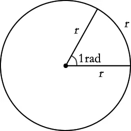

# 介绍
众所周知地球是一个球体，地平面是一个弧形，那么两个地理位置之间的中点该如何确定，比如北京与上海两个城市之间的中点在哪里？
可以直接对经纬度进行平均，求中点吗？
**答案：当然不可以** <br/>

我们都知道一个地理位置是由经度、维度来确定，平时在计算地理信息时基本都是两列数据，一列是经度，一列是维度，比如：<br/>
北京："lon":116.512885,"lat":39.847469， <br/>
上海："lon":116.332334,"lat":39.882806 <br/>
>- **lon：longitude    经度** <br/>
经度是指通过某地的经线面与本初子午面所成的**二面角**。<br/>
在本初子午线以东的经度叫东经，在本初子午线以西的叫西经。<br/>
东经用“E”表示，西经用“W”表示。<br/>
><br/>
>- **lat：latitude    维度** <br/>
赤道的纬度为0°，将行星平分为南半球和北半球。<br/>
纬度是指某点与地球球心的连线和地球赤道面所成的**线面角**，其数值在0至90度之间。<br/>
位于赤道以北的点的纬度叫北纬，记为N，位于赤道以南的点的纬度称南纬，记为S。

# 概念-----计算原理
**那么应该怎么计算呢？**
我们可以把地球看做是一个立体坐标系，有`x`轴，`y`轴，`z`轴三个方向，对于球面上的一个点，可以分别计算出在`x`轴，`y`轴，`z`轴的投影，那么在三个轴上面的分量是可以直接求均值，最后再进行反向合成，这样即可求出球面上对应的中点。                                                                                                                                                                                                                                                                                                                                                                                                                                                                                                                                                                                                                                                                                                  

下图手工画出了，在`x`轴，`y`轴，`z`轴如何进行投影（可进行参考）：

根据手绘图可以计算出，各个分量：<br/>
**`x = cos(lat) * sin(lon)`** <br/>
**`y = cos(lat) * cos(lon)`**<br/>
**`z = sin(lat)`** <br/>


**角度和弧度相互转换** <br/>
由于我们实际数据中的经纬度是角度，而我们在计算分量时需要用弧度，比如 **`cos(π/2)`** ，这里就先需要转换，那么怎么进行转换：<br/>
python的math模块里面有相应转换函数 <br/>
radians()-----将角度转换为弧度 <br/>
degrees()-----将弧度转换为角度 <br/>

>**脑补一下角度与弧度：**  <br/>
度和弧度都是衡量角的大小的单位，就像米（m）和英寸（in）都是用来衡量长度的单位。度用°来表示，弧度用rad表示。<br/>
1rad = (180/π)° ≈ 57.3°  
1° = (π/180)rad ≈ 0.01745rad <br/>
><br/> 
>**弧度的定义**  <br/>
在一个圆中，弧长等于半径的弧，其所对的圆心角就是 1rad。也就是说，两条射线从圆心向圆周射出，形成一个夹角和夹角正对的一段弧。当这段弧的长度正好等于圆的半径时，两条射线的夹角的弧度为 1。

根据定义，圆一周的弧度数为 2πr/r = 2π，360° = 2πrad，平角（即 180° 角）为 πrad，直角为 π/2rad

在具体计算中，角度以弧度给出时，通常不写弧度单位，直接写值。最典型的例子是三角函数，例如：sin(8π)、tan(3π/2)

# 自定义函数
```python
import pandas as pd
import numpy as np
from math import cos, sin, atan2, sqrt, radians, degrees

data=pd.read_excel('./data.xlsx')

def center_geolocation(df): 
    """
    输入多个经纬度坐标，找出中心点  [lon,lat]->[经度,维度]
    :param geolocations: 列表
    :return 中心经纬度
    """
    x = 0
    y = 0
    z = 0
    lenth = len(df)
    for lon, lat in zip(df['lon'].to_list(),df['lat'].to_list()):
        lon = radians(float(lon))    #radians将角度转换为弧度
        lat = radians(float(lat))
        x += cos(lat) * sin(lon)
        y += cos(lat) * cos(lon)
        z += sin(lat)
    
    x = float(x / lenth)
    y = float(y / lenth)
    z = float(z / lenth)
    
    #degrees将弧度转换为角度
    lon=degrees(atan2(x, y))
    lat=degrees(atan2(z, sqrt(x * x + y * y)))
    
    return pd.DataFrame({'lon':[lon],'lat':[lat]})    

#使用
result_data=data.groupby('ID').apply(center_geolocation)
result_data.index=result_data.index.droplevel(level=1)
result_data.to_excel('./result_data.xlsx')
```

**************************************************************************
**以上是自己实践中遇到的一些问题，分享出来供大家参考学习，欢迎关注微信公众号：DataShare ，不定期分享干货**
