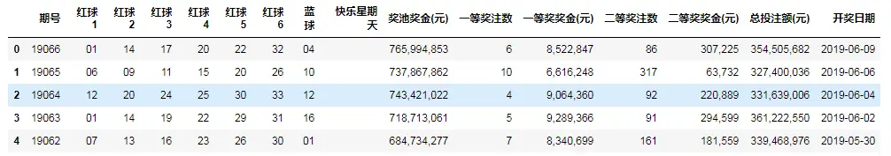
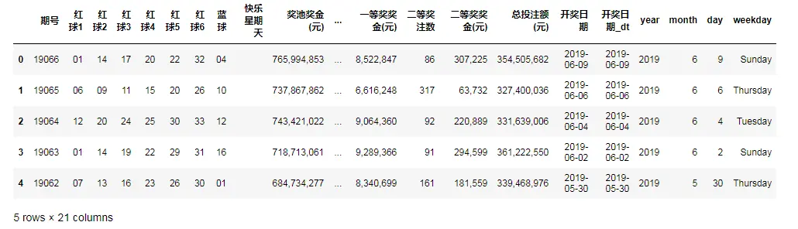
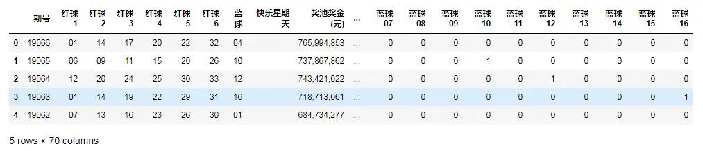
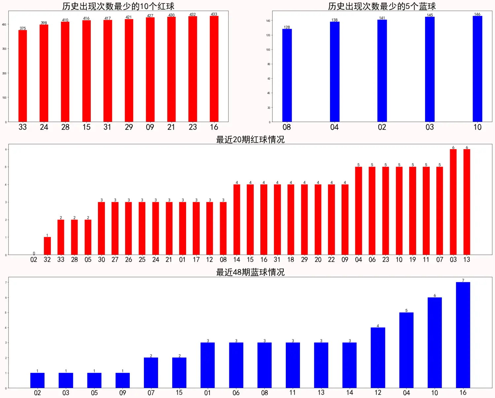

由于身边同事经常买双色球，时间长了也就慢慢关注这个，我们中午经常也一块去吃饭，然后去彩票站点。之前是在支付宝上面就可以买，那会自己也会偶尔买10元的。这片文章主要是爬取了历史双色球所有数据，并进行简单分析，纯属业余爱好，分析结果仅供参考。

# 1.数据爬取网页
历史双色球数据：[https://datachart.500.com/ssq/](https://datachart.500.com/ssq/)
```python
 #分析网页后可以得知get历史所有数据的参数
url='https://datachart.500.com/ssq/history/newinc/history.php?start=03001'  

#加载相关的库
import requests
import numpy as np
import pandas as pd

#获取历史所有双色球数据
response = requests.get(url)
response.encoding = 'utf-8'  
re_text = response.text

#网页数据解析
re=re_text.split('<tbody id="tdata">')[1].split('</tbody>')[0]
result=re.split('<tr class="t_tr1">')[1:]

all_numbers=[]
for i in result:
    each_numbers=[]
    i=i.replace('<!--<td>2</td>-->','')
    each=i.split('</td>')[:-1]
    for j in each:
        each_numbers.append(j.split('>')[1].replace('&nbsp;',''))
    
    all_numbers.append(each_numbers)
  
#定义列名称  
col=['期号','红球1','红球2','红球3','红球4','红球5','红球6','蓝球','快乐星期天','奖池奖金(元)',
     '一等奖注数','一等奖奖金(元)','二等奖注数','二等奖奖金(元)','总投注额(元)','开奖日期']

#解析完网页数据，生成双色球数据框
df_all=pd.DataFrame(all_numbers,columns=col)
df_all.head()
```



# 2.数据转换
```python
#日期转换
df_all['开奖日期_dt']=pd.to_datetime(df_all['开奖日期'])
df_all['year']=df_all['开奖日期_dt'].dt.year
df_all['month']=df_all['开奖日期_dt'].dt.month
df_all['day']=df_all['开奖日期_dt'].dt.day
df_all['weekday']=df_all['开奖日期_dt'].dt.weekday_name
df_all.head()
```


```python
#one-hot 编码转换自定义函数
def lotterydata(df):
    modeldata=df.copy()
    
    redball=[]
    for i in range(1,34):
        redball.append('红球'+'%02d'%i)
    for i in redball:
        modeldata[i]=0
    
    blueball=[]
    for i in range(1,17):
        blueball.append('蓝球'+'%02d'%i)
    for i in blueball:
        modeldata[i]=0
        
    
    for row in range(modeldata.shape[0]):
        #print(row)
        #print(modeldata.iloc[row,:])
        for i in redball:
            #print(i)
            #modeldata[i]=0
            if (modeldata.iloc[row,:]['红球1']==i[-2:] or modeldata.iloc[row,:]['红球2']==i[-2:] 
                or modeldata.iloc[row,:]['红球3']==i[-2:] or modeldata.iloc[row,:]['红球4']==i[-2:] 
                or modeldata.iloc[row,:]['红球5']==i[-2:] or modeldata.iloc[row,:]['红球6']==i[-2:]):
                modeldata.loc[row,i]=1

        for j in blueball:
            #modeldata[j]=0
            if modeldata.iloc[row,:]['蓝球']==j[-2:]:
                modeldata.loc[row,j]=1
    return modeldata

#生成各颜色球的0-1编码
modeldata=lotterydata(df_all)
modeldata.head()
```


# 3.数据分析与展示
```python
allhistorydata=modeldata.iloc[:,-49:].copy()

#历史所有红球和蓝球数据
allhistorydata_red=allhistorydata.iloc[:,:33]
allhistorydata_blue=allhistorydata.iloc[:,-16:]

#最近20期红球和最近48期蓝球
#（33*3）/6  每个红球有3次出现机会，看一共需要多少期，这里取整数20期
#（16*3）/1  每个蓝球有3次出现机会，看一共需要多少期
recently20_red=allhistorydata.iloc[:20,:33]
recently48_blue=allhistorydata.iloc[:48,-16:]

#求和
historyred_sum=allhistorydata_red.sum()
historyblue_sum=allhistorydata_blue.sum()

recently20red_sum=recently20_red.sum()
recently48blue_sum=recently48_blue.sum()

#排序
historyred_sum=historyred_sum.sort_values(ascending=True)
historyblue_sum=historyblue_sum.sort_values(ascending=True)

recently20red_sum=recently20red_sum.sort_values(ascending=True)
recently48blue_sum=recently48blue_sum.sort_values(ascending=True)

#数据展示
import matplotlib.pyplot as plt

%matplotlib inline
plt.rcParams['font.sans-serif'] = ['SimHei']    #显示中文

plt.figure(figsize=(30,24),facecolor='snow')

#历史出现次数最少的10个红球
x_red=historyred_sum.index.map(lambda x:x[-2:])[:10]
y_red=historyred_sum.values[:10]

#历史出现次数最少的5个蓝球
x_blue=historyblue_sum.index.map(lambda x:x[-2:])[:5]
y_blue=historyblue_sum.values[:5]

plt.subplot(3,2,1)
plt.bar(x_red,y_red,width=0.4,align='center',color='r')
for a,b in zip(x_red,y_red):
    plt.text(a,b,b,ha='center',va='bottom',fontsize=15)
plt.tick_params(axis='x',labelsize=30)
plt.title("历史出现次数最少的10个红球",fontsize=30)

plt.subplot(3,2,2)
plt.bar(x_blue,y_blue,width=0.2,align='center',color='b')
for a,b in zip(x_blue,y_blue):
    plt.text(a,b,b,ha='center',va='bottom',fontsize=15)
plt.tick_params(axis='x',labelsize=30)
plt.title("历史出现次数最少的5个蓝球",fontsize=30)

#最近20期红球
x20_red=recently20red_sum.index.map(lambda x:x[-2:])
y20_red=recently20red_sum.values

#最近48期蓝球
x48_blue=recently48blue_sum.index.map(lambda x:x[-2:])
y48_blue=recently48blue_sum.values

plt.subplot(3,1,2)
plt.bar(x20_red,y20_red,width=0.5,align='center',color='r')
for a,b in zip(x20_red,y20_red):
    plt.text(a,b,b,ha='center',va='bottom',fontsize=15)
plt.tick_params(axis='x',labelsize=25)
plt.title("最近20期红球情况",fontsize=30)

plt.subplot(3,1,3)
plt.bar(x48_blue,y48_blue,width=0.5,align='center',color='b')
for a,b in zip(x20_blue,y20_blue):
    plt.text(a,b,b,ha='center',va='bottom',fontsize=15)
plt.tick_params(axis='x',labelsize=25)
plt.title("最近48期蓝球情况",fontsize=30)

plt.show()

```

**最终的数据展示结果，仅供参考！！！**



**************************************************************************
**以上是自己实践中遇到的一些问题，分享出来供大家参考学习，欢迎关注微信公众号：DataShare ，不定期分享干货**

