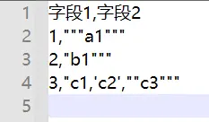

# 背景
在数据分析时，有时我们会碰到csv格式文件，需要先进行数据处理，转换成所需要的数据格式，然后才能进行分析

业务侧的同学可能对Excel文件比较熟悉，Excel可以把单个sheet直接保存为csv文件，也可以直接读取csv文件，变成Excel文件

技术侧的同学有时需要把数据库里面的数据导出到一个csv文件，有时也需要把别人给的csv文件加载到数据库中

csv文件在各个地方都这么流行，你真的彻底了解它吗？

>CSV（逗号分隔值文件格式），逗号分隔值（Comma-Separated Values，CSV，有时也称为字符分隔值，因为分隔字符也可以不是逗号）
# csv文件包含的各种数据

- **常规的内容** <br/>
表格中：

<br/>
csv文件中：


- **字段内部有逗号** <br/>
表格中：

<br/>
csv文件中：


- **字段内部有引号** <br/>
表格中：

<br/>
csv文件中：


- **字段内部有换行符** <br/>
表格中：

<br/>
csv文件中：


- **字段内部有空格** <br/>
表格中：

<br/>
csv文件中：


# csv文件规则
从上面的各种内容可以看出，当字段中包含特殊的字符时，在csv文件中会用双引号进行特殊处理

官方标准：<br/>
RFC4180：[https://www.rfc-editor.org/rfc/rfc4180.txt](https://www.rfc-editor.org/rfc/rfc4180.txt) <br/>
维基百科wiki：[https://wiki.lazarus.freepascal.org/CSV](https://wiki.lazarus.freepascal.org/CSV)

>- **字段内包含逗号， 双引号， 或是换行符的字段必须放在双引号内**
>- **字段内包含引号必须在其前面增加一个引号，来实现引号的转码**
>- **元素中的换行符将被保留下来**
>- **分隔符逗号前后的空格仍然会被保留**
# 用pandas进行解析
- **常规的内容**

```python
import pandas as pd

data1=pd.read_csv('1-常规的内容.csv',encoding='GB2312')

data1
```
- **字段内部有逗号**

```python
import pandas as pd

data1=pd.read_csv('2-字段内部有逗号.csv',encoding='GB2312',quotechar='"')

data1
```
- **字段内部有引号**

```python
import pandas as pd

data1=pd.read_csv('3-字段内部有引号.csv',encoding='GB2312',quotechar='"')

data1
```
- **字段内部有换行符**
***该程序是在 Windows 平台运行，换行符为 `\r\n`***

```python
import pandas as pd

data1=pd.read_csv('4-字段内部有换行符.csv',
                  encoding='GB2312',
                  quotechar='"',
                  engine='python')

data1
```
- **字段内部有空格**

```python
import pandas as pd

data1=pd.read_csv('5-字段内部有空格.csv',
                  encoding='GB2312',
                  quotechar='"')

data1
```
# pd.read_csv部分参数解释
```python
import pandas as pd
print(pd.__version__)   #1.3.4
```
<br/>

完整的参数：
```python
pd.read_csv(
    filepath_or_buffer: 'FilePathOrBuffer',
    sep=<no_default>,delimiter=None,header='infer',names=<no_default>,
    index_col=None,usecols=None,squeeze=False,prefix=<no_default>,
    mangle_dupe_cols=True,dtype: 'DtypeArg | None' = None,
    engine=None,converters=None,true_values=None,
    false_values=None,skipinitialspace=False,skiprows=None,
    skipfooter=0,nrows=None,na_values=None,keep_default_na=True,
    na_filter=True,verbose=False,skip_blank_lines=True,
    parse_dates=False,infer_datetime_format=False,keep_date_col=False,
    date_parser=None,dayfirst=False,cache_dates=True,iterator=False,
    chunksize=None,compression='infer',thousands=None,
    decimal: 'str' = '.',lineterminator=None,quotechar='"',
    quoting=0,doublequote=True,escapechar=None,
    comment=None,encoding=None,encoding_errors: 'str | None' = 'strict',
    dialect=None,error_bad_lines=None,warn_bad_lines=None,
    on_bad_lines=None,delim_whitespace=False,low_memory=True,
    memory_map=False,float_precision=None,storage_options: 'StorageOptions' = None,
)
```
<br/> 
下面主要解释一些常用的参数：<br/> 

- `sep` <br/>
sep参数是字符型的，代表每行数据内容的分隔符号，默认是逗号，另外常见的还有制表符（\t）、空格等，根据数据的实际情况传值
还提供了一个参数名为delimiter的定界符，这是一个备选分隔符，是sep的别名，效果和sep一样。如果指定该参数，则sep参数失效

- `dtype` <br/>
指定各数据列的数据类型，建议在导入数据时全部使用字符型，`dtype='str'`，后面在数据处理时再转换为需要的类型
- `engine` <br/>
解析器、引擎，可以选择C或Python。
C语言的速度最快，Python语言的功能最为完善
- `iterator` <br/>
是否设置为迭代器，如果设置为True，则返回一个TextFileReader对象，并可以对它进行迭代，以便逐块处理文件，一般结合`chunksize`使用，指定文件块的大小，分块处理大型CSV文件
- `lineterminator` <br/>
每行的解释符号，但只能允许一个字符长度，仅对C解析器有效
- `quotechar` <br/>
字段之间的定界符，这样就能正确解析包含特殊符号的字段了

# 历史相关文章
- [Python pandas在读取csv文件时（linux与windows之间传输），数据行数不一致的问题](./Python-pandas在读取csv文件时（linux与windows之间传输），数据行数不一致的问题.md)
- [Python pandas数据分列，分割符号&固定宽度](./Python-pandas数据分列，分割符号&固定宽度.md)
- [Python 字符串格式化方法总结](./Python-字符串格式化方法总结.md)
**************************************************************************
**以上是自己实践中遇到的一些问题，分享出来供大家参考学习，欢迎关注微信公众号：DataShare ，不定期分享干货**
