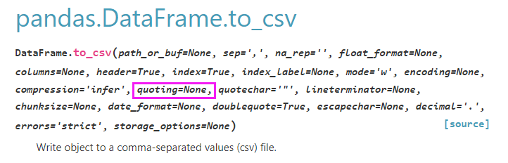

# 背景
最近在做数据处理时，发现别人给的 csv 文件用 txt 打开后，发现里面的所有字段都是带双引号，与自己之前见过的 csv 文件有点不一样，自己脑海里面隐约也见过 python 有相关的设置参数，于是就查看 python 官方文档中的 csv 模块介绍，总结分享出来予以记录，方便后续查看

csv文档地址：[https://docs.python.org/zh-cn/3.11/library/csv.html](https://docs.python.org/zh-cn/3.11/library/csv.html)  
csv代码：[https://github.com/python/cpython/blob/3.11/Lib/csv.py](https://github.com/python/cpython/blob/3.11/Lib/csv.py)

***csv 模块的常量是从 _csv 模型引入，_csv 是用 c 语言编写***

# csv模块定义的常量说明
- **csv.QUOTE_ALL，等于0**  
指示 `writer` 对象给所有字段加上引号
- **csv.QUOTE_MINIMAL，等于1**  
指示 `writer` 对象仅为包含特殊字符（例如 *定界符(delimiter)*、*引号字符(quotechar)*  或  *行结束符(lineterminator)* 中的任何字符）的字段加上引号
- **csv.QUOTE_NONNUMERIC，等于2**   
指示 `writer` 对象为所有非数字字段加上引号
指示 `reader` 将所有未用引号引出的字段转换为 float 类型
- **csv.QUOTE_NONE，等于3**   
指示 `writer` 对象不使用引号括住字段。当 *定界符(delimiter)* 出现在输出数据中时，其前面应该有 *转义符(escapechar)*。如果未设置 *转义符(escapechar)*，则遇到任何需要转义的字符时，`writer` 都会抛出 Error 异常
指示 `reader` 不对引号字符进行特殊处理

# 在 pandas 中的案例演示
**模拟数据**

**pandas to_csv**
默认使用的是 `csv.QUOTE_MINIMAL`   
文档：https://pandas.pydata.org/pandas-docs/stable/reference/api/pandas.DataFrame.to_csv.html

**csv.QUOTE_ALL 生成csv文件**

**csv.QUOTE_MINIMAL 生成csv文件**

**csv.QUOTE_NONNUMERIC 生成csv文件**

**csv.QUOTE_NONE 生成csv文件**

**jupyter-notebook 完整代码**

# 历史相关文章
- [对csv文件，又get了新的认知](./对csv文件，又get了新的认知.md)
- [Python pandas在读取csv文件时（linux与windows之间传输），数据行数不一致的问题](./Python-pandas在读取csv文件时（linux与windows之间传输），数据行数不一致的问题.md)
- [Python pandas数据分列，分割符号&固定宽度](./Python-pandas数据分列，分割符号&固定宽度.md)
- [Python 字符串格式化方法总结](./Python-字符串格式化方法总结.md)
**************************************************************************
**以上是自己实践中遇到的一些问题，分享出来供大家参考学习，欢迎关注微信公众号：DataShare ，不定期分享干货**
