><p style="font-family: 'Microsoft YaHei', sans-serif; line-height: 1.5;">
>作者：数据人阿多
></p>

# 背景
懂编程语言最开始是属于程序猿的世界，现在随着国内人们受教育程度的提升、互联网科技的发展，业务人员也开始慢慢需要懂编程语言。从最近几年的招聘需求看，要求会Python则成为刚需。

业务人员之前使用的大部分都是Excel，现在随着数据量的提升，Excel已无法满足数据处理需求。如果在Excel里面数据量超过10万行，则Excel运行起来就相当卡顿。

下面展示一些在Excel里面常用的功能，看看其在Python里面具体是怎么实现的，Python处理数据用到的主要是pandas库，这也是《利用python进行数据分析》整本书介绍的对象。

如下所示为2021年2月编程语言排行榜：
从排行榜来看，python越来越吃香了
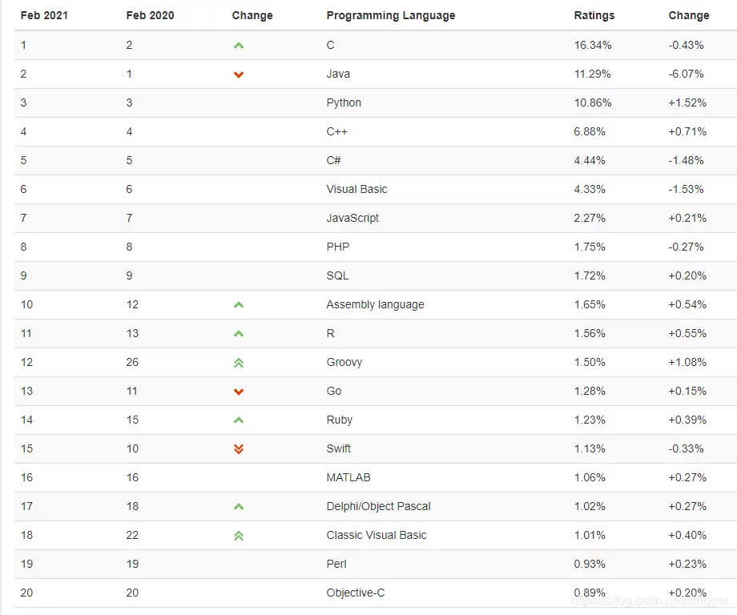

# 案例
*这里只是展示方法，用到数据只有15行*
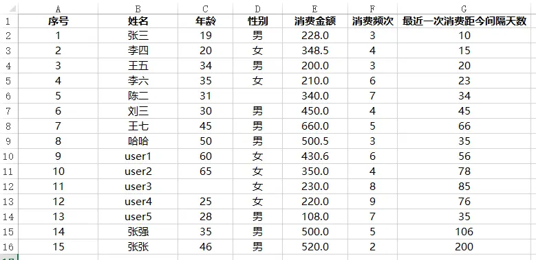
### 导入模拟数据
```python
import pandas as pd
import numpy as np

data = pd.read_excel('模拟数据.xlsx')

data.head()
```
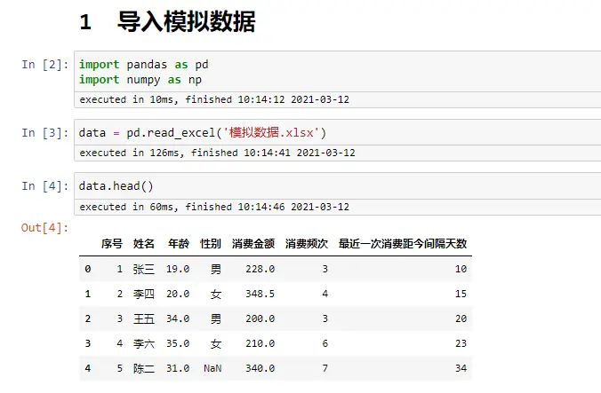

### 查看数据行、列
```python
len(data)    #数据行数

len(data.columns)    #数据列数

data.info()     #数据各列详细信息

data.describe()   #默认，值统计数值型列

data.describe(include='all')   #所有列

data.describe(include='object')   #只针对列为字符型
```
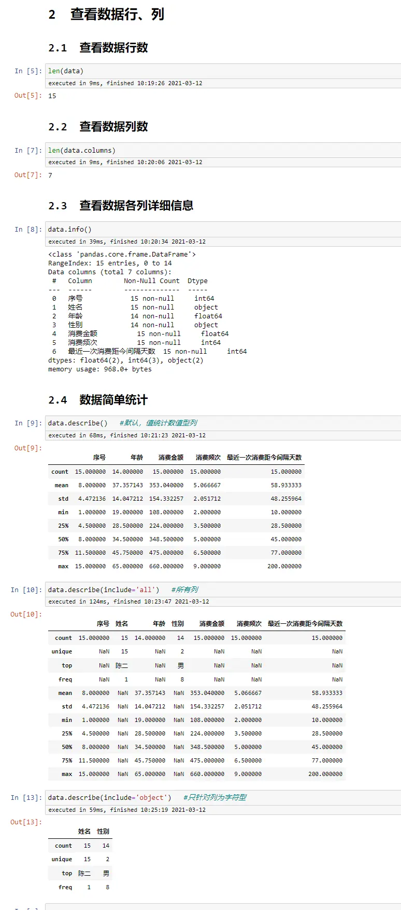
### 查看数据类型
```python
data.dtypes
```
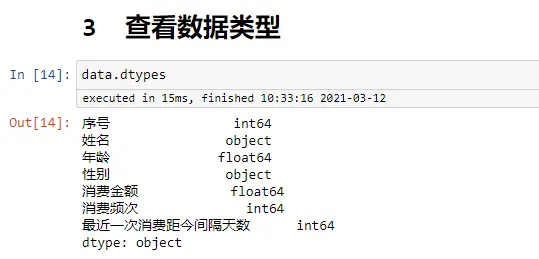
### 数据筛选
```python
data[data['性别']=='男']

data[data['年龄']>=30]

data[(data['年龄']>=30) & (data['性别']=='男')]   #两个条件 与

data[(data['年龄']>=30) | (data['性别']=='男')]    #两个条件 或
```
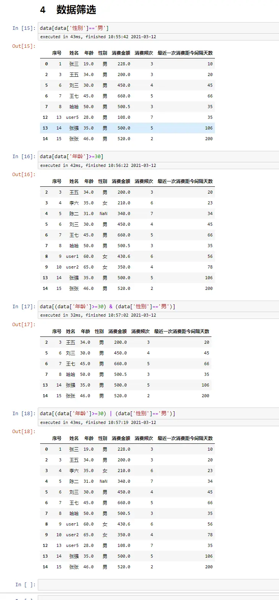
### 基于筛选，修改里面的数据
```python
data.loc[data['姓名']=='张三','性别']='女'   #把张三 性别 修改为：女

data
```
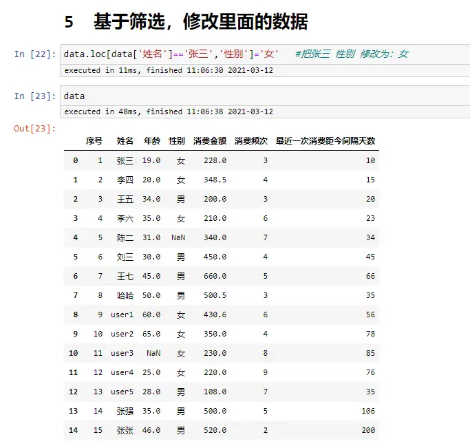
### 数据缺失值替换
```python
data   #性别、年龄  里面各有个缺失值

int(data['年龄'].mean(skipna=True))

#年龄的缺失值，用平均值来代替
data['年龄'].fillna(int(data['年龄'].mean(skipna=True)),inplace=True)   

data

data['性别'].fillna('其他',inplace=True)

data
```
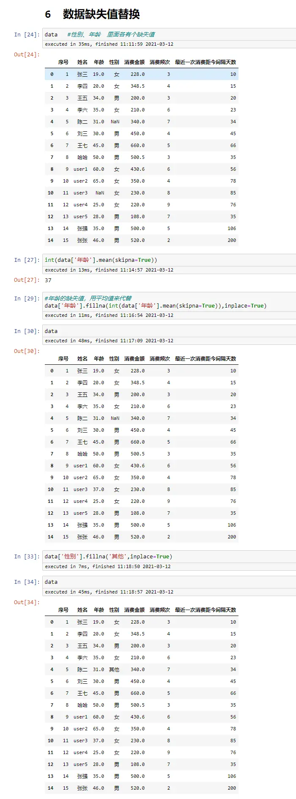
### 添加行
```python
#方法一
data.loc[15]=[16,'new',55,'女',350,4,50]
data

#方法二
data_new = pd.DataFrame([[16,'new',55,'女',350,4,50]],columns=data.columns)
pd.concat([data,data_new],ignore_index=True)
```
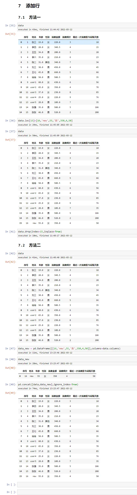
### 添加列
添加列相对比较简单，直接赋值即可
```python
data['new_column_1']=0
data['new_column_2']='new'
```
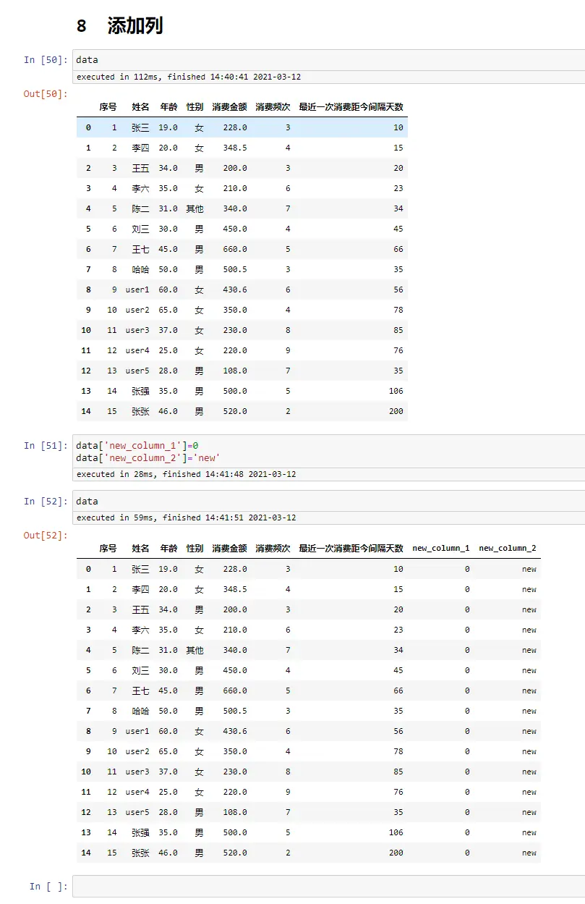
### 删除行
```python
data.loc[15]=[16,'new',55,'女',350,4,50,0,'new']    #先添加一个测试行

data

data.drop(index=15,inplace=True)    #删除行

data
```
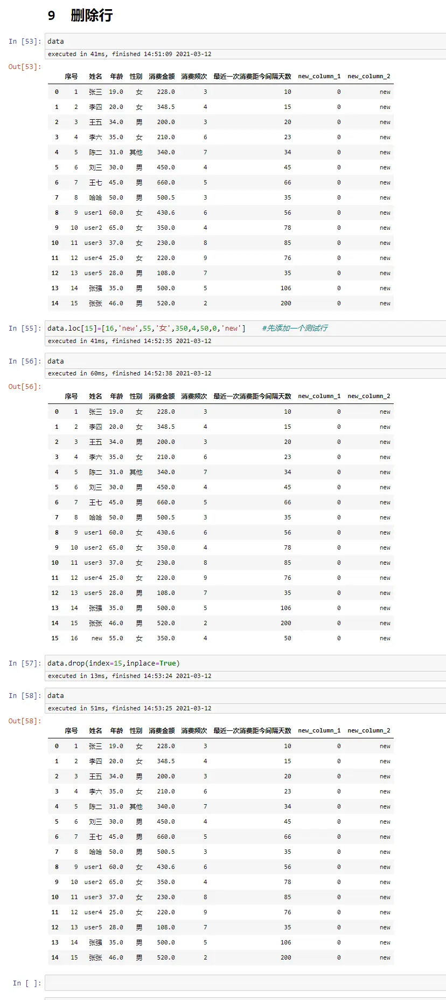
### 删除列
```python
data.drop(columns='new_column_1')    #返回删除后的新数据，原始数据不变

data.drop(columns=['new_column_1','new_column_2'])   #返回删除后的新数据，原始数据不变

data.drop(columns=['new_column_1','new_column_2'],inplace=True)   #在原始数据上处理

data
```
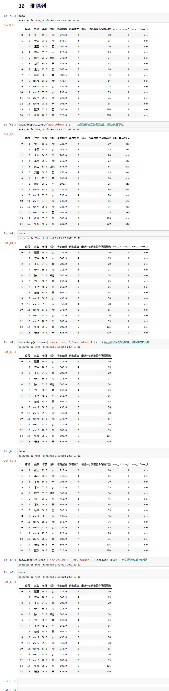
### 数据去重
```python
data 

data[['性别','消费频次']]

data[['性别','消费频次']].drop_duplicates(keep='first')  #保留第1个，一般结合排序使用

data[['性别','消费频次']].drop_duplicates(keep='last') #保留最后1个，一般结合排序使用

#根据 性别、消费频次 2列进行去重
data.drop_duplicates(subset=['性别','消费频次'],keep='first')
```
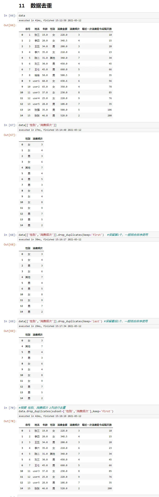
### 数据排序
相对Excel方便很多
```python
data

data.sort_values(by='消费金额',ascending=True)

data.sort_values(by='消费金额',ascending=False)

data.sort_values(by=['消费频次','消费金额'],ascending=[False,True])
```
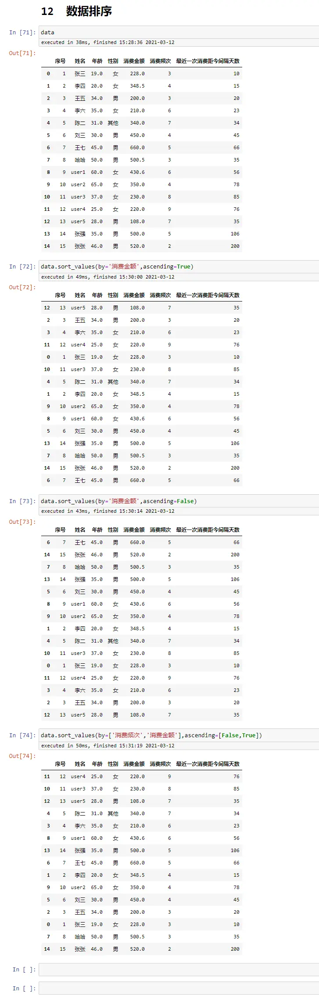
### 数据统计
```python
data

data['性别'].value_counts()

data['性别'].value_counts(normalize=True)  #百分比

data.value_counts(subset='性别')

data.value_counts(subset=['消费频次'],sort=True,ascending=True)
```
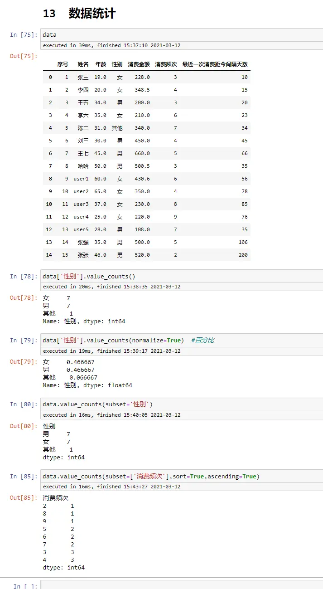
### 数据透视表
```python
data

pd.pivot_table(data,index=['性别'],aggfunc='count')

pd.pivot_table(data,index=['性别'],values=['姓名'],aggfunc='count')

pd.pivot_table(data,index=['性别'],
               columns=['消费频次'],
               values=['姓名'],
               aggfunc='count',
               fill_value=0)

pd.pivot_table(data,index=['性别'],
               columns=['消费频次'],
               values=['姓名'],
               aggfunc='sum',
               fill_value=0)

pd.pivot_table(data,index=['性别'],
               columns=['消费频次'],
               values=['消费金额'],
               aggfunc='sum',
               fill_value=0)

pd.pivot_table(data,index=['性别'],
               columns=['消费频次'],
               values=['最近一次消费距今间隔天数'],
               aggfunc='mean',
               fill_value=0)
```
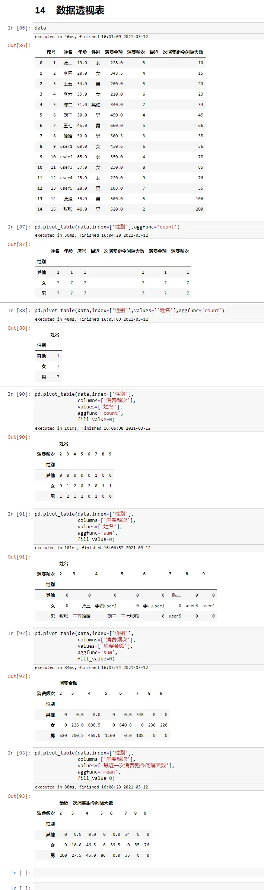
### sum函数
```python
data

data['消费金额'].sum()
```
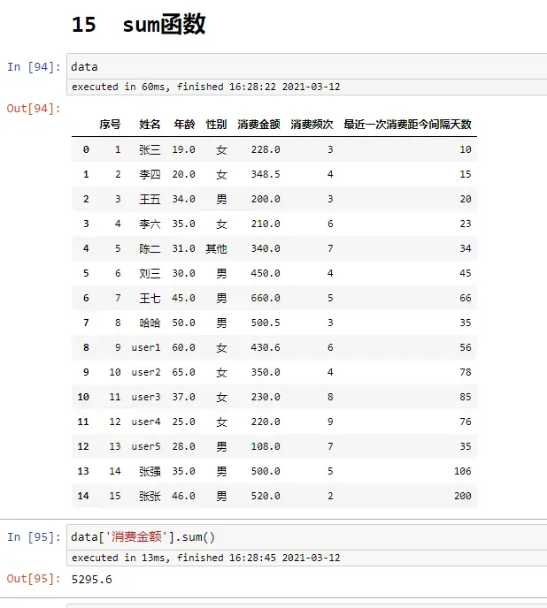
### count函数
```python
data

data.count()

data['姓名'].count()
```
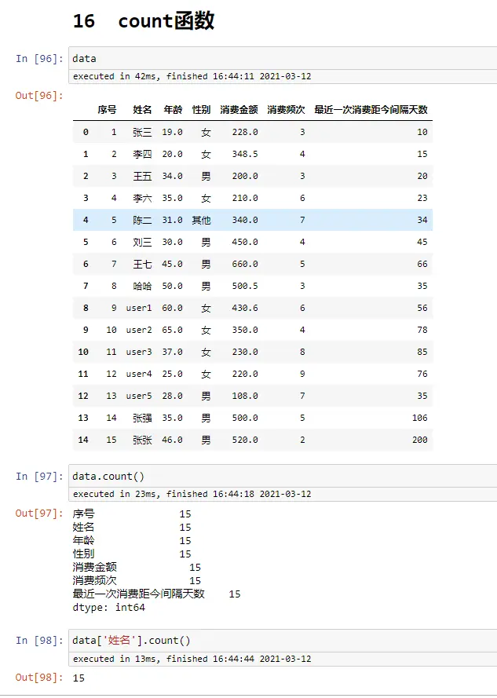
### if函数
```python
data

#方法一
data['性别_处理']=data['性别'].map(lambda x:1 if x=='男' else 0)

#方法二
def gender(x):
    if x=='男':
        return 1
    else:
        return 0

data['性别_处理2']=data['性别'].map(gender)

#方法三
dict_gender={'男':1,'女':0 ,'其他':0}
data['性别_处理3']=data['性别'].map(dict_gender)
```
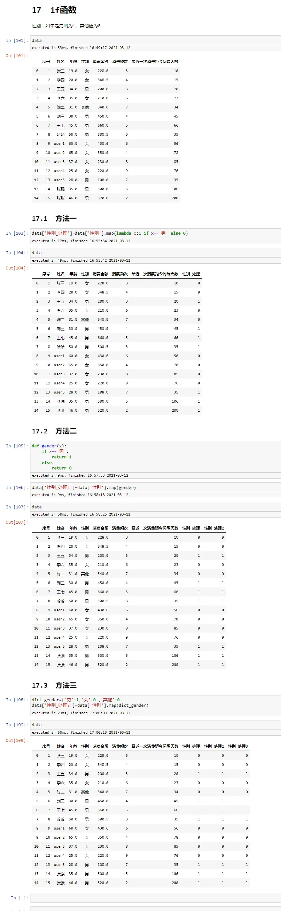

# 历史相关文章
- [像excel透视表一样使用pandas透视函数](./像excel透视表一样使用pandas透视函数.md)
- [Python pandas 数据筛选与赋值升级版详解](./Python-pandas-数据筛选与赋值升级版详解.md)
**************************************************************************
**以上是自己实践中遇到的一些问题，分享出来供大家参考学习，欢迎关注微信公众号：DataShare ，不定期分享干货**

