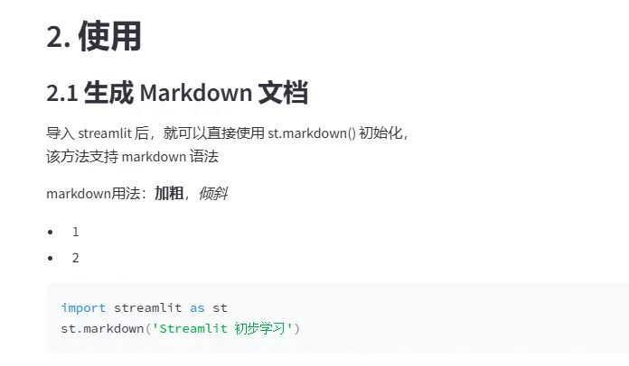
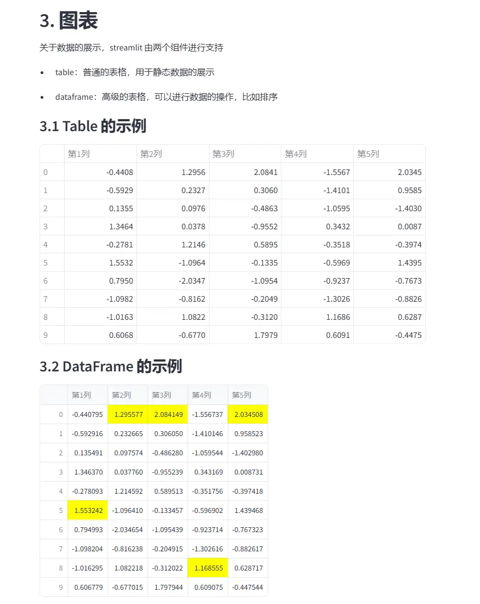
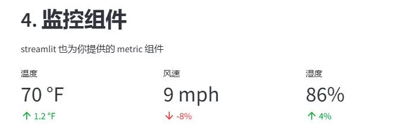
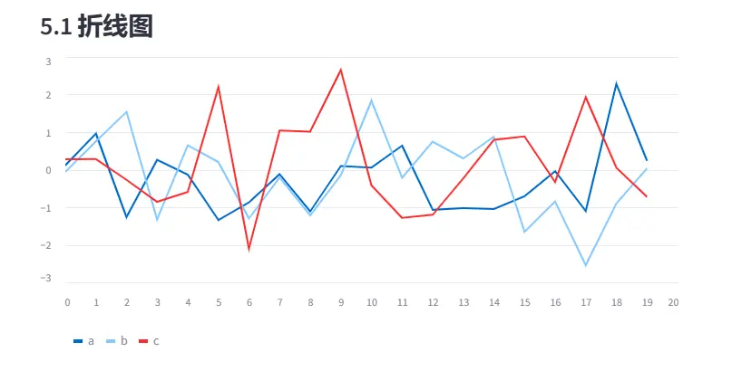
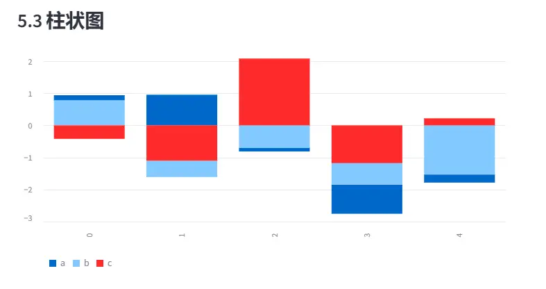
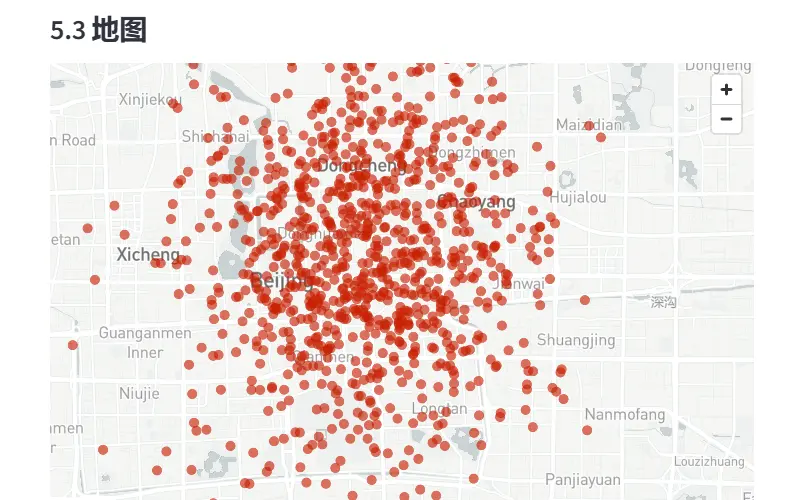
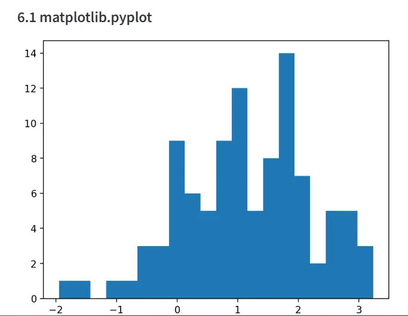

# 背景
在上一篇文章《基于DeepSeek，构建个人本地RAG知识库》中用到了 `streamlit` 库，于是小编初步深入了解了一下，感觉很好用，是数据人的一个好帮手，避免学习前端知识，利用该库直接在 Python 中编码代码，然后启动服务后，在浏览器中可以直接查看 web 页面，省略了后端、前端构建 web 的繁琐过程，数据人可以直接把自己的数据以 web 形式展示出来

# 小编环境
```python
import sys
print('python 版本：',sys.version)
#python 版本： 3.11.11 | packaged by Anaconda, Inc. | 
#(main, Dec 11 2024, 16:34:19) [MSC v.1929 64 bit (AMD64)]

import streamlit
print(streamlit.__version__)
#1.42.2

import pandas as pd 
print(pd.__version__)
#2.2.2

import numpy as np 
print(np.__version__)
#2.2.2

import matplotlib
print(matplotlib.__version__)
#3.10.0
```
# streamlit 库使用

## 1. 安装
和安装其他三方包一样，进行安装 `streamlit`
```bash
pip install streamlit
```
## 2. 使用
- **导入需要的库**
```python
import streamlit as st 
import pandas as pd 
import numpy as np 
import matplotlib.pyplot as plt
```
- **各种文本**

header：一级标题
subheader：二级标题
text：纯文本
markdown：支持markdown语法
code：代码
```python
# 展示一级标题
st.header('2. 使用')

# 展示二级标题
st.subheader('2.1 生成 Markdown 文档')

# 纯文本
st.text("""导入 streamlit 后，就可以直接使用 st.markdown() 初始化，
该方法支持 markdown 语法""")

# markdown
st.markdown('markdown用法：**加粗**，*倾斜* \n - 1 \n- 2 ')

# 展示代码，有高亮效果
code2 = '''import streamlit as st
st.markdown('Streamlit 初步学习')'''
st.code(code2, language='python')
```
web页面效果：


- **表格**

table：普通表格
dataframe：高级表格，可以进行数据的操作，比如排序
```python
# 展示一级标题
st.header('3. 图表')

# markdown
st.markdown('关于数据的展示，streamlit 由两个组件进行支持')
st.markdown('- table：普通的表格，用于静态数据的展示')
st.markdown('- dataframe：高级的表格，可以进行数据的操作，比如排序')

# 展示二级标题
st.subheader('3.1 Table 的示例')

df = pd.DataFrame(
    np.random.randn(10, 5),
    columns=('第%d列' % (i+1) for i in range(5))
)

st.table(df)


# 展示二级标题
st.subheader('3.2 DataFrame 的示例')
st.dataframe(df.style.highlight_max(axis=0))
```
web页面效果：


- **监控组件**

可以使用 `st.columns` 先生成3列，然后针对每列调用 `metric` 方法，生成监控组件
```python
# 展示一级标题
st.header('4. 监控组件')
# markdown
st.markdown('streamlit 也为你提供的 metric 组件')

col1, col2, col3 = st.columns(3)
col1.metric("温度", "70 °F", "1.2 °F")
col2.metric("风速", "9 mph", "-8%")
col3.metric("湿度", "86%", "4%")
```
web页面效果：



- **内部原生图表**

Streamlit 原生支持多种图表：
- st.line_chart：折线图
- st.area_chart：面积图
- st.bar_chart：柱状图
- st.map：地图

```python
# 展示一级标题
st.header('5. 原生图表组件')

# markdown
st.markdown('Streamlit 原生支持多种图表：')
st.markdown('- st.line_chart：折线图')
st.markdown('- st.area_chart：面积图')
st.markdown('- st.bar_chart：柱状图')
st.markdown('- st.map：地图')


# 展示二级标题
st.subheader('5.1 折线图')
chart_data = pd.DataFrame(
    np.random.randn(20, 3),
    columns=['a', 'b', 'c'])

st.line_chart(chart_data)


# 展示二级标题
st.subheader('5.2 面积图')
chart_data = pd.DataFrame(
    np.random.randn(20, 3),
    columns = ['a', 'b', 'c'])

st.area_chart(chart_data)
st.area_chart(chart_data,x_label='x',y_label='y',stack='center')
st.area_chart(chart_data,x_label='x',y_label='y',stack=True)
st.area_chart(chart_data,x_label='x',y_label='y',stack=False)


# 展示二级标题
st.subheader('5.3 柱状图')

chart_data = pd.DataFrame(
    np.random.randn(5, 3),
    columns = ["a", "b", "c"])
st.bar_chart(chart_data)
st.bar_chart(chart_data,stack=False)
st.bar_chart(chart_data,stack=False,horizontal=True)


# 展示二级标题
st.subheader('5.3 地图')
df = pd.DataFrame(
    np.random.randn(1000, 2) / [50, 50] + [39.91, 116.41],
    columns=['lat', 'lon']
)
st.map(df)
```
web页面效果：




- **集成三方库图表**

Streamlit 除了一些原生图表组件，同时还支持像 matplotlib.pyplot、Altair、vega-lite、Plotly、Bokeh、PyDeck、Graphviz 等的外部图表，这里演示一下 matplotlib.pyplot 的用法

```python
# 展示一级标题
st.header('6. 外部图表组件')

st.markdown("""
    Streamlit 的一些原生图表组件，虽然做到了傻瓜式，但仅能输入数据、高度和宽度，
    如果你想更漂亮的图表，就像 
    matplotlib.pyplot、Altair、vega-lite、Plotly、Bokeh、PyDeck、Graphviz 
    那样，streamlit 也提供了支持：
    
    - st.pyplot
    - st.bokeh_chart
    - st.altair_chart
    - st.altair_chart
    - st.vega_lite_chart
    - st.plotly_chart
    - st.pydeck_chart
    - st.graphviz_chart
    """
    )

# 展示二级标题
st.subheader('6.1 matplotlib.pyplot')

arr = np.random.normal(1, 1, size=100)
print(arr)
fig, ax = plt.subplots()
ax.hist(arr, bins=20)
st.pyplot(fig)
```
web页面效果：


# 历史相关文章
- [Python 基于Matplotlib制作动态图](https://www.jianshu.com/p/2c8024b0e4eb)
- [Python 基于plotly库快速画旭日图](https://www.jianshu.com/p/ce51d6a98c9c)
- [Python 利用Matplotlib制作初中时圆规画的图](https://www.jianshu.com/p/88d9b185d108)

**************************************************************************
**以上是自己实践中遇到的一些问题，分享出来供大家参考学习，欢迎关注微信公众号：DataShare ，不定期分享干货**
