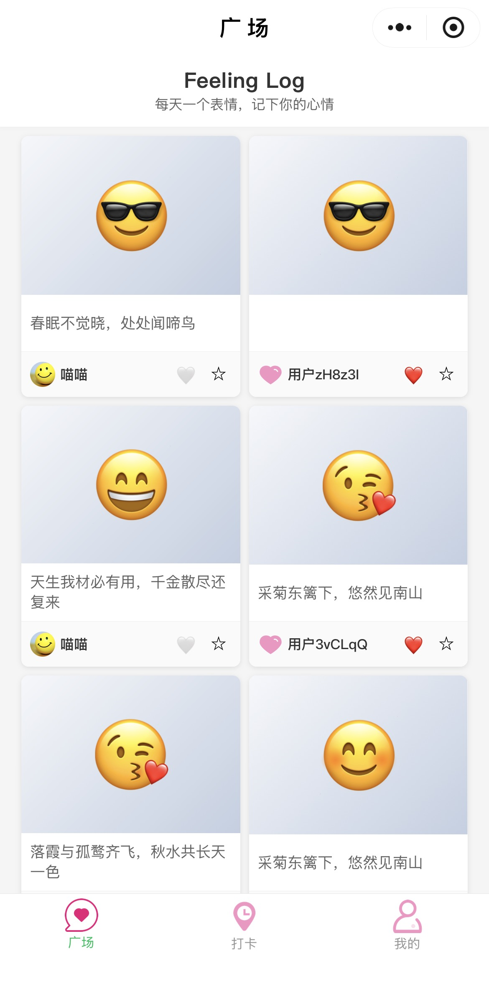
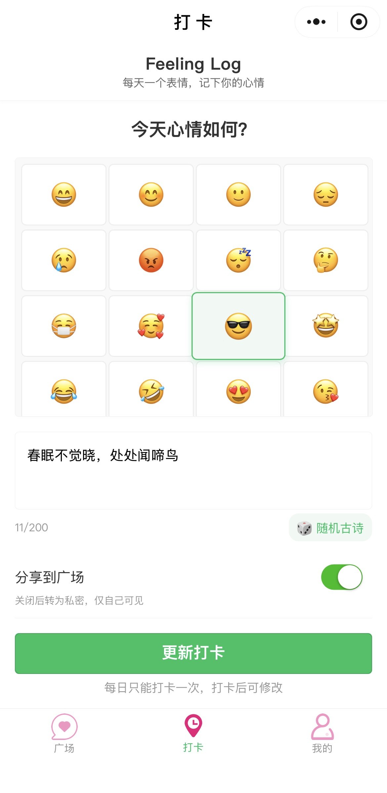
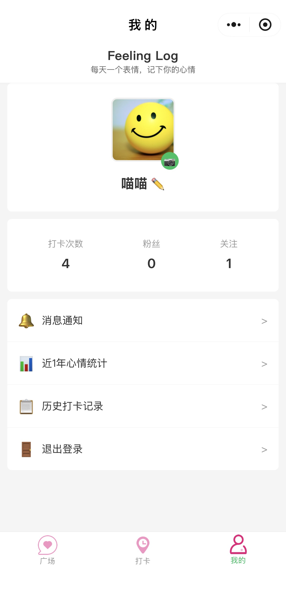
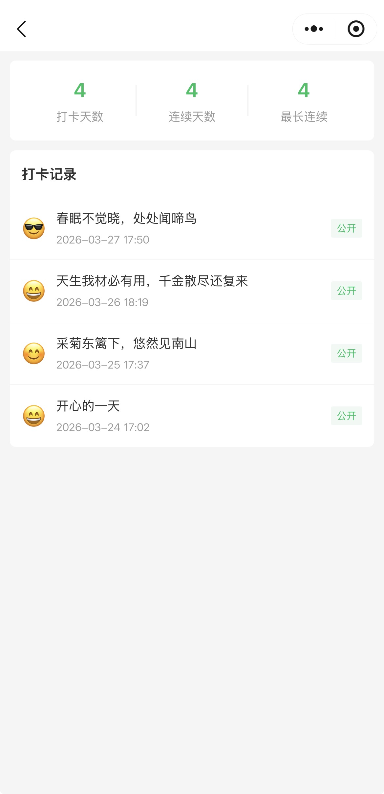
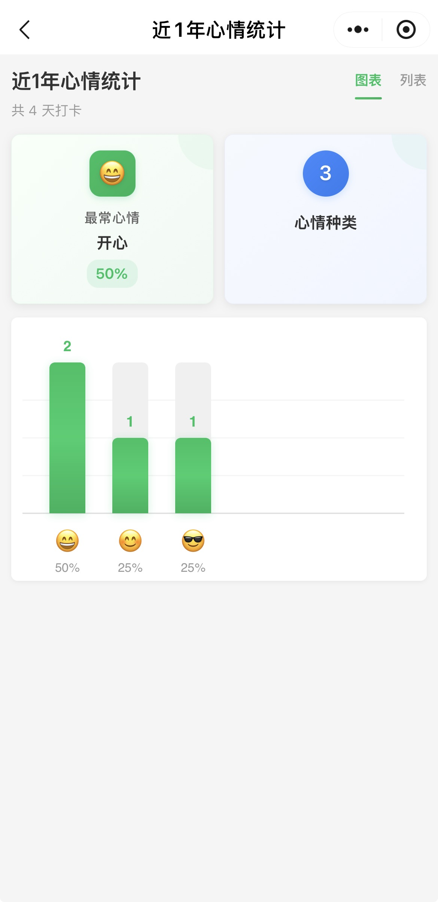
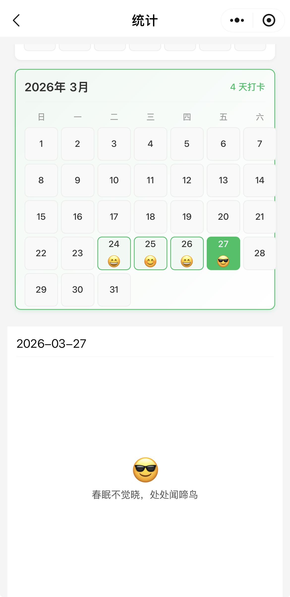

><p style="font-family: 'Microsoft YaHei', sans-serif; line-height: 1.5;">
>作者：数据人阿多&emsp;&emsp;&emsp;日期：2026年3月27日
></p>

不需要精通编程，只需要一份清晰的需求文档，AI就能帮你把脑海里的想法变成真实可用的产品。本文分享小编用Vibe Coding开发小程序的真实体验，从0到1，全程干货

# 项目缘起：为什么想做这样一个小程序？

现代人的生活节奏越来越快，忙碌之余，我们常常忽略了对自己情绪的关照。做一个记录情绪的工具，这个想法在小编心里酝酿了很久

于是，**Feeling Log（心情打卡）小程序** 应运而生。它不只是一个记录工具，更是一个帮助你觉察情绪、理解自己的温暖伙伴

**核心功能一览：**

- 📝 **每日心情打卡**：选择Emoji，配上简短的文字记录，每天几秒钟留存情绪瞬间。记录可公开，也可仅自己可见
- 🌟 **心情广场**：看看别人今天的心情如何，点赞、互动，在共鸣中感受“你并不孤单”
- 📊 **数据统计**：近一年的心情分布一目了然，帮你看见情绪的起伏变化，更了解自己
- 👥 **轻社交互动**：关注有趣的人，接收点赞与评论通知，构建一个温暖而不打扰的小圈子


**开发方式：** AI辅助编程（Vibe Coding）

**开发工具：** QClaw


# 先看效果：小程序长这样
<div style="display: flex; flex-wrap: wrap; gap: 10px; justify-content: space-between;">
  <div style="flex: 0 0 calc(33.33% - 10px);">
    
  </div>
  <div style="flex: 0 0 calc(33.33% - 10px);">
    
  </div>
  <div style="flex: 0 0 calc(33.33% - 10px);">
    
  </div>
  <div style="flex: 0 0 calc(33.33% - 10px);">
    
  </div>
  <div style="flex: 0 0 calc(33.33% - 10px);">
    
  </div>
  <div style="flex: 0 0 calc(33.33% - 10px);">
    
  </div>
</div>


# Vibe Coding是什么？颠覆传统的开发新范式

**1. 传统开发 vs Vibe Coding**

**传统开发流程：**
```text
需求分析 → 技术选型 → 架构设计 → 编码实现 → 
调试修复 → 性能优化 → 测试上线
```
每一个环节都需要专业技能，周期长，门槛高

**Vibe Coding流程：**
```text
需求文档反复打磨 → 与AI详细沟通需求 → AI生成代码 → 验证测试 → 完成
```
你只需要说清楚“要什么”，AI负责解决“怎么实现”

**2. Vibe Coding的核心特点**

1️⃣ **需求驱动**

你不是在写代码，而是在“描述产品”。你负责想清楚做什么，AI负责技术实现。

2️⃣ **对话式开发**

全程以对话的方式推进。遇到问题，直接描述给AI，AI帮你分析、修复，像有一个全栈工程师随时待命。

3️⃣ **快速迭代**

需求有变更？告诉AI，立即调整。发现Bug？描述现象，AI快速修复。试错成本极低，想法能更快落地


# 开发流程：分“两步走”实战策略

**第一步：打磨需求文档——让AI当评审员**

这一步至关重要。需求文档写得越清晰、越细致，AI生成的代码质量就越高，返工就越少

我的做法是：先把自己想到的功能需求写下来，然后扔给AI，让它以“评审员”的身份挑问题、提建议。根据AI的反馈反复优化、补充细节

就这样，需求文档从最初的**100多字**，一路细化到了**1000多字**，这1000字，就是后面顺利开发的基石


**第二步：开发与迭代：让AI当全栈工程师**

需求文档确定后，我把文档交给QClaw，它自动完成了：
- 项目结构创建
- 所有前端页面和功能实现
- 编写云函数

<br/>

而我需要做的，只剩下：
- 在开发者工具中编译运行
- 测试功能是否符合预期
- 发现问题后，直接告诉AI
- 配置云开发环境

整个过程，我从 **“写代码的人”** 变成了 **“提需求的人”和“验收产品的人”**

# 开发中遇到的问题

**🔁 1. 需求不清晰，反复修改**

前端UI的布局和样式描述不够具体，导致反复调整了好几版

反而是后端接口，因为逻辑清晰，AI实现得非常顺畅，基本没怎么返工

**经验：** 对UI的描述要尽量详细

**🗣️ 2. 同一个意思，换个词效果天差地别**

在实现“用户必须先登录才能进入小程序”这个功能时，一开始怎么跟AI沟通都无法彻底解决，总是会自动登录

后来我把提示词从“用户需要登录”改成了 “必须强制用户登录” ，仅仅加了“强制”两个字，AI就准确理解并修复了这个问题

**经验：** 跟AI沟通时，用词要准确、坚决，避免模糊表达

**🤖 3. 切换模型，解决疑难Bug**

QClaw默认的大模型，解决BUG时有时不够深入，切换为DeepSeek后便能解决

**💸 4. QClaw的每日4000万免费tokens不够用**

随着功能的增加，会把之前已经做好的功能给修改错了，导致反复修改，从而tokens消耗很快


# 写在最后
Vibe Coding确实让“从想法到产品”的路径变得更短、更平了。AI是强大的助手，但它不是万能的

**几点真心建议：**

- **需求文档是成功的关键**——花时间打磨它，值得

- **理解比使用更重要**——懂一点技术原理，能让你更好地驾驭AI

- **沟通要精准**——用词模糊，AI就会“自由发挥”。人与人之间沟通尚且容易误解，何况是与一个生成随机结果的AI对话

- **适时切换模型**——让不同的AI发挥各自的优势

如果你也有一个酝酿已久的产品想法，不妨试试Vibe Coding。也许，你的第一个产品，就在不远处等你


# 历史相关文章
- [OpenClaw使用体验](/大模型相关/20260313-OpenClaw使用体验.md)
- [VibeCoding完全指南：2026年，我们用“感觉”写代码](/大模型相关/20260320-VibeCoding完全指南：2026年，我们用“感觉”写代码.md)


