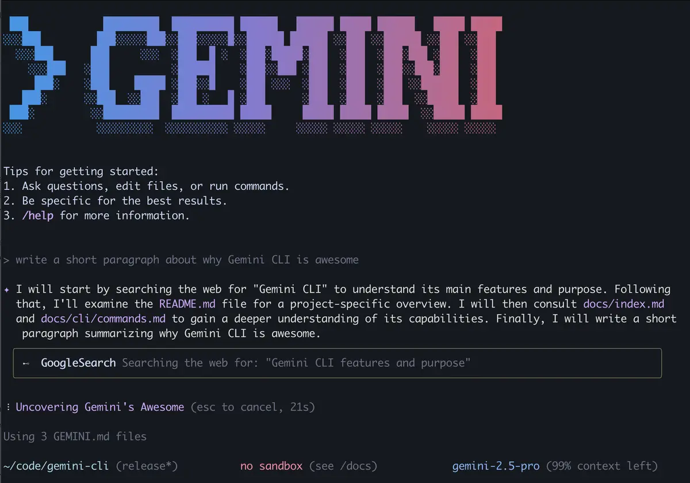
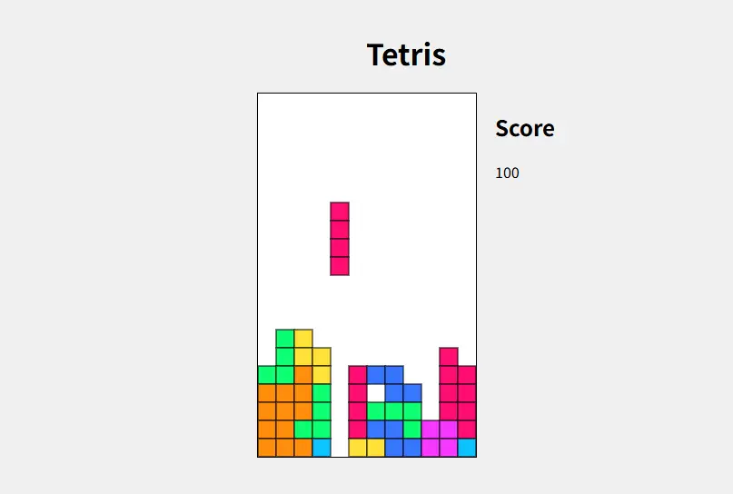
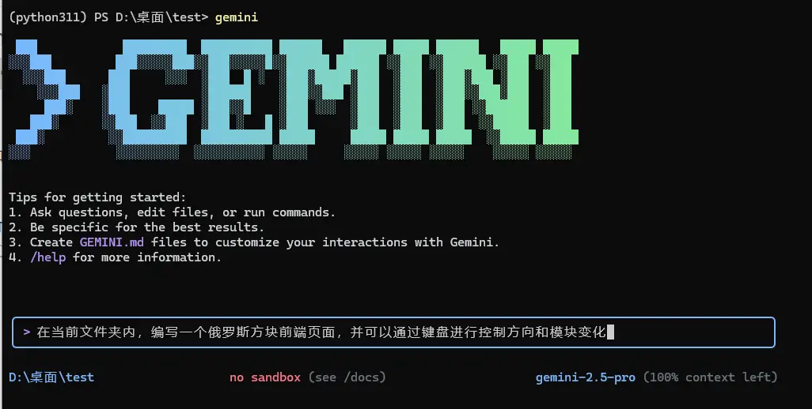
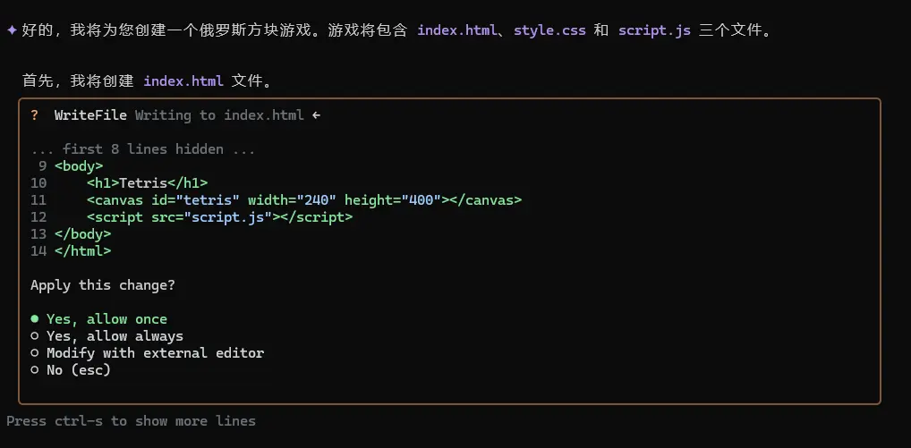
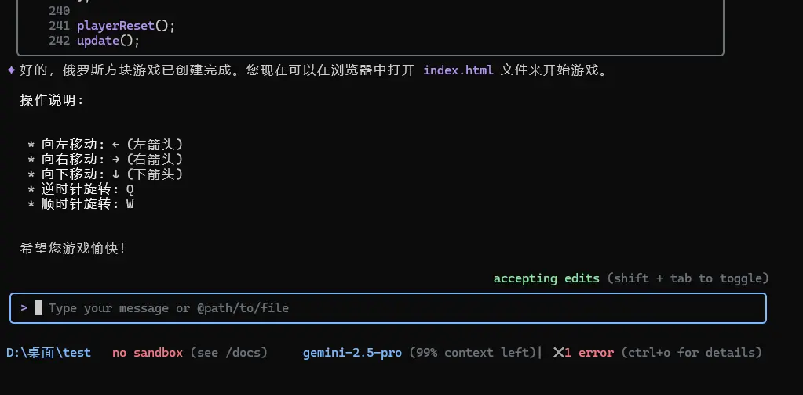
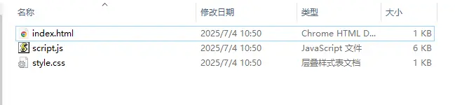

><p style="font-family: 'Microsoft YaHei', sans-serif; line-height: 1.5;">
>作者：数据人阿多
></p>

# 背景
如今，大家在遇到问题时，都已经学会了先去deepseek一下，然后得到自己需要的答案，这充分体现了大模型在信息检索领域的强大应用。然而，这仅仅是大模型潜力的一个方面。随着大模型技术的持续深化与普及，其影响力必将进一步渗透至各行各业。

近期，谷歌开源的 gemini-cli 工具，无疑为开发者社区带来了显著利好，
经过小编试用，感觉大模型在编程应用方面，又迈上了一个新台阶



# 小编环境

```bash
系统：Win10 系统
网络：魔法上网工具
```
# 俄罗斯方块效果


# 安装大概流程
开启魔法上网：。。。。。。

官方安装教程：https://github.com/google-gemini/gemini-cli

获取api key：https://aistudio.google.com/apikey

**注意点：**
- 在使用gemini时，魔法上网需要开启 `Tun` 模式 
- 获取的key，添加到系统环境变量，在登录认证时选择api 认证方式

# 开发俄罗斯方块
在桌面新建一个 `Test文件夹`，在该文件夹中打开终端，输入 `gemini` 命令后，然后选择编码风格和认证方式登录后，进入gemini，在提示框中输入相应的需求话术


发送需求后，等待gemini回答，并自行创建文件，这里会创建3个文件，`index.html`，`style.css`，`script.js`


完成之后，会提示怎么进行操作


在文件夹中，打开index.html 即可看到俄罗斯方块界面



整体使用起来比较顺畅，类似端到端的感觉，gemini直接把文件创建好，让你运行即可


# 历史相关文章
- [基于DeepSeek，构建个人本地知识库RAG](./基于DeepSeek，构建个人本地RAG知识库.md)
- [从互联网+，到DeepSeek+，新一轮的技术变革](./随笔/从互联网+，到DeepSeek+，新一轮的技术变革.md)
- [让ChatGPT回答闰年的计算逻辑](/数学知识/让ChatGPT回答闰年的计算逻辑.md)

**************************************************************************
**以上是自己实践中遇到的一些问题，分享出来供大家参考学习，欢迎关注微信公众号：DataShare ，不定期分享干货**
