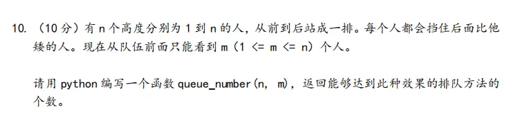
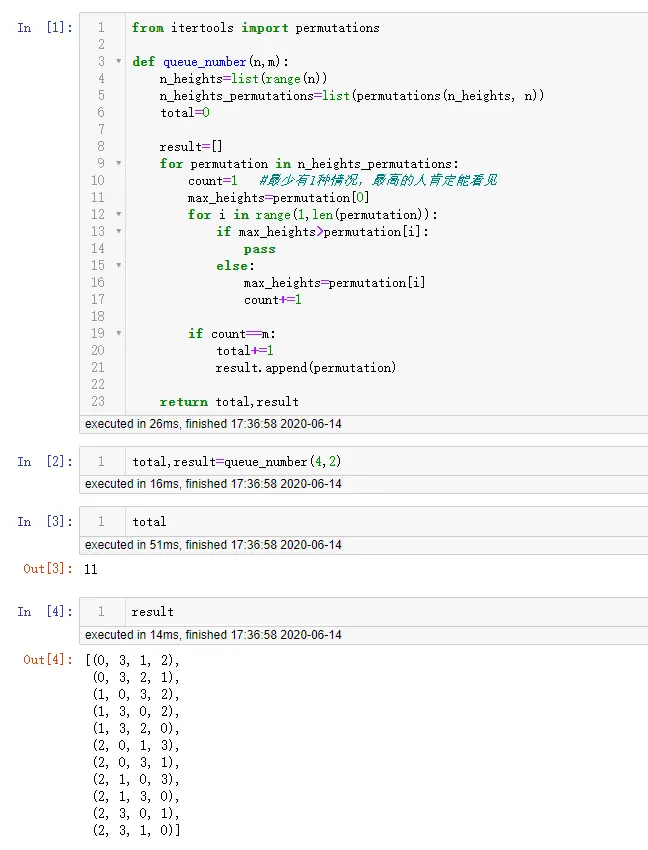

><p style="font-family: 'Microsoft YaHei', sans-serif; line-height: 1.5;">
>作者：数据人阿多
></p>

# 背景

略微懂点编程的人都知道，计算机其实很死板，是靠简单的逻辑运算、算术运算实现复杂的问题，也就是if-else、加、减等。只不过现在有了升级，更高级、更智能的办法-----人工智能，但是道理还都是一样的，计算机在计算时靠的是它的速度，而人类靠的是大脑、智慧；计算机只不过是把很多情况都列举出来，找到最合适的，而人类靠的是解决问题的方法、智慧。

例如：现在的神经网络在训练参数时，用到的梯度下降，计算机靠它的计算速度一步一步的迭代，可以求出最佳的结果，而人类可以靠已有的智慧，可以直接计算出结果（简单的神经网络）。

**所以枚举就是计算机解决问题的根本方法**，上一篇文章[《利用Python枚举所有的排列情况》](./利用Python枚举所有的排列情况.md)，详细介绍了怎么用Python来获取各种排列情况，这一篇文章就利用一道面试算法题，来实际应用一下。

题目如下所示：


# 解决方法

前面背景已经介绍利用枚举来解决，那么

- 第一步：枚举出所有的排列情况
- 第二步：在每种排列情况里面进行查找

**重点是第二步，需要查找前面值比后面值连续大的次数，如果次数满足要求，那就是一种结果**

下面就直接展示详细代码：


代码：

```python
from itertools import permutations

def queue_number(n,m):
    n_heights=list(range(n))
    n_heights_permutations=list(permutations(n_heights, n))

    total=0
    result=[]

    for permutation in n_heights_permutations:
        count=1   #最少有1种情况，最高的人肯定能看见
        max_heights=permutation[0]
        for i in range(1,len(permutation)):
            if max_heights>permutation[i]:
                pass
            else:
                max_heights=permutation[i]
                count+=1
      
        if count==m:
            total+=1
            result.append(permutation)
  
    return total,result

total,result=queue_number(4,2)
```

# 历史相关文章

- [利用Python枚举所有的排列情况](./利用Python枚举所有的排列情况.md)
